[version]: # (1.0.0)

A navegação é o processo pelo qual os usuários acessam as telas e funcionalidades de um sistema web, site ou aplicativo, permitindo que estes realizem suas tarefas, sejam conduzidos através de fluxos de etapas ou acessem à informação desejada.

---

## Estruturando o Processo de Navegação

Ao se iniciar um projeto de interface de um sistema ou aplicativo deve-se estar atento a alguns conceitos e ideias que podem ajudar na construção do processo de navegação deste tipo de produto. Abaixo pode-se observar alguns destes conceitos.

### Inventário
É necessário, antes de mais nada, identificar quais usuários utilizarão seu site, sistema, ou aplicativo e definir quais funcionalidades, tarefas ou conteúdos são mais comuns para cada tipo de usuário.

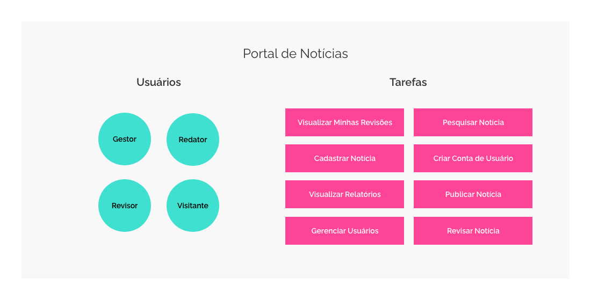
*Identifique os principais usuários de sua aplicação e as atividades pertinentes a eles*

### Priorização
Atribua níveis de prioridade às atividades mais comuns para cada tipo de usuário. Organize em prioridade alta, média ou baixa e ajuste os níveis de prioridade caso as necessidades desses usuários mudem ao longo do tempo. Ao construir a interface gráfica, dê destaque aos elementos com alta prioridade ou aos elementos mais frequentemente acessados.

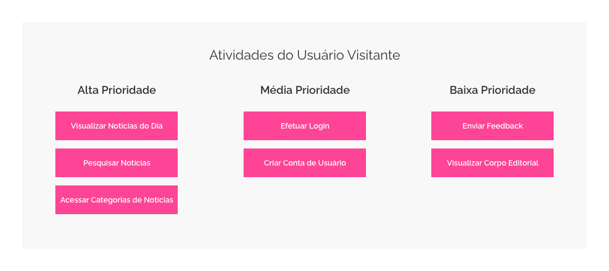
*Defina prioridades alta, média e baixa para as atividades de cada tipo de usuário*

### Sequência
Identifique quais caminhos os usuários percorrem em seu site, sistema ou aplicativo e utilize esses caminhos para estruturar sua navegação.

Dê ênfase aos destinos frequentes utilizados em sua navegação e agrupe tarefas relacionadas para facilitar o acesso pelos usuários.

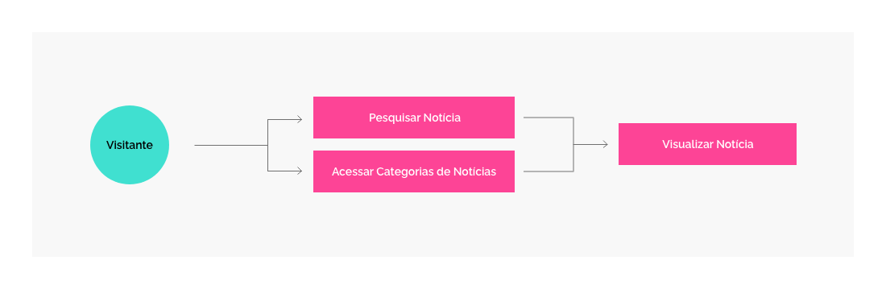
*Identifique quais caminhos os usuários percorrem*

### Desconstrução
Divida tarefas complexas ou fluxos amplos em atividades menores, isso facilita o aprendizado pelos usuários, tornando a compreensão do todo mais fácil. Essas atividades menores também podem ser usadas com mais frequência pelos usuários e atender melhor seus objetivos.

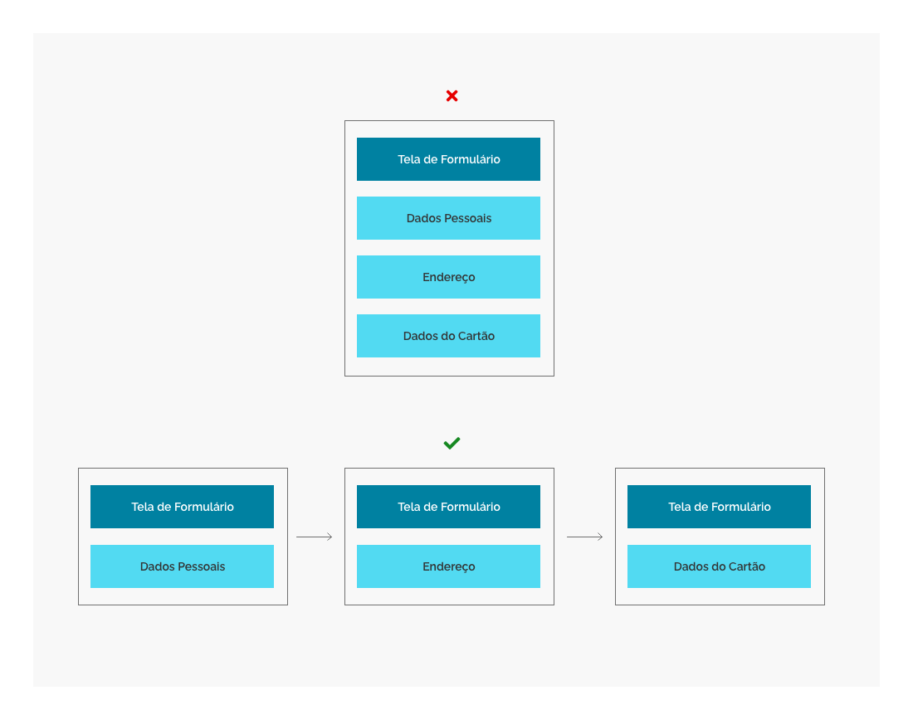
*Desconstrução - Divida um formulário complexo em etapas menores utilizando um Wizard por exemplo*

### Hierarquia
Organize seu conteúdo estruturando-o dentro de uma hierarquia. No topo desta hierarquia devem estar os conteúdos de maior relevância e que dão acesso aos conteúdos das camadas mais baixas desta hierarquia.

#### Elementos de Hierarquia na Navegação
Os elementos de hierarquia na navegação são:

##### 1 - Home

É a entrada principal de seu site, sistema ou aplicativo e deve exibir o conteúdo de apresentação deste, assim como um componente principal de navegação que dará acesso às outras camadas hierárquicas.

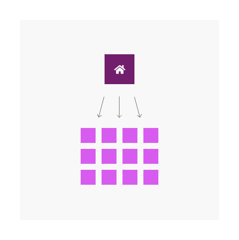
*A partir da home o usuário tem acesso as outras camadas hierárquicas*

##### 2 - Pais e Filhos

O nível superior na hierarquia de navegação é chamado de "pai" enquanto que o(s) nível(is) inferiores são chamadas de "filhos". É importante manter sempre presente acesso de navegação entre nível pai e filhos.

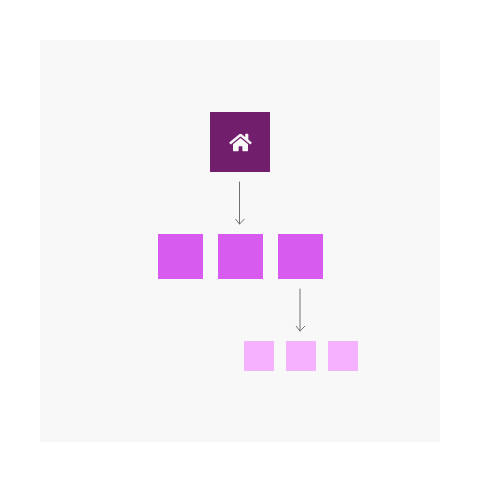
*Pais e Filhos - Mantenha sempre o acesso entre elementos pais e filhos*

##### 3 - Fluxo

É o caminho pelo qual os usuários transitam entre níveis pais e filhos, entre níveis irmãos ou qualquer outra localidade dentro de uma hierarquia. Através do fluxo pode-se determinar o tipo de navegação a ser utilizada. Por exemplo, no fluxo de pai para filho utiliza-se a navegação descendente, enquanto que no fluxo de filho para pai utiliza-se a navegação ascendente.

*Exemplo de Fluxo - Navegação Ascendente e Descendente*

##### 4 - Irmãos

Os níveis que possuem o mesmo pai são chamados de "irmãos". Geralmente são atividades ou tarefas que possuem a mesma prioridade e contextos semelhantes. A navegação entre irmãos é chamada de _Navegação Lateral_.

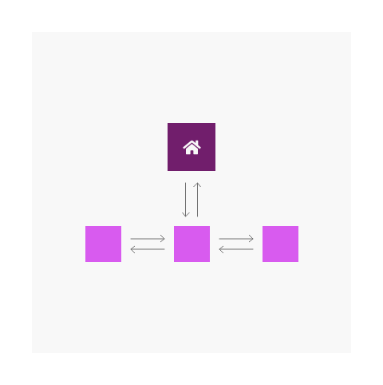
*Exemplo de navegação lateral (entre irmãos)*

##### 5 - Hiperlinks

Os hiperlinks são recursos que permitem os usuários acessar rapidamente os níveis na hierarquia, mesmo que não sejam adjacentes à sua navegação. Seja de pai para filho, irmão para irmão ou qualquer outra localidade desejada. Os hiperlinks cruzados levam os usuários a qualquer lugar dentro do site, sistema ou aplicativo. Já os hiperlinks externos levam os usuários a fontes externas.

*Os hiperlinks acessam qualquer localidade dentro ou fora de sua aplicação*

### Boas Práticas

 - **Navegação Fácil:** Uma boa navegação deve ser fácil, intuitiva e previsível. Tanto usuários novos como experientes devem ser capazes de aprender com rapidez e facilidade a navegação proposta;

 - **Relacionamentos e Contexto:** Ofereça opções relacionadas ou contextuais, isso ajuda o usuário encontrar temas semelhantes àqueles que está buscando;

 - **Guie o Usuário:** Quando a necessidade for a conclusão de um fluxo, tarefa ou jornada, induza o usuário pelo caminho correto, não deixando dúvidas a respeito de qual botão ou link a ser clicado ou caminho a ser percorrido; 

 - **Focalize a Atenção:** Personalize a navegação de seu aplicativo, sistema ou site dando destaque aos elementos que conduzem a conteúdos e tarefas mais importantes para o usuário; 

---

## Tipos de Navegação
O ato de se mover por telas ou seções de uma aplicação pode ser realizado por determinados tipos de navegação. E para cada tipo de navegação existem componentes ou comportamentos de navegação mais adequados. São eles:

 - Navegação Lateral;
 - Navegação Progressiva;
 - Navegação Reversa.

### Navegação Lateral
Compreende no movimento entre telas ou seções da aplicação de um mesmo nível hierárquico (níveis irmãos), podendo oferecer também acesso a itens relacionados em um conjunto.

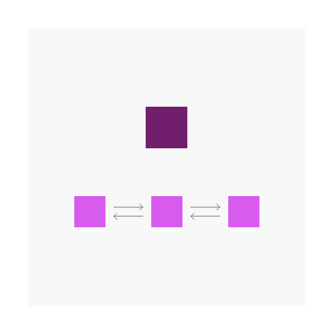
*Ilustração - Navegação Lateral*

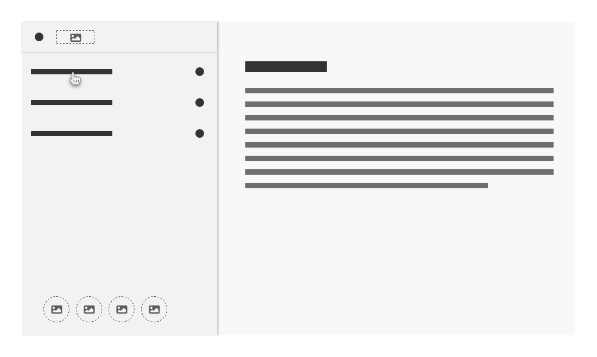
*Exemplo de navegação lateral com Menu - O usuário pode navegar entre níveis irmãos*

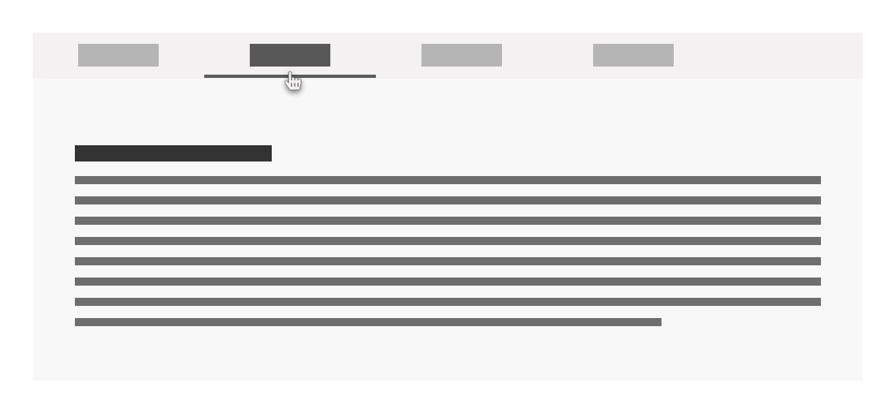
*Exemplo de navegação lateral com Tabs - O usuário pode navegar entre níveis irmãos*

| Componente     | Utilize para                   |
| -------------- | ------------------------------ |
| Menu Principal | `Destinos de nível superior`   |
| Lists          | `Qualquer nível de hierarquia` |
| Tabs           | `Qualquer nível de hierarquia` |
| Carousel       | `Qualquer nível de hierarquia` |

#### Boas Práticas na Navegação Lateral
 - Componentes de navegação lateral que contém os principais níveis de hierarquia devem permanecer sempre visíveis em qualquer tela da aplicação. Desta forma o usuário terá acesso imediato às principais telas do sistema ou aplicativo;
 - Em dispositivos móveis, quando utilizar recursos de _collapse_ ou _dropdown_ para componentes como _Menu_, reforce a ênfase visual no ícone ou button de acesso deste componente, assim o usuário terá certeza de onde encontrar seu componente principal de navegação;
 - Evite utilizar _Menus_, _Tabs_ ou _Lists_ com uma quantidade muito extensa de itens. Neste caso, tente organizar sua estrutura principal de navegação de forma inteligente, oferecendo ao usuário o que realmente importa.

### Navegação Progressiva
Consiste na movimentação entre telas de níveis consecutivos na hierarquia ou em sequência de etapas em um fluxo. E podem funcionar de três formas:

#### Navegação Descendente
Se aprofunda nos níveis mais baixos da hierarquia, se locomovendo de telas de nível superior "pai" para telas de níveis mais inferiores "filhos". Em essência uma navegação descendente. 

 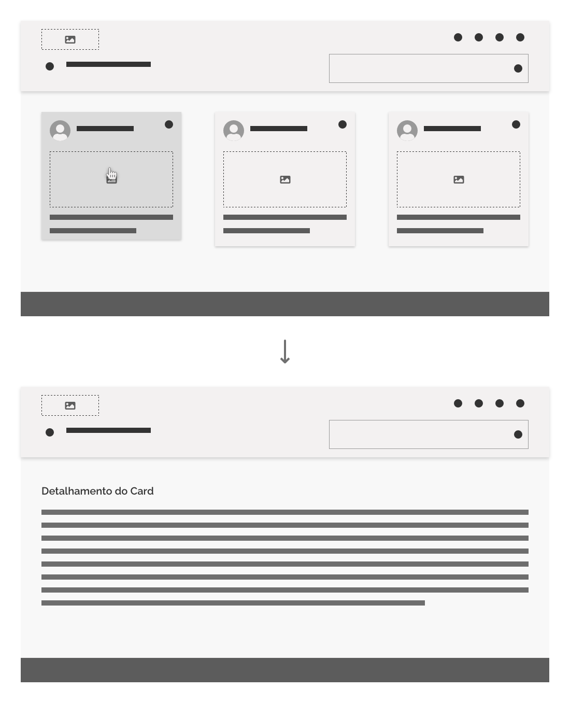
*Exemplo de Navegação com Cards em telas de Dashboard - Acessando níveis inferiores na camada de hierarquia*

#### Navegação Sequencial
Consiste em se locomover através de um fluxo ou jornada com telas sequencialmente ordenadas, por exemplo, etapas de um _Wizard (Assistente)_.

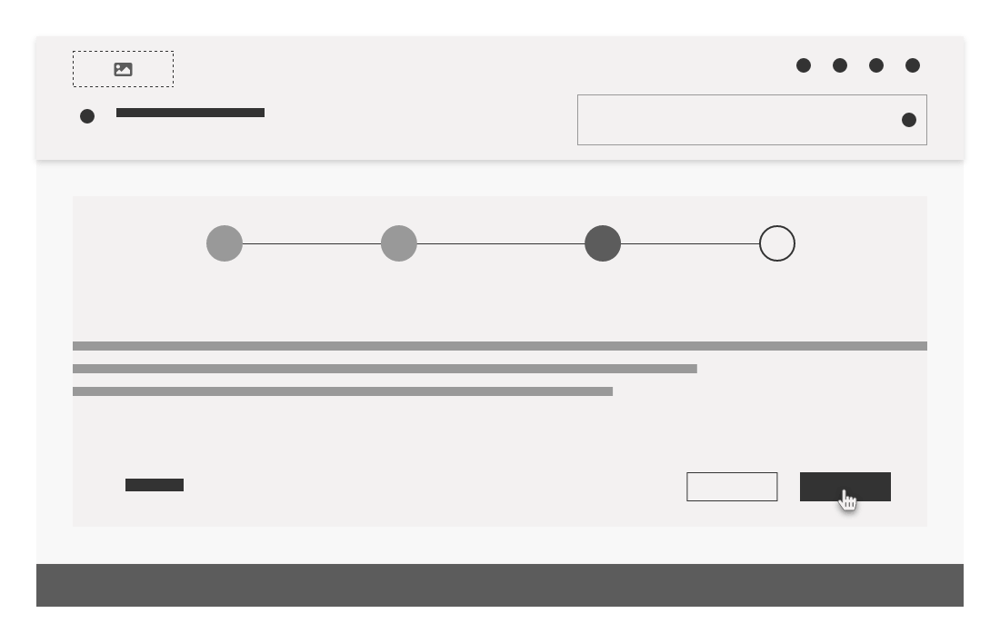
*Exemplo de Navegação Sequencial com Wizard - O Usuário navega por etapas sequenciais*

Outro exemplo muito comum é a utilização do _Componente Pagination_, organizando uma navegação sequencial entre itens ordenados.

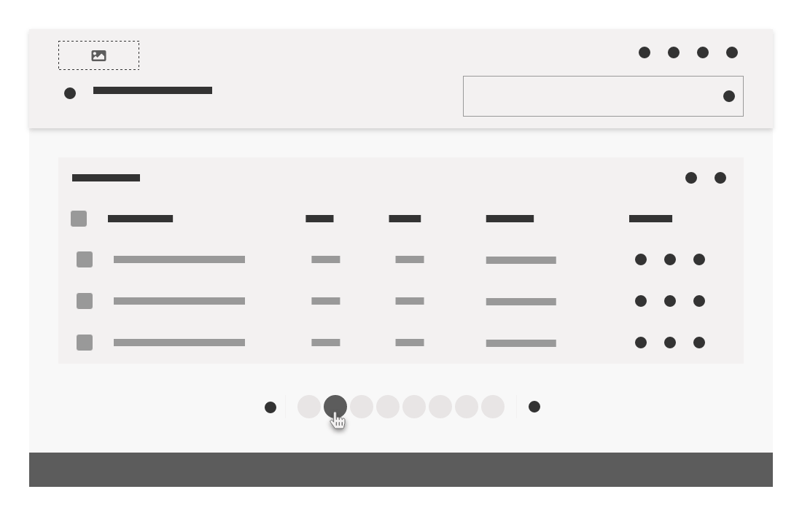
*Exemplo de Navegação Sequencial com Pagination - O Usuário navega por agrupamento de itens ordenados em lote*

#### Navegação Direta
Refere-se a navegação de uma tela para qualquer outra da aplicação, podendo deslocar o usuário da tela inicial para outra tela mais profunda na hierarquia. Por exemplo, uma navegação por busca.

 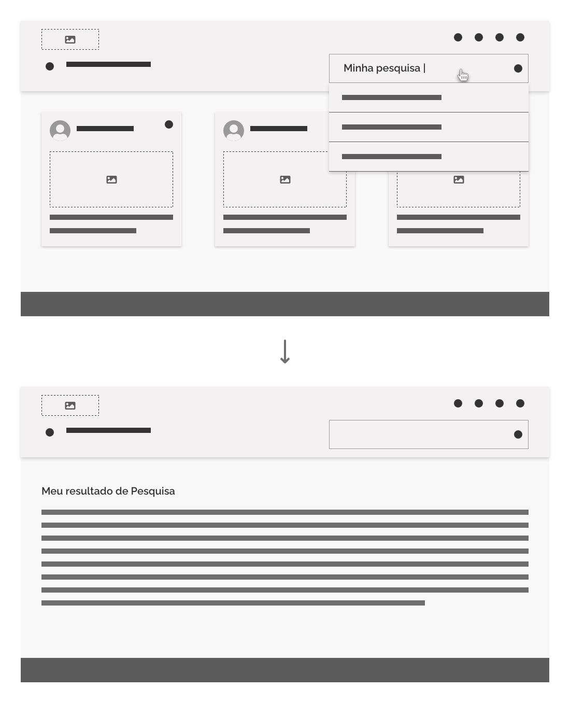
*Exemplo de Navegação Direta - O usuário acessa um conteúdo específico através de pesquisa*

Abaixo pode-se observar alguns componentes mais adequados para _Navegação Progressiva_:

| Componente         | Tipo de Navegação       |
| ------------------ | ----------------------- |
| Cards              | `Navegação Descendente` |
| Janelas Modais     | `Navegação Descendente` |
| Magic Button       | `Navegação Descendente` |
| Wizards            | `Navegação Sequencial`  |
| Steps              | `Navegação Sequencial`  |
| Pagination         | `Navegação Sequencial`  |
| Hiperlinks         | `Navegação Direta`      |
| Tags Interativas   | `Navegação Direta`      |
| Inputs de Pesquisa | `Navegação Direta`      |
| Sign-In            | `Navegação Direta`      |

#### Boas Práticas na Navegação Progressiva

 - Em navegações descendentes, utilize recursos visuais como ícones que podem auxiliar o usuário a perceber um acesso a um nível inferior na hierarquia;
 - Para navegações sequenciais, fortaleça a ênfase visual em botões que são responsáveis por guiar o usuário em etapas futuras de uma jornada; 
 - Em navegações diretas, mantenha sempre presente nas interfaces outros componentes que auxiliem o usuário retornar ao ponto de partida ou que deixem claro o caminho percorrido;

### Navegação Reversa
Refere-se em navegar retrocedendo cronologicamente entre as telas da aplicação ou retrocedendo em uma navegação ascendente dentro dos níveis hierárquicos.

#### Navegação Cronológica
Este tipo de navegação consiste em retroceder cronologicamente através do histórico de navegação recente do usuário. É possível deslocar o usuário dentro de uma aplicação ou até mesmo entre aplicações diferentes. Um exemplo bem comum é o _Button_ "Voltar" do navegador.

 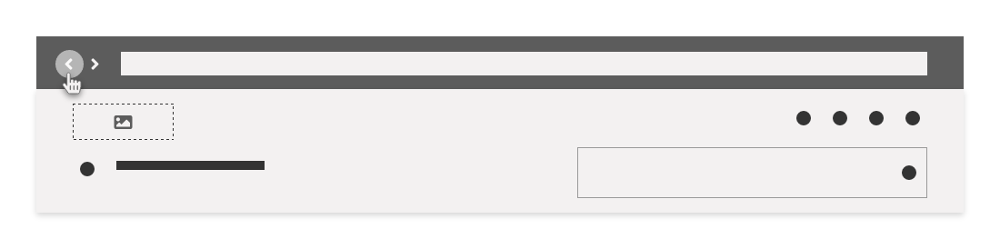
*Exemplo de Navegação Cronológica utilizando o button Voltar do Navegador*

Apesar de ser bem comum este tipo recurso na barra do _Navegador_, recomenda-se utilizar, em alguns casos, o _button_ "Voltar" dentro da própria tela da aplicação, auxiliando o usuário retornar em etapas sequenciais cronologicamente. Como o caso do _Wizard_ ou em telas específicas, por exemplo. 

 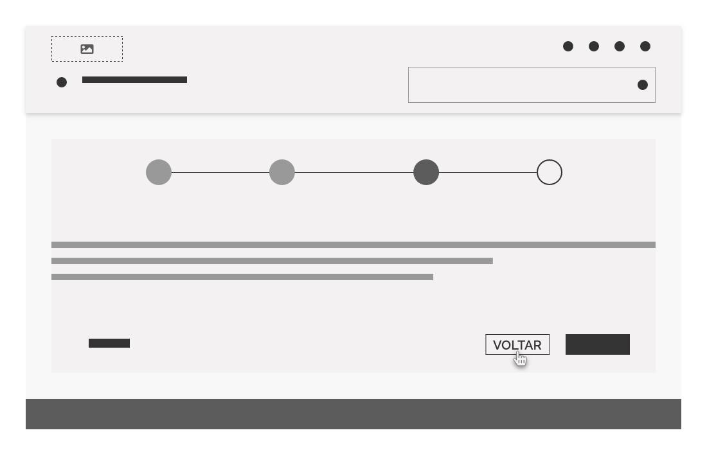
*Navegação Cronológica com Wizard*

#### Navegação Ascendente
A _Navegação Ascendente_ permite que o usuário navegue pelas telas subindo através dos níveis hierárquicos da aplicação, até alcançar a tela inicial.

Uma boa recomendação é utilizar o componente _Breadcrumbs_ como elemento de Navegação Ascendente. Neste componente o usuário tem uma visão clara de todo fluxo hierárquico e pode navegar retrocedendo na hierarquia até chegar ao nível principal.

 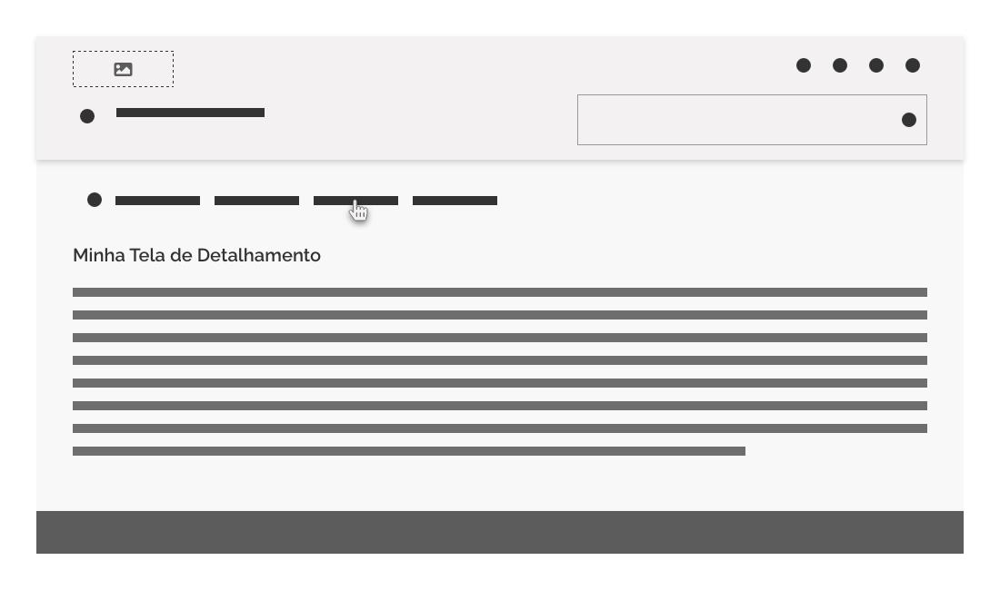
*Fluxo Reverso com Navegação Ascendente e Breadcrumbs*

Neste caso, também é muito usado o recurso do _button_ "Voltar" dentro da aplicação.

 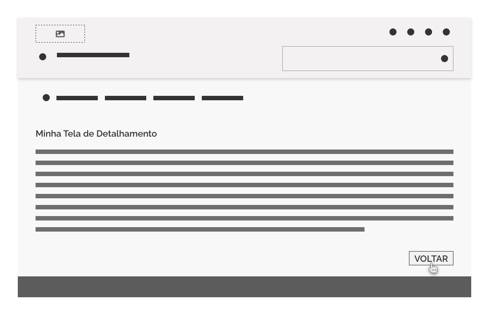
*Fluxo Reverso com Navegação Ascendente e Button Voltar*

Componentes mais adequados para _Navegação Reversa_:

| Componente                  | Tipo de Navegação       |
| --------------------------- | ----------------------- |
| _Button_ Voltar (Navegador) | `Navegação Cronológica` |
| _Button_ Voltar (Aplicação) | `Navegação Cronológica` |
| Breadcrumbs                 | `Navegação Ascendente`  |

#### Boas Práticas na Navegação Reversa
 - Sempre que possível, retorne o usuário para tela anterior, exibindo-a em seu estado original e posição da barra de rolagem;
 - Forneça ao usuário mensagens claras, caso a tela anterior não esteja mais disponível. Pode-se usar nestes casos os padrões de _Empty State_, _Telas de Erro_ ou _Componente Message_;
 - Indique claramente ao usuário o relacionamento entre as telas "pais" e telas "filhas". É importante que o usuário consiga identificar o acesso à tela "pai" facilmente e retroceder na navegação.

--- 
## Padrões de Navegação

Padrões de navegação são formas de organizar e utilizar um ou mais componentes de navegação para atender diversas necessidades na interface gráfica, nos diferentes tipos de navegação e em contextos diferentes de hierarquia.

### Organizando Padrões de Navegação

Os padrões de navegação devem ser aplicados para atender melhor as necessidades dos usuários da aplicação. Geralmente, sistemas ou aplicativos com um modelo de hierarquia muito complexo ou profundo tem requisitos de navegação diferentes de aplicações mais simples com poucas camadas de visualização. É importante estar atento e utilizar os padrões mais adequados para sua interface, sendo possível também combiná-los de forma a obter melhor resultado na usabilidade.

Abaixo seguem alguns padrões que podem ser úteis na estruturação de uma navegação eficiente.

#### Navegação Embutida

Navegação Embutida é um padrão onde os componentes de navegação fazem parte do próprio conteúdo exibido em tela. Geralmente são usados em sistemas ou aplicativos com uma navegação muito simples, com uma forte visualização primária. 

Este modelo é recomendado para: 

 - aplicativos ou sistemas com poucos níveis hierárquicos;
 - aplicativos que usam na visão primária as tarefas mais comuns ou todas as tarefas;
 - aplicativos ou sistemas que possuem uma forte visualização primária e poucas visualizações alternativas;
 - aplicativos ou sistemas usados com pouca frequência.

  
*Exemplo de Navegação Embutida em um App de música - Os controles de navegação funcionam em uma forte visualização primária*

#### Navegação Aninhada

A Navegação Aninhada é um padrão onde se estrutura os componentes de navegação de forma a deixar claro ao usuário os níveis hierárquicos de sua aplicação. A ideia neste modelo é fortalecer o aprendizado do usuário na sequência de caminhos, grupos e subgrupos.

Geralmente muito comum em estruturas de _Menus_ ou _Listas_. Neste caso, recomenda-se aninhar os itens de níveis "irmãos" abaixo dos itens "pais".

Este tipo de padrão é adequado para:

 - Modelos de Navegação Lateral;
 - Estruturas de navegação muito profundas ou complexas;
 - Acessar itens de primeiro nível em visualizações não relacionadas.

   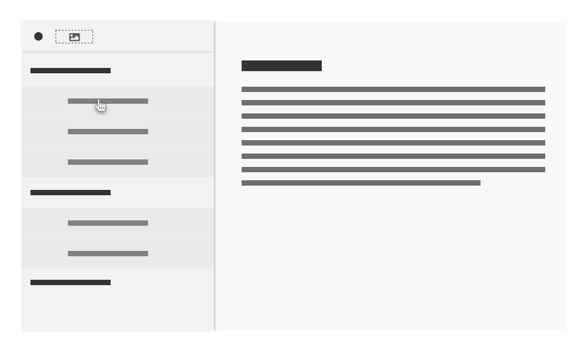
*Exemplo de Navegação Aninhada utilizando agrupamentos de pais e filhos no Menu*

##### Navegação Aninhada com Collapse ou Dropdown

O padrão de Navegação Aninhada com Collapse ou Dropdown possui o mesmo objetivo da Navegação Aninhada, aprimorando a exibição do conteúdo nos espaços da interface. Neste modelo utiliza-se estruturas de _Collapse_ ou _Dropdown_ incorporadas aos componentes de navegação. 

Desta forma pode-se otimizar melhor os espaços na tela e oferecer maior área de conteúdo visível para o usuário. É bastante útil para:

 - Recursos de responsividade;
 - Aplicações _Mobile_;
 - Aplicações _Desktop_ com pouco espaço em tela.

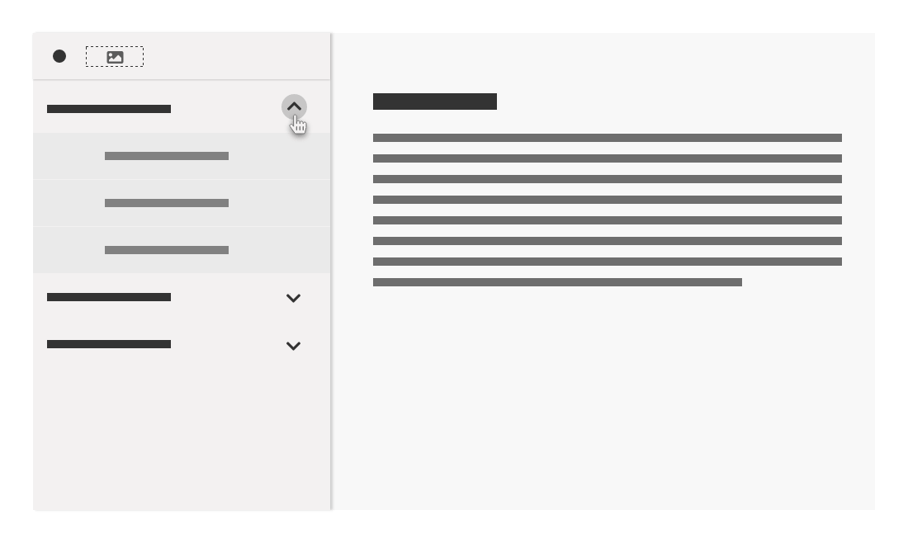
*Exemplo de Navegação Aninhada com Collapse - Permite melhor otimização do espaço vertical*

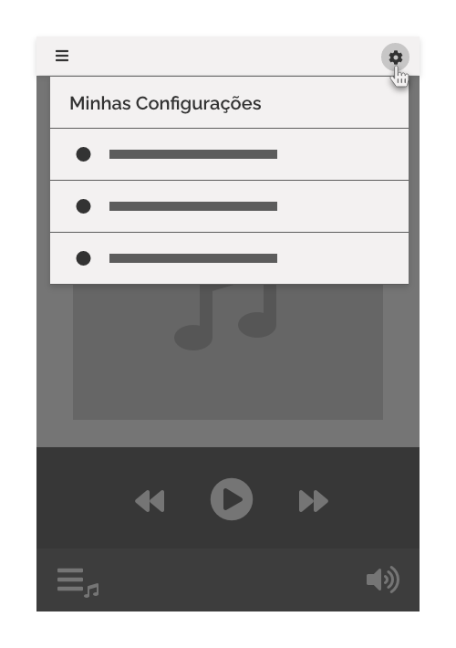
*Exemplo de Navegação Aninhada com Dropdown - Adequado para aplicações mobile ou espaços bastante reduzidos*

##### Navegação Aninhada em Cascata
O padrão de _Navegação Aninhada em Cascata_ possui a mesma utilidade da Navegação Aninhada com _Collapse_ ou _Dropdown_. Os objetivos em usabilidade são os mesmos. A diferença é que este tipo possui um comportamento diferenciado, exibindo os itens "filhos" lateralmente aos itens "pais" e não abaixo. Observe o exemplo a seguir:

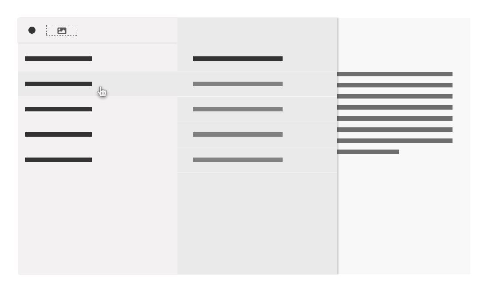
*Exemplo de Navegação Aninhada em Cascata*

Em dispositivos mobile, com espaços mais restritos, cada bloco em cascata é visualizado individualmente, ocultando a visualização dos demais. Veja o exemplo abaixo:

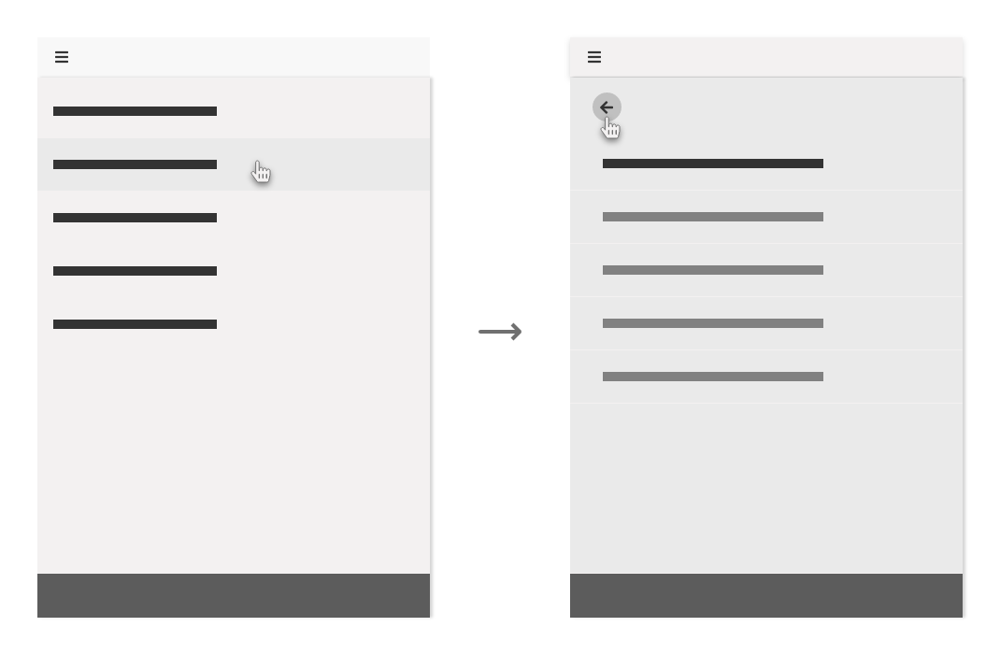
*Exemplo de Navegação Aninhada em Cascata Mobile - Cada bloco em cascata é visualizado individualmente pelo usuário*

#### Navegação Gestual

O padrão de Navegação Gestual é o modelo no qual utiliza-se recursos de toque por parte do usuário durante a navegação na interface, em determinados dispositivos.

A _Navegação Gestual_ permite que os usuários utilizem o dedo para deslizar entre os itens de navegação. Geralmente esses itens são irmãos em termos de nível de hierarquia. Esses recursos são mais presentes em aplicações para dispositivos móveis e devem ser considerados ao se projetar este tipo de interface. São mais comumentes utilizados em ações de rolagem vertical da tela, rolagem horizontal em componentes do tipo carrossel, galeria de imagens e ações de _touch_ em elementos interativos por exemplo.

A _Navegação Gestual_ é recomendada para:

 - Itens relacionados e ordenados naturalmente, como páginas ou elementos em sequência;
 - Visualizações com poucos itens filhos;
 - Visualizações com conteúdos semelhantes.

Os recursos de _Navegação Gestual_ mais comuns são:

 - Deslizar horizontalmente (direita e esquerda);
 - Deslizar verticalmente (cima e baixo);
 - Tocar em elementos interativos;
 - Ampliar ou reduzir a visualização da tela (com dois dedos).

 Abaixo pode-se observar alguns exemplos de _Navegação Gestual_.

 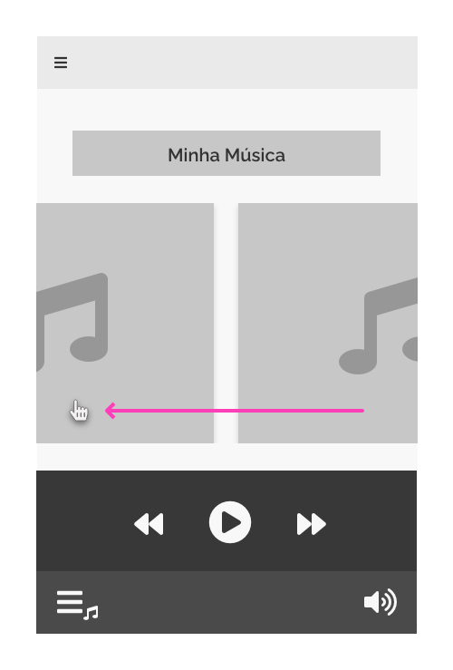
*Exemplo de Navegação Gestual Horizontal - O usuário desliza o dedo horizontalmente navegando sobre uma lista de músicas em um aplicativo*

 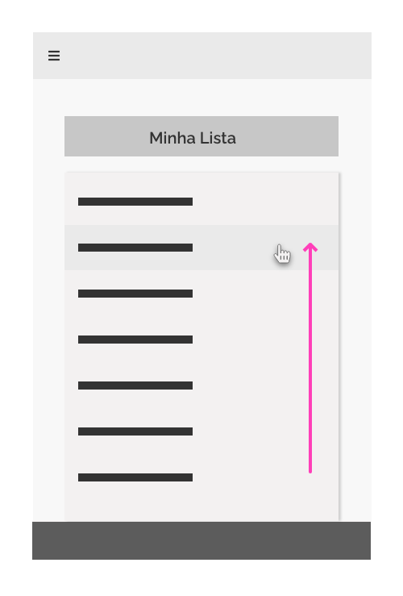
*Exemplo de Navegação Gestual Vertical - O usuário desliza o dedo verticalmente navegando sobre uma lista em um aplicativo*

 
*Exemplo de Navegação Gestual com Touch - O usuário aciona elementos interativos com o toque*

 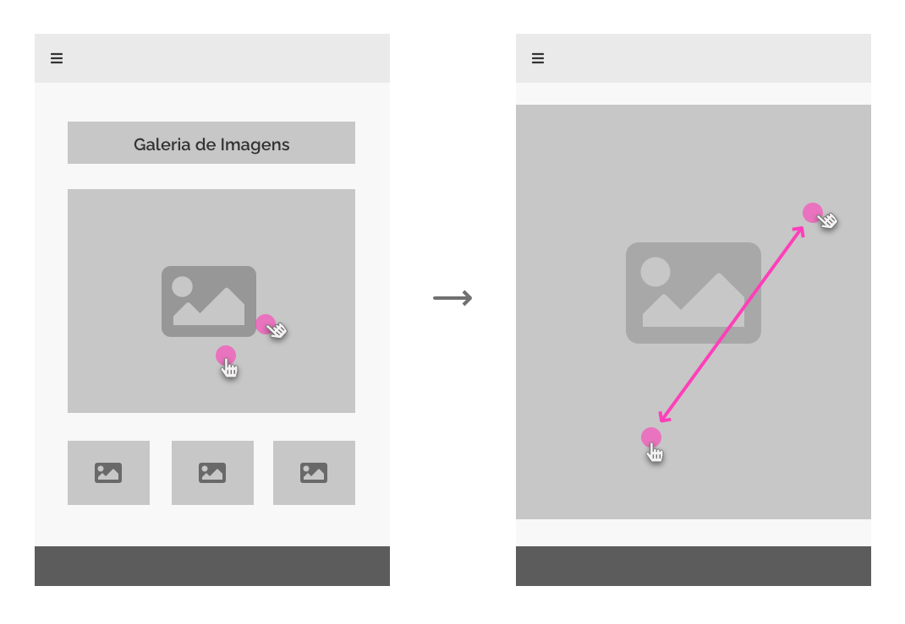
*Exemplo de Navegação Gestual com Zoom - O usuário utiliza dois dedos para ampliar ou reduzir a visualização do elemento ou da tela*

#### Padrões Combinados

Padrões Combinados são formas de harmonizar diferentes padrões de navegação com o objetivo de resolver necessidades específicas na interface e oferecer melhor experiência de usabilidade ao usuário. No entanto, deve-se estar atento aos princípios e boas práticas de design e combinar estes recursos com cautela. 

Abaixo pode-se observar algumas combinações mais comumente usadas:

 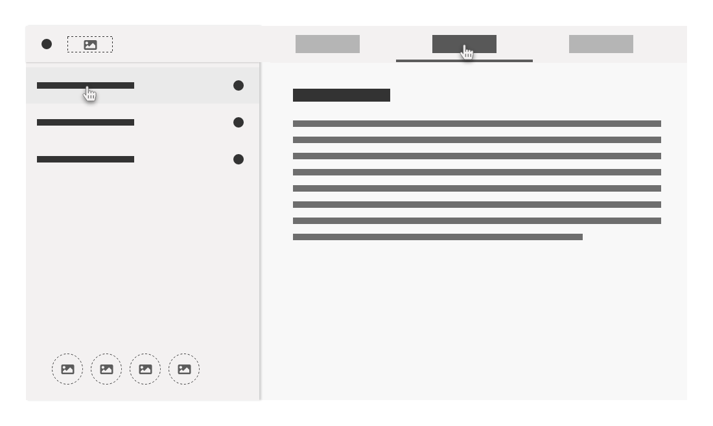
*Exemplo Combinado de Menu e Tabs - Neste exemplo foi utilizado dois componentes adequados para navegação do tipo Lateral. O Menu possui uma navegação lateral entre níveis "pais", enquanto que os Tabs possuem navegação lateral entre itens "filhos".*

 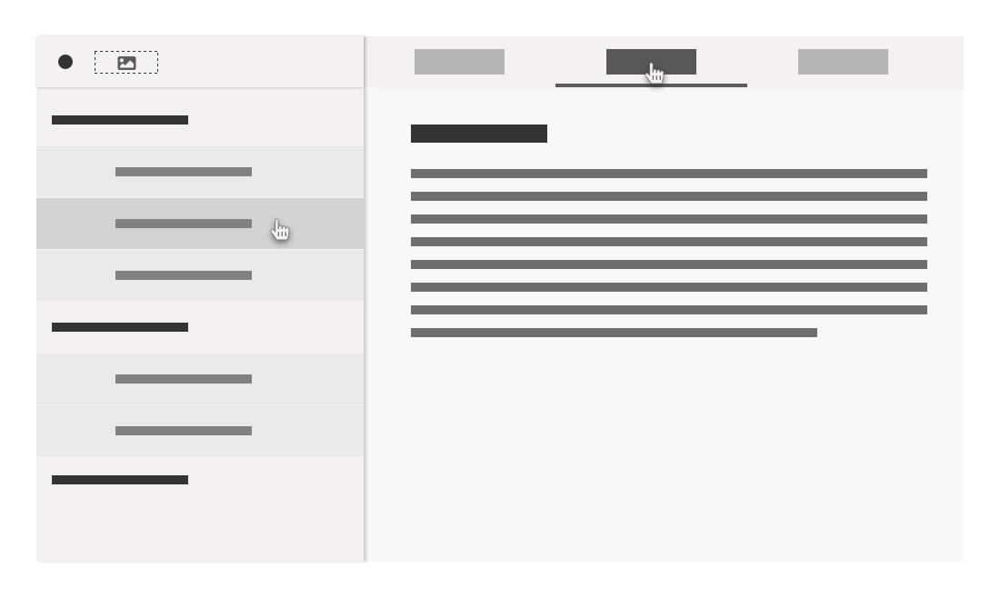
*Exemplo Combinado de Menu Aninhado e Tabs - Neste exemplo foi reforçado mais ainda um modelo de navegação aninhada e navegação lateral. Enquanto o componente Menu já possui aninhamento com itens "filhos" utiliza-se o componente Tabs para exibir itens "filhos" daqueles selecionados no Menu.*

--- 

## Referências

- [Understanding Navigation - Material Design](https://material.io/design/navigation/understanding-navigation.html)

- [Navigation Patterns - Material Design](https://material.io/archive/guidelines/patterns/navigation.html)

- [Step by step navigation - GOV.UK Design System](https://design-system.service.gov.uk/patterns/step-by-step-navigation/)

