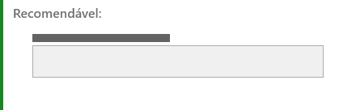
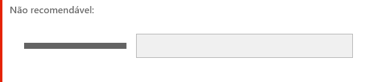

# *Microcopy*

Definimos o *microcopy* como sendo todas interações textuais encontrados nos diversos componentes ou elementos da interface.

Esse documento tem por finalidade orientar a criação e utilização de *microcopies* nos componentes e elementos do *design system*.

---

## Entendendo o conteúdo

Para tornar as recomendações mais dinâmicas, agrupamos as recomendações por afinidades em 7 grandes grupos:

1. Ação;
1. Entrada de Dados;
1. Estrutura de *Layout*;
1. *Feedback*;
1. Navegação;
1. Visualização de Dados;
1. SEO.

Quando houver recomendações específicas para determinado elemento, elas serão feitas no tópico "Orientações específicas" ou diretamente na diretriz dos próprios componentes.

### 1. Ação

**Elementos de ação** permitem ao usuário realizar uma ação específica dentro da interface, por meio de uma interação com o intuito de obter informações.  

Os textos para interação têm a função de chamar a atenção do usuário, guiar e incentivá-lo a interagir com os elementos. Portanto, esse tipo de *microcopy* precisa ser bem assertivo, conciso e com as palavras certas para impactar quem lê.

São exemplos de elementos de ação:

- ***Button***
- ***Hyperlink***
- ***Magic Button***
- ***Tag*** (de interação)

#### Boas práticas

- Escreva rótulos curtos, objetivos e claros. O ideal é que sejam utilizadas no máximo duas palavras (três quando for inevitável).

- Evite truncar rótulos.

- Não use verbos nos labels das *tags*. Opte por substantivos ou adjetivos.

- Mantenha o texto dos componentes de ação em uma única linha.

- Utilize termos familiares para os usuários.

- Apenas a primeira letra do rótulo deve ser maiúscula. *Buttons* são as exceções.

- Evite sempre que possível siglas e/ou abreviações.

- Mantenha a consistência semântica entre todos os componentes de ação e, se possível, com os demais componentes também.

#### Orientações específicas

- Utilize a menor quantidade de palavras possível, desde que não haja perda de sentido. No exemplo abaixo há perda de sentido ao deixar de utilizar os termos "todos os").

<blockquote style="border-left: 4px solid #168821">
<b>Recomendável:</b> Remover todos os usuários
</blockquote>

<blockquote style="border-left: 4px solid #E52207">
<b>Não recomendável:</b> Remover usuários
</blockquote>

- Nos *buttons*, as letras iniciais de todas as palavras devem ser maiúsculas, exceto artigos e preposições.

<blockquote style="border-left: 4px solid #168821">
<b>Recomendável:</b> Gerar Relatório
</blockquote>

<blockquote style="border-left: 4px solid #E52207">
<b>Não recomendável:</b> Gerar relatório
</blockquote>

- Use verbos que especifiquem claramente a ação pretendida. O ideal é que o usuário saiba o que a ação vai causar, sem necessariamente ler todo o conteúdo. Uma boa dica é utilizar o mesmo verbo do *button* na pergunta, isso ajuda a completar o sentido da ação. Evite *buttons* com apenas "Sim" e "Não".

<blockquote style="border-left: 4px solid #168821">
<b>Recomendável:</b> Quer salvar seus dados? Voltar / Salvar
</blockquote>

<blockquote style="border-left: 4px solid #E52207">
<b>Não recomendável:</b> Quer salvar seus dados? Sim / Não
</blockquote>

- Inicie o texto do *button* com um verbo no infinitivo para apelar à ação e refira-se prioritariamente ao resultado que o usuário vai obter com o clique.

<blockquote style="border-left: 4px solid #168821">
<b>Recomendável:</b> Acessar Minha Conta / Cancelar Envio / Enviar Documento
</blockquote>

<blockquote style="border-left: 4px solid #E52207">
<b>Não recomendável:</b> Acessar / Cancelar / Enviar
</blockquote>

- Não use artigos. Eles podem confundir algo que é mais simples, aumentando o comprimento de uma linha, além de gerar outros efeitos indesejados.

<blockquote style="border-left: 4px solid #168821">
<b>Recomendável:</b> Adicionar Marcação
</blockquote>

<blockquote style="border-left: 4px solid #E52207">
<b>Não recomendável:</b> Adicionar uma Marcação
</blockquote>

- Caso não haja texto no *button*, tenha certeza de que ícone expressa bem a ação desejada. Se for necessário, utilize tooltip para reforçar a intenção do ícone.

- Não use verbos de ação nos labels das *tags*. Opte por substantivos ou adjetivos.

<blockquote style="border-left: 4px solid #168821">
<b>Recomendável:</b> Criação de conteúdo
</blockquote>

<blockquote style="border-left: 4px solid #E52207">
<b>Não recomendável:</b> Criar conteúdo
</blockquote>

- Os *hyperlinks* devem fornecer informações sobre a ação ou destino associado. Tente evitar “clique aqui” ou “saiba mais”.

<blockquote style="border-left: 4px solid #168821">
<b>Recomendável:</b> Cadastre-se
</blockquote>

<blockquote style="border-left: 4px solid #E52207">
<b>Não recomendável:</b> Clique aqui para se cadastrar.
</blockquote>

- O microcopy de *hiperlink* deve ser objetivo, indicando o seu destino de forma clara. Evite criar *hyperlinks* em frases ou expressões longas. Opte pelo uso de palavras-chave.

<blockquote style="border-left: 4px solid #168821">
<b>Recomendável:</b> O vestibular está com <a>inscrições abertas</a>.
</blockquote>

<blockquote style="border-left: 4px solid #E52207">
<b>Não recomendável:</b> <a>O vestibular está com inscrições abertas</a>.
</blockquote>

- Utilize estratégicas de *“call-to-action“* para elaborar microtextos nos rótulos dos *magic buttons*. Informe aos usuários qual ação eles realizarão se clicarem no botão. O texto deve ser curto, informativo e impactante de modo a chamar a atenção dos usuários, induzindo-os à ação.

- Forneça um *hiperlinks* sempre que estiver se referindo a algo relevante ou recursos de um site externo.

### 2. Entrada de Dados

**Elementos de entrada de dados** são todos aqueles que servem para o usuário inserir dados ou informações. Geralmente são utilizados na criação de formulários.

São exemplos de elementos de entrada de dados:

- ***Checkbox***
- ***Input***
- ***Radio***
- ***Select***
- ***Switch***
- ***Text area***
- ***Upload***

#### Boas práticas

- Considere apenas a letra inicial da sentença maiúscula. Não deixe o texto todo em caixa alta.

- Utilize rótulos sucintos, descritivos, completos e objetivos (procure utilizar no máximo 3 palavras) para informar ao usuário de maneira rápida qual informação deve ser preenchida no elemento de formulário.

- Mantenha a consistência: se optar pelos dois pontos “:” no final do rótulo mantenha esse padrão em todos os elementos do formulário.

- Os títulos dos formulários devem explicar clara e rapidamente o objetivo do formulário.

#### Orientações específicas

- É recomendável rótulos no topo dos componentes de formulário, pois tornam imediata a visualização por parte dos usuários. Outra vantagem é que não ocupam espaço na horizontal, sendo possível usar rótulos com tamanhos grandes, especialmente em telas de *smartphones*.

- Os textos dos rótulos devem ser positivos, breves, claros e diretos.

<blockquote style="border-left: 4px solid #168821">
<b>Recomendável:</b> Cancelar envio de e-mails.
</blockquote>

<blockquote style="border-left: 4px solid #E52207">
<b>Não recomendável:</b> Não me envie mais e-mails.
</blockquote>

- As opções em componentes de **seleção múltipla** devem estar ordenadas com base em diferentes critérios como: ordem alfabética ou numérica, preço (mais caro para o mais barato ou vice-versa), por escala (tamanho ou magnitude), popularidade entre os usuários, lucratividade (produto mais lucrativo para o menos lucrativo), etc.

<blockquote style="border-left: 4px solid #168821">
<b>Recomendável:</b> Armando, Bárbara, Cláudio, Danilo, Érica, Fernanda...
</blockquote>

<blockquote style="border-left: 4px solid #E52207">
<b>Não recomendável:</b> Cláudio, Armando, Fernanda, Érica, Danilo,...
</blockquote>

- Sempre que possível, evite que os textos do *select* sejam muito extensos, dificultando a leitura e entendimento das informações pelos usuários.

- Para informações mais detalhadas consulte o documento [Padrões>Formulário](/ds/padroes/design/formulario).

### 3. Estrutura de Layout

Chamamos de **componentes** ou **elementos de estrutura de *layout*** todos aqueles que funcionam para estruturar a composição das informações em uma tela.

São exemplos de elementos de estrutura de *layout*:

- ***Card***
- **Legenda de imagem**
- **Modal**
- **Textos de acessibilidade**
- **Título e subtítulos de página**

#### Boas práticas

- A recomendação de escrever textos concisos também valem para quando você precisa escrever um texto maior. Muitas vezes, só uma frase ou palavra não vai resolver o problema do seu usuário. No entanto, você pode melhorar a experiência dividindo o texto em blocos mais curtos.

- Evite usar palavras com todas as letras em maiúsculas, isso dificulta a leitura.

- Os textos devem ser escritos em uma linguagem simples e fácil de serem compreendidos pelos usuários não técnicos. Instruções devem ser simples de modo que os usuários não tenham que memorizá-las para corrigir o erro.

- **Legendas** ou **transcrições** devem estar disponíveis para todos os vídeos. As informações apresentadas nos vídeos também devem estar disponíveis em outros formatos.

#### Orientações específicas

- Os **títulos** e **subtítulos** precisam ser objetivos e concisos. Eles organizam o conteúdo para os leitores. Devem incluir as palavras-chave mais relevantes e destacar os principais pontos da página.

<blockquote style="border-left: 4px solid #168821">
<b>Recomendável:</b> Últimas Notícias
</blockquote>

<blockquote style="border-left: 4px solid #E52207">
<b>Não recomendável:</b> Página com as Últimas Notícias do Site
</blockquote>

- **Títulos** e **subtítulos** são escritos em maiúsculas e minúsculas. Evite usar pontuação final, exceto para pontos de interrogação ou quando um título tiver duas ou mais frases.

<blockquote style="border-left: 4px solid #168821">
<b>Recomendável:</b>  Lei de Acesso à Informação
</blockquote>

<blockquote style="border-left: 4px solid #E52207">
<b>Não recomendável:</b> Lei de acesso à informação.
</blockquote>

- Organize os **títulos** e **subtítulos** hierarquicamente, com os títulos primeiro, seguidos pelos subtítulos em ordem.

  - Os **títulos (H1)** dão às pessoas uma amostra do que estão prestes a ler. Use-os para títulos de páginas.

  - Os **subtítulos (H2, H3, etc.)** dividem os artigos em seções menores e mais específicos. Eles oferecem aos leitores caminhos para o seu conteúdo e o torna mais escaneável.

- O **texto alternativo** é uma forma de rotular imagens e é especialmente importante para pessoas que não conseguem ver as imagens nos sites. O texto alternativo deve descrever a imagem em uma ou duas frases curtas.

<blockquote style="border-left: 4px solid #168821">
<b>Recomendável:</b> alt="ponte no Central Park, em Nova York, cercada por árvores, flores e vegetação"
</blockquote>

<blockquote style="border-left: 4px solid #E52207">
<b>Não recomendável:</b> alt="ponte flores árvores parque verde"
</blockquote>

### 4. *Feedback*

**Elementos de *feedback*** são aqueles que fornecem algum tipo de *feedback* sobe o que ocorre no sistema com o objetivo de informar ou orientar o usuário sobre o que deve ser feito.

São exemplos de elementos de *feedback*:

- ***Empty State***
- ***Message*** (erro, sucesso, alerta e informação)
- ***Notification***
- ***Tag***
- ***Tooltip***

#### Boas Práticas

- O princípio que se aplica a todo *writing* também se aplica aos *feedbacks* do sistema. Quanto mais longa a mensagem, menos provável que seus usuários a leiam.

- As mensagens de erro devem permitir que os usuários entendam que ocorreu um erro, por que ocorreu e o que fazer para contornar a situação.

- Forneça explicações fáceis de entender sobre o erro nas páginas (erro 404 e outras páginas de erro) e qual é a melhor coisa que o usuário pode fazer neste momento.

- Evite as velhas mensagens de “Ops”. Isso não ajuda a suavizar nada para os usuários e pode até incomodá-los. Geralmente, não é um bom negócio falar com seus usuários como se fossem crianças. Lembre-se de criar mensagens de *feedbacks* compatíveis ao tom e voz do produto.

- Não zombe de seus usuários. É permitido utilizar uma linguagem mais leve e amigável, mas evite fazer humor em mensagens de erro.

- Exiba uma mensagem de sucesso confirmando a validação bem-sucedida de um formulário.

#### Orientações Específicas

- Não culpe o usuário. Os usuários já ficarão frustrados quando receberem uma mensagem de erro. Evite usar frases como “você fez” ou “você não fez” ao explicar o que deu errado. Em vez disso, mantenha as diretivas específicas sobre o que o usuário precisa fazer para remediar a ação problemática.

<blockquote style="border-left: 4px solid #168821">
<b>Recomendável:</b> Insira um endereço de e-mail válido usando o seguinte formato: nome@provedor.com.
</blockquote>

<blockquote style="border-left: 4px solid #E52207">
<b>Não recomendável:</b> Você digitou seu e-mail incorretamente.
</blockquote>

- As mensagens de sucesso servem para mostrarmos ao usuário que a ação que ele pretendia realizar deu certo. Para mostrar contentamento, é possível utilizar a palavra "sucesso" e ponto de exclamação "!" na sequência.

<blockquote style="border-left: 4px solid #168821">
<b>Recomendável:</b> O arquivo foi enviado com sucesso!
</blockquote>

<blockquote style="border-left: 4px solid #E52207">
<b>Não recomendável:</b> Arquivo enviado.
</blockquote>

- Crie *Empty States* que sejam consistentes e que transmita a finalidade da tela. Se possível, dê orientações úteis ao usuário.

<blockquote style="border-left: 4px solid #168821">
<b>Recomendável:</b> Sua galeria está vazia. Para adicionar imagens basta clicar no botão abaixo.
</blockquote>

<blockquote style="border-left: 4px solid #E52207">
<b>Não recomendável:</b> Você não possui imagens.
</blockquote>

### 5. Navegação

**Elementos de navegação** são todos aqueles que servem para criar fluxos de navegação, sejam entre páginas ou em uma mesma página.

São exemplos de elementos de navegação:

- ***Bread crumbs***
- ***Menu***
- ***Skip link***
- ***Steps***
- ***Tab***
- ***Wizard***

#### Boas práticas

- Os textos dos componentes de navegação devem ser sucintos e objetivos. Por conta do espaço limitado, deve-se evitar o uso de textos longos e quebra do texto em duas ou mais linhas.

- Prefira as letras iniciais de todas as palavras em maiúsculas, exceto artigos e preposições (O componente *Skip Link* não precisa seguir essa regra).

#### Orientações específicas

- Usuários de leitores de tela devem conseguir navegar apenas "pulando" de *link* em *link*. Para tanto, é necessário elaborar microtextos claros e objetivos para os *Skip links*, que permitam a cada usuário decidir se clica ou não no *hiperlink*, com base na leitura do microtexto, sem precisar ler todo o contexto em que o *hiperlink* está inserido.

### 6. Visualização de Dados

**Elementos de visualização de dados** são todos aqueles que servem para apresentar dados ou informações ordenadas para o usuário.

São exemplos de elementos de visualização de dados:

- ***List***
- ***Table***

#### Orientações específicas

- Use o separador de milhar para facilitar a leitura de números grandes em tabelas.

<blockquote style="border-left: 4px solid #168821">
<b>Recomendável:</b> 1.398.672,00
</blockquote>

<blockquote style="border-left: 4px solid #E52207">
<b>Não recomendável:</b> 1398672,00
</blockquote>

- Mantenha o alinhamento dos elementos de uma **tabela** consistentes conforme a orientação a seguir:

|Tipo|Alinhamento|Observação|
|------|------|------|
|Texto|Esquerda||
|Número|Direita|No entanto, ID's e, em geral, outros números que não  precisam ser adicionados devem ser alinhados à esquerda|
|Dado monetário|Direita||
|Ícone|Centro||

### 7. SEO

Além das recomendações para escrever bons textos nos elementos da interface, consideramos úteis algumas dicas para os textos relacionados ao SEO.

**SEO (*Search Engine Optimization*)** trata-se de um conjunto de técnicas que tem como objetivo posicionar páginas entre os melhores resultados dos mecanismos de busca. Por meio das técnicas de SEO é possível otimizar o site para que ele ultrapasse os demais e esteja na primeira página de resultados do *Google*, chamando a atenção dos usuários com o conteúdo mais relevante para suas buscas.

Portanto não use técnicas agressivas de SEO, como preenchimento de palavras-chave para aumentar os resultados da pesquisa. Facilite para que as pessoas e os mecanismos de pesquisa encontrem e compartilhem o conteúdo.

Aqui estão algumas maneiras simples de conseguir isso:

- Organize sua página em torno de um tópico.

- Use termos claros e descritivos em títulos e cabeçalhos relacionados ao tópico em questão.

- Use títulos descritivos para estruturar sua página e destacar informações importantes.

- Dê a cada imagem um texto alternativo descritivo.

---

## Referências

- [NN/g - Nielsen Norman Group](https://www.nngroup.com/)
- [O que é Copywriting: confira as principais técnicas e gatilhos para persuadir e vender com palavras](https://rockcontent.com/br/blog/copywriting/)
- [Copywriting: o que é e como criar textos que vendem?](https://hotmart.com/pt-br/blog/teste-2)
