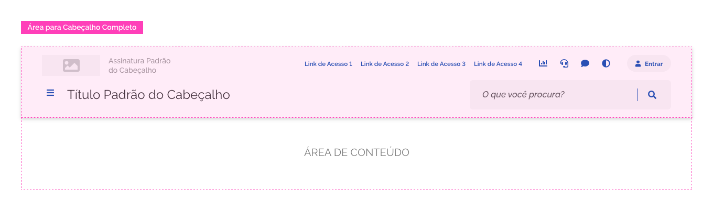
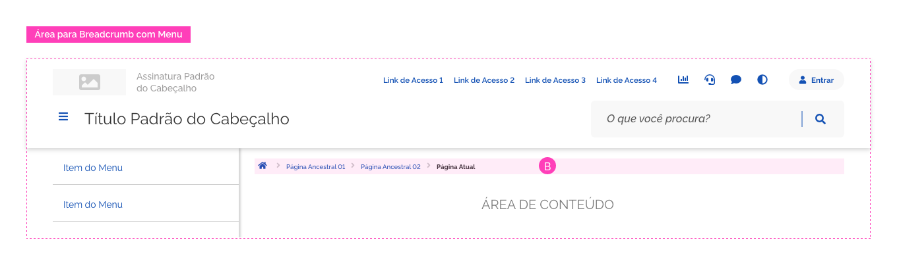
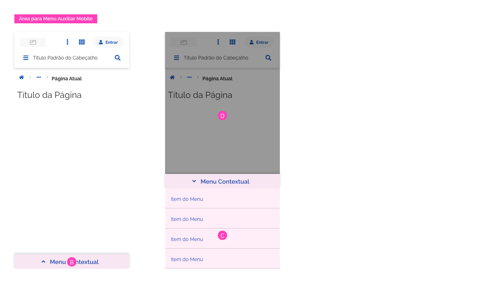
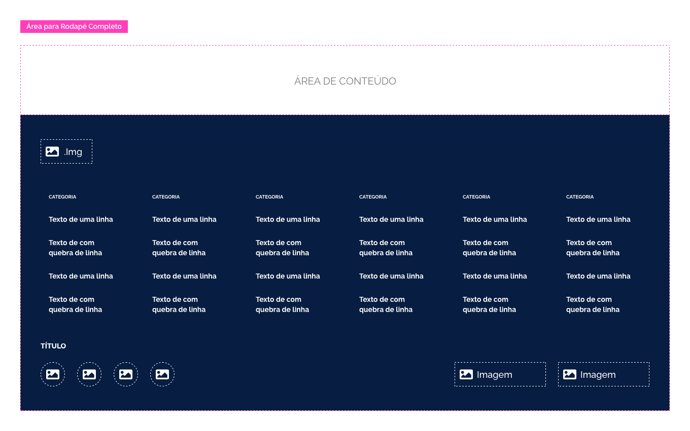
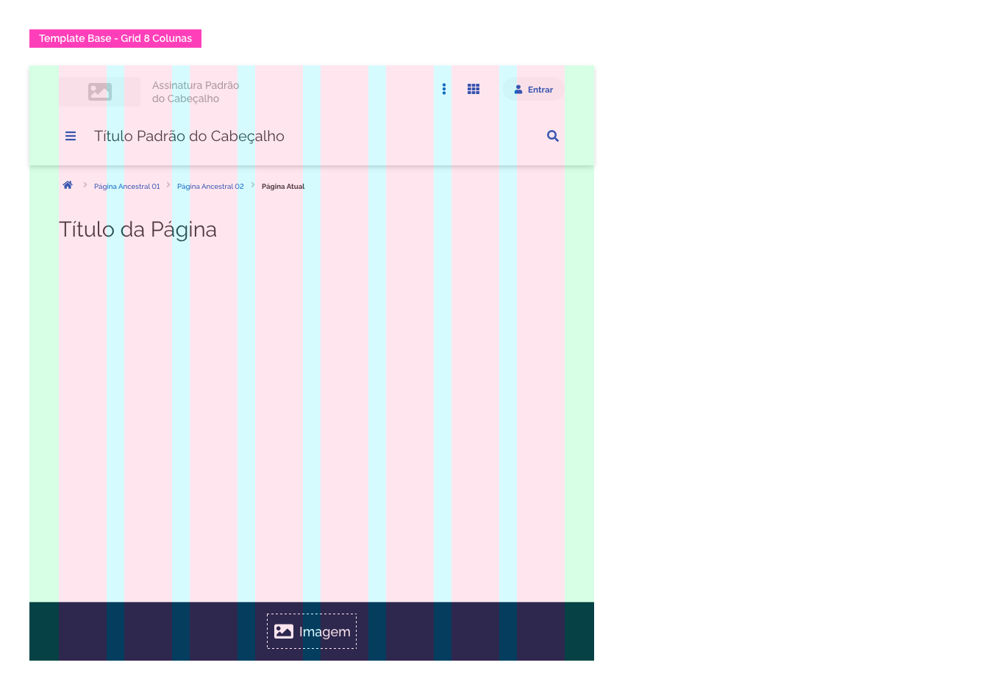
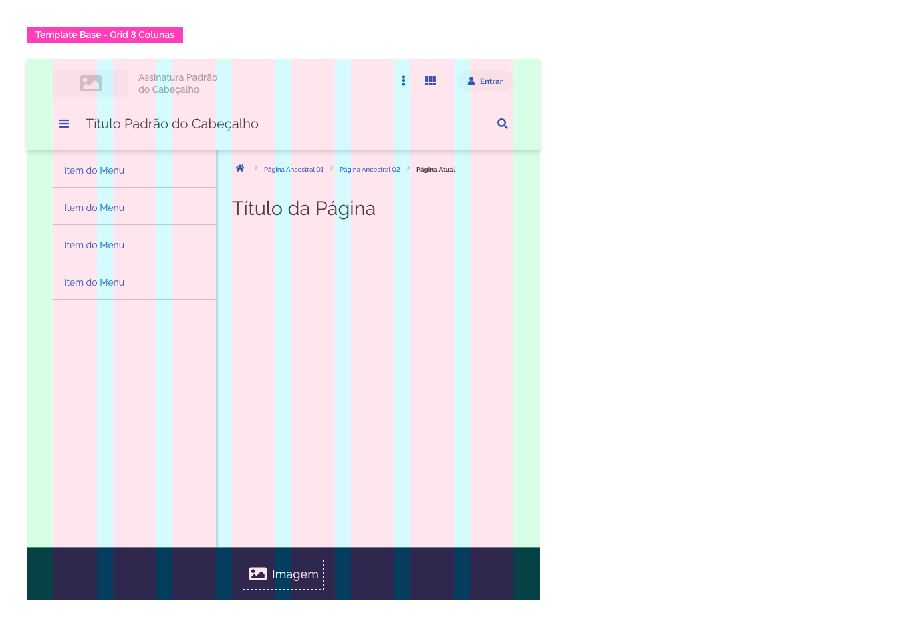
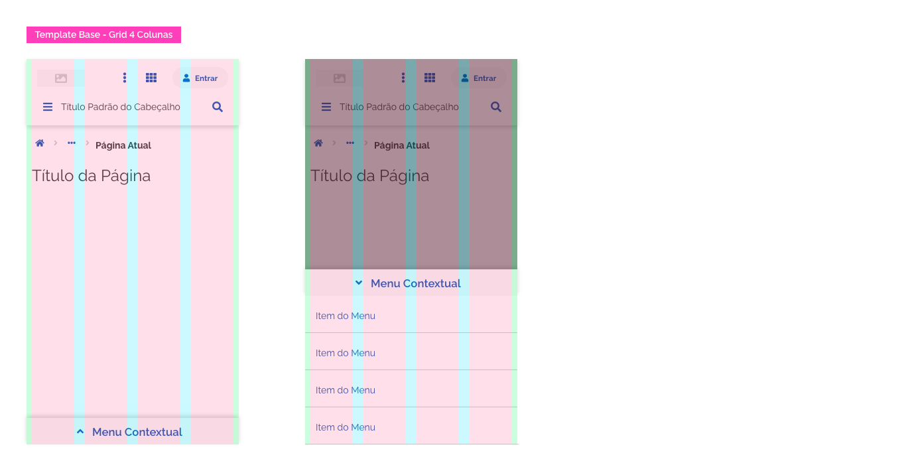
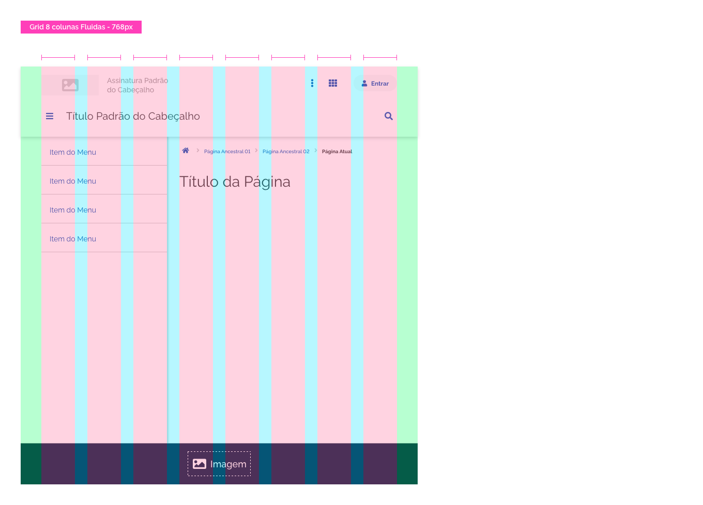
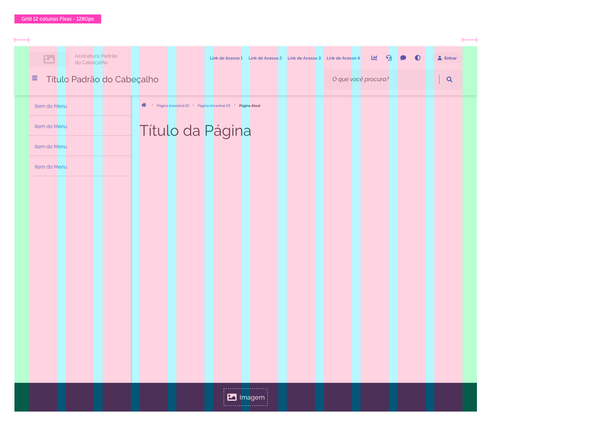
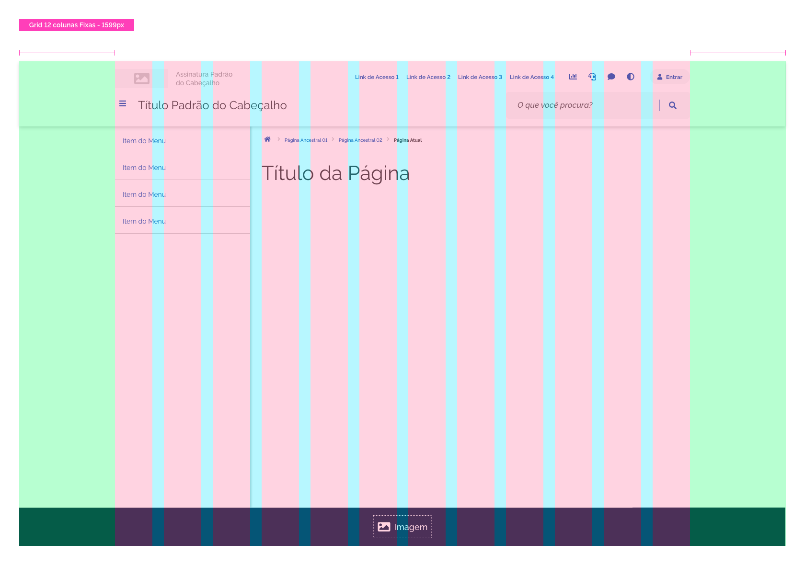

[version]: # '2.0.0'

---

## Uso

O _Base_ deve ser usado como ponto de partida para construção de uma página em projetos de layout ou como referência visual na fase de desenvolvimento e implementação de código desta página. Deve-se utilizar corretamente os tipos estruturais de cada resolução específica, assim como as dimensões e espaçamentos característicos de cada área estrutural.

---

## Anatomia

A seguir estão listadas as regiões ou áreas essenciais e opcionais que fazem parte do _Base_.

1. Área para Cabeçalho
2. Área para Breadcrumbs (Opcional)
3. Área para Menu Auxiliar (Opcional)
4. Área para Conteúdo
5. Área para Rodapé

---

### 1. Área para Cabeçalho

Esta é uma área essencial e obrigatória no _Base_. Nesta região deve-se utilizar apenas o _Componente Cabeçalho_ com suas variações e tipos.

É importante observar que a área para o cabeçalho possui altura variável, dependendo do tipo de cabeçalho que será utilizado.

### 2. Área para Breadcrumbs (Opcional)

Esta é uma área opcional no _Base_. Aqui será usado o Componente que auxilia na navegação entre páginas, o Breadcrumbs. Esta área possui um tamanho vertical fixo, porém os espaçamentos mudam de acordo com a resolução da tela ou a presença do _Menu Auxiliar_. Verifique as dimensões e espaçamentos na seção _Design Tokens_.

A - Região definida para Breadcrumb.

B - Região definida para Breadcrumb com _Menu Auxiliar_.

### 3. Área para Menu Auxiliar (Opcional)

Esta é uma área opcional no _Base_. Esta região conterá o _Menu Auxiliar_ ou _Contextual_. Sua aparência e comportamento mudam de acordo com a resolução da tela. Esta área fica alinhada à Grid e sua largura varia de acordo com a mesma. Veja mais detalhes na seção Comportamento > Responsividade.

A - Região definida para o _Menu Auxiliar_ ou _Contextual_.

Em dispositivos móveis, Grid de 4 Colunas, o _Menu Auxiliar_ apresenta-se como mostra o exemplo abaixo.

B - Componente _Menu Contextual_ fechado.
C - Componente _Menu Contextual_ aberto.
D - Componente _Scrim_ por cima do conteúdo da página.

### 4. Área para Conteúdo

Esta é uma área essencial no _Base_. Esta região conterá todo conteúdo do site/sistema. Sua altura varia de acordo com o conteúdo da página e o usuário poderá utilizar a barra de rolagem do navegador para visualizar todo conteúdo.

A - A área de conteúdo se estende por todo espaço horizontal, respeitando as margens de proteção laterais, superior e inferior. Para mais detalhes sobre os espaçamentos consulte a seção _Design Tokens_.

B - Nos templates que contém _Menu Auxiliar_ a área de conteúdo é menor, se adequando aos espaçamentos da _Grid_. Para mais detalhes sobre os espaçamentos consulte a seção _Design Tokens_.

### 5. Área para Rodapé

Esta é uma área essencial do _Base_. Aqui será utilizado o _Componente Rodapé_ com suas variações e tipos. Sua altura varia de acordo com o tipo e complexidade do _Rodapé_.

---

## Comportamento

### Responsividade

O _Base_ possui comportamento responsivo e se adequa a todas as resoluções no DSGOV. Abaixo apresentam-se três exemplos de comportamento se adequando à três situações de uso específico, Desktop, Tablet e Smartphone.

#### A) Desktop (Grid de 12 Colunas)

#### B) Tablet (Grid de 8 Colunas)

#### C) Smartphone (Grid de 4 Colunas)

O _Base_ com _Menu Auxiliar_ possui o mesmo comportamento.

#### A) Desktop (Grid de 12 Colunas)

Observe que a largura do _Menu Contextual_ se ajusta à largura das 3 primeiras colunas da _Grid_.

#### B) Tablet (Grid de 8 Colunas)

Observe que a largura do _Menu Contextual_ se ajusta à largura das 3 primeiras colunas da _Grid_.

#### C) Smartphone (Grid de 4 Colunas)

Na versão para Grid de 4 Colunas há uma adaptação substancial no _Menu Contextual_. Este se apresenta como uma barra na base da área visível da tela. Ao _Touch_ do usuário, o _Menu Contextual_ expande de baixo para cima e ocupa parte da tela. Por trás do _Menu Contextual_ a tela é coberta pelo _Componente Scrim_, dando foco ao _Menu_.

Ao rolar a tela, a barra do Menu Contextual permanecerá sempre fixa na base da área visível da tela.

#### Largura Fixa x Largura Fluida

Como observado nos exemplos acima, cada tipo de _Grid_ é composto pelo número de colunas, largura das colunas, espaçamentos entre colunas e espaçamentos laterais. Contudo, é importante observar que a largura do Base em resoluções diferentes pode variar bastante, mesmo em cada modelo de Grid (12, 8 ou 4 colunas).

Por exemplo, numa Grid de 12 colunas é possível ter resoluções distintas, com 1280px, 1440px, 1600px etc. O mesmo ocorre em Grids de 8 e 4 colunas com resoluções menores. Tendo em vista este aspecto, os tipos de Grids possuem comportamentos diferentes:

-   Grids de 4 e 8 colunas possuem comportamento fluido;
-   Grids de 12 colunas possuem comportamento fixo.

##### Grid de 4 e 8 colunas - Comportamento Fluido

Adequado para:

-   Smartphone Portrait
-   Smartphone Landscape
-   Tablet Portrait
-   Tablet Landscape

Observe que o tamanho das margens laterais e espaçamentos entre colunas permanecem fixos, enquanto que as larguras das colunas variam de tamanho.

###### Grid de 4 colunas

###### Grid de 8 colunas

##### Grid de 12 colunas - Comportamento Fixo

Adequado para:

-   Desktop
-   TV

Nesta situação a largura das colunas e espaçamentos entre colunas permanecem fixos e as margens externas variam de tamanho. É importante observar que a área que compreende todo conteúdo possui uma largura fixa de 1200px. Consulte maiores detalhes na documentação da _Grid_.

Note que as áreas de Cabeçalho e Rodapé sangram a _Grid_, porém o conteúdo interno dessas áreas permanecem respeitando as margens. Consulte maiores detalhes na documentação da _Grid_.

---

## Design Tokens

### Espaçamentos (Grid de 12 Colunas)

| Name                                      | Property      | Value  |
| ----------------------------------------- | ------------- | ------ |
| Área para Cabeçalho                       | margin-top    | `0px`  |
| Área para Cabeçalho                       | margin-bottom | `16px` |
| Área para Cabeçalho                       | margin-left   | `0px`  |
| Área para Cabeçalho                       | margin-right  | `0px`  |
| Área para Breadcrumbs                     | margin-top    | `16px` |
| Área para Breadcrumbs                     | margin-left   | `40px` |
| Área para Breadcrumbs (com Menu Auxiliar) | margin-left   | `24px` |
| Área para Breadcrumbs                     | margin-right  | `40px` |
| Área para Breadcrumbs                     | margin-bottom | `24px` |
| Área para Menu Auxiliar                   | margin-top    | `0px`  |
| Área para Menu Auxiliar                   | margin-bottom | `0px`  |
| Área para Menu Auxiliar                   | margin-left   | `40px` |
| Área para Menu Auxiliar                   | margin-right  | `24px` |
| Área para Conteúdo                        | margin-top    | `24px` |
| Área para Conteúdo                        | margin-bottom | `40px` |
| Área para Conteúdo                        | margin-left   | `40px` |
| Área para Conteúdo (com Menu Auxiliar)    | margin-left   | `24px` |
| Área para Conteúdo                        | margin-right  | `40px` |
| Área para Rodapé                          | margin-top    | `40px` |
| Área para Rodapé                          | margin-bottom | `0px`  |
| Área para Rodapé                          | margin-left   | `0px`  |
| Área para Rodapé                          | margin-right  | `0px`  |

### Espaçamentos (Grid de 8 Colunas)

| Name                                      | Property      | Value  |
| ----------------------------------------- | ------------- | ------ |
| Área para Cabeçalho                       | margin-top    | `0px`  |
| Área para Cabeçalho                       | margin-bottom | `16px` |
| Área para Cabeçalho                       | margin-left   | `0px`  |
| Área para Cabeçalho                       | margin-right  | `0px`  |
| Área para Breadcrumbs                     | margin-top    | `16px` |
| Área para Breadcrumbs                     | margin-left   | `40px` |
| Área para Breadcrumbs (com Menu Auxiliar) | margin-left   | `24px` |
| Área para Breadcrumbs                     | margin-right  | `40px` |
| Área para Breadcrumbs                     | margin-bottom | `24px` |
| Área para Menu Auxiliar                   | margin-top    | `0px`  |
| Área para Menu Auxiliar                   | margin-bottom | `0px`  |
| Área para Menu Auxiliar                   | margin-left   | `40px` |
| Área para Menu Auxiliar                   | margin-right  | `24px` |
| Área para Conteúdo                        | margin-top    | `24px` |
| Área para Conteúdo                        | margin-bottom | `24px` |
| Área para Conteúdo                        | margin-left   | `40px` |
| Área para Conteúdo (com Menu Auxiliar)    | margin-left   | `24px` |
| Área para Conteúdo                        | margin-right  | `40px` |
| Área para Rodapé                          | margin-top    | `24px` |
| Área para Rodapé                          | margin-bottom | `0px`  |
| Área para Rodapé                          | margin-left   | `0px`  |
| Área para Rodapé                          | margin-right  | `0px`  |

### Espaçamentos (Grid de 4 Colunas)

| Name                                   | Property      | Value  |
| -------------------------------------- | ------------- | ------ |
| Área para Cabeçalho                    | margin-top    | `0px`  |
| Área para Cabeçalho                    | margin-bottom | `16px` |
| Área para Cabeçalho                    | margin-left   | `0px`  |
| Área para Cabeçalho                    | margin-right  | `0px`  |
| Área para Breadcrumbs                  | margin-top    | `16px` |
| Área para Breadcrumbs                  | margin-bottom | `16px` |
| Área para Breadcrumbs                  | margin-left   | `8px`  |
| Área para Breadcrumbs                  | margin-right  | `8px`  |
| Área para Menu Auxiliar                | margin-top    | `16px` |
| Área para Menu Auxiliar                | margin-bottom | `0px`  |
| Área para Menu Auxiliar                | margin-left   | `0px`  |
| Área para Menu Auxiliar                | margin-right  | `0px`  |
| Área para Conteúdo                     | margin-top    | `16px` |
| Área para Conteúdo                     | margin-bottom | `16px` |
| Área para Conteúdo                     | margin-left   | `8px`  |
| Área para Conteúdo                     | margin-right  | `8px`  |
| Área para Rodapé                       | margin-top    | `16px` |
| Área para Rodapé (com Menu Contextual) | margin-top    | `0px`  |
| Área para Rodapé                       | margin-bottom | `0px`  |
| Área para Rodapé                       | margin-left   | `0px`  |
| Área para Rodapé                       | margin-right  | `0px`  |
