[version]: # (3.0.3)

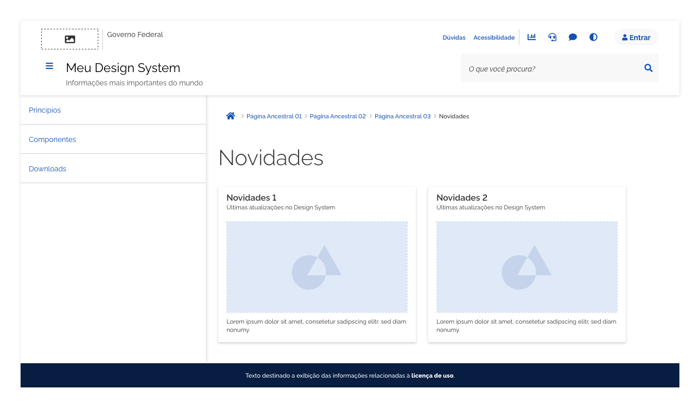
*Exemplo de tela contendo elementos dentro do modelo _Base_.* 

O _template base_ deve ser utilizado como ponto de partida para construção de uma página em projetos de _layout_ ou como referência visual na fase de desenvolvimento e implementação de código da página. Deve-se utilizar corretamente os tipos estruturais de cada resolução específica, assim como as dimensões e espaçamentos definidos de cada área estrutural.

---

## Anatomia

A anatomia do Base é dividida por áreas ou regiões onde podemos encontrar componentes específicos ou tipos de conteúdo. Cada região possui suas regras que devem ser seguidas ao longo da navegação da interface.

1. Área de Cabeçalho
1. Área de Conteúdo;
1. Área de Localização (_opcional_);
1. Área de Navegação (_opcional_);
1. Área de Rodapé.

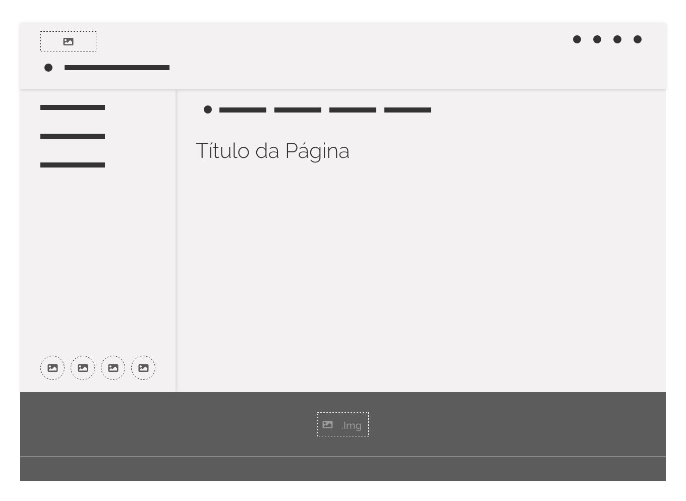
*Divisões das áreas do _Template Base_.*

---

## Detalhamento dos itens

### 1. Área de cabeçalho

Esta é uma área essencial e obrigatória no _template base_. Nesta região deve-se utilizar apenas o componente _header_ com suas variações.

Todos os comportamentos e outras regras definidas na [diretriz do _Header_](/components/header) devem ser utilizados dentro do _Base_.

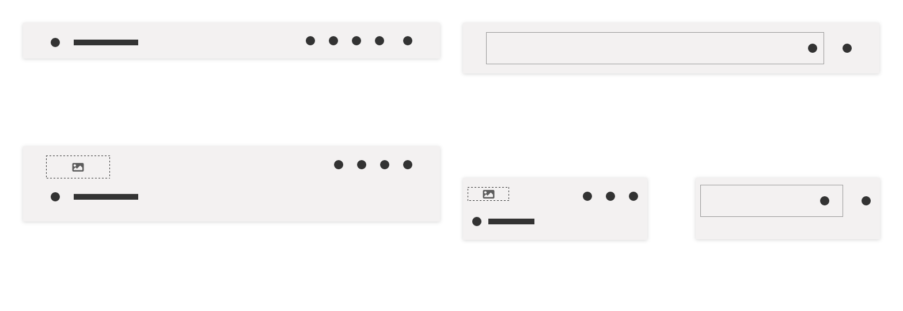
*Exemplo de diversos usos do componente _Header_ dentro do _Base_.*

É importante observar que a área para o cabeçalho possui altura variável, dependendo do tipo de comportamento utilizado.

### 2. Área de conteúdo

Esta é uma área essencial no _template base_. Esta região contém todo conteúdo específico de uma página. Pode-se utilizar de qualquer elemento ou componente para que o usuário consiga entender e interagir com a solução proposta.

Sua altura varia de acordo com o conteúdo da página e o usuário poderá utilizar a barra de rolagem do navegador para visualizar todo o conteúdo disponível.

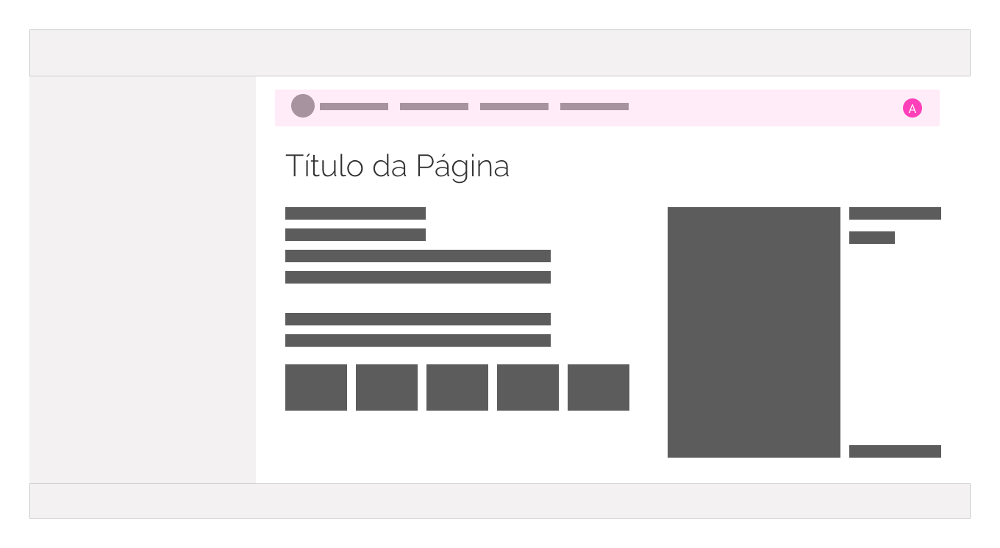
*Na área de conteúdo podemos encontrar a área de Localização (A). Na maioria das situações, quando o _Breadcrumb_ não for suficiente, adicione um título (logo após a área de Localização) para informar ao usuário sobre o conteúdo da página em questão.*

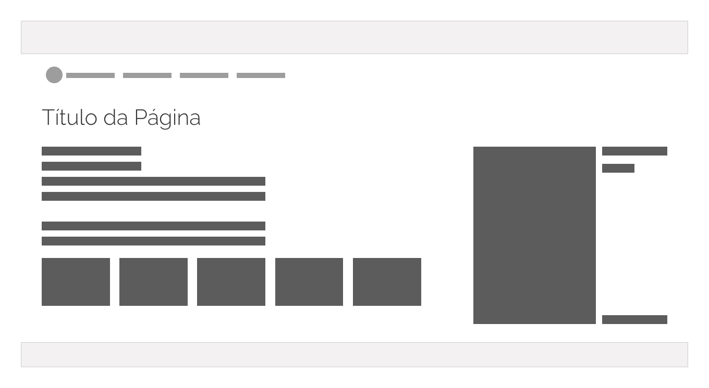
*Caso a **Área de Menu** não esteja visível, a **Área de Conteúdo** ocupará todo o espaço horizontal disponível.*

### 3. Área de localização (_opcional_)

Esta é uma área opcional e deve ser utilizado o componente _**Breadcrumb**_ para auxiliar na navegação entre as páginas existentes na aplicação e também para localização da página atual. Quando utilizada, deve ser o primeiro conteúdo exibido dentro da Área de Conteúdo.

**Observação:** Em algumas situações, a área para Localização não terá muita utilidade, como por exemplo, em telas iniciais ou em aplicações para celulares.

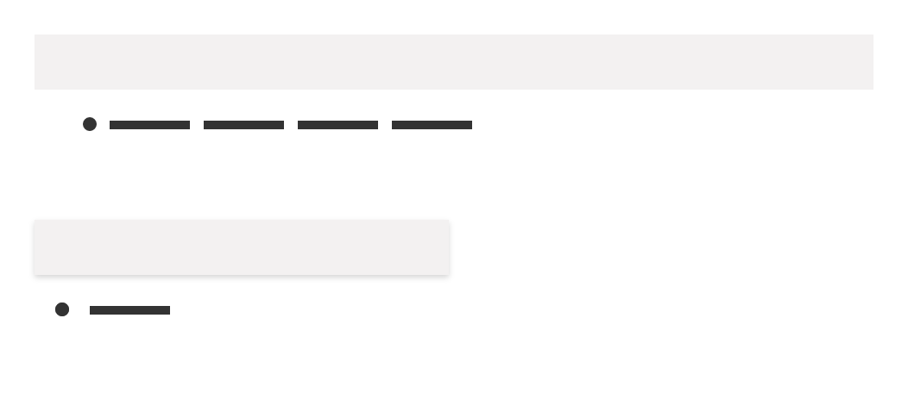
*Todos os comportamentos (e outras regras) descritas na [diretriz do _Breadcrumb_](/components/breadcrumb) podem ser utilizadas dentro da Área de Localização.*

### 4. Área de navegação (_opcional_)

Esta é uma área opcional. Esta região contém exclusivamente o componente **Menu**, utilizando-se de todas as regras e recomendações descritas em sua [diretriz](/components/menu).

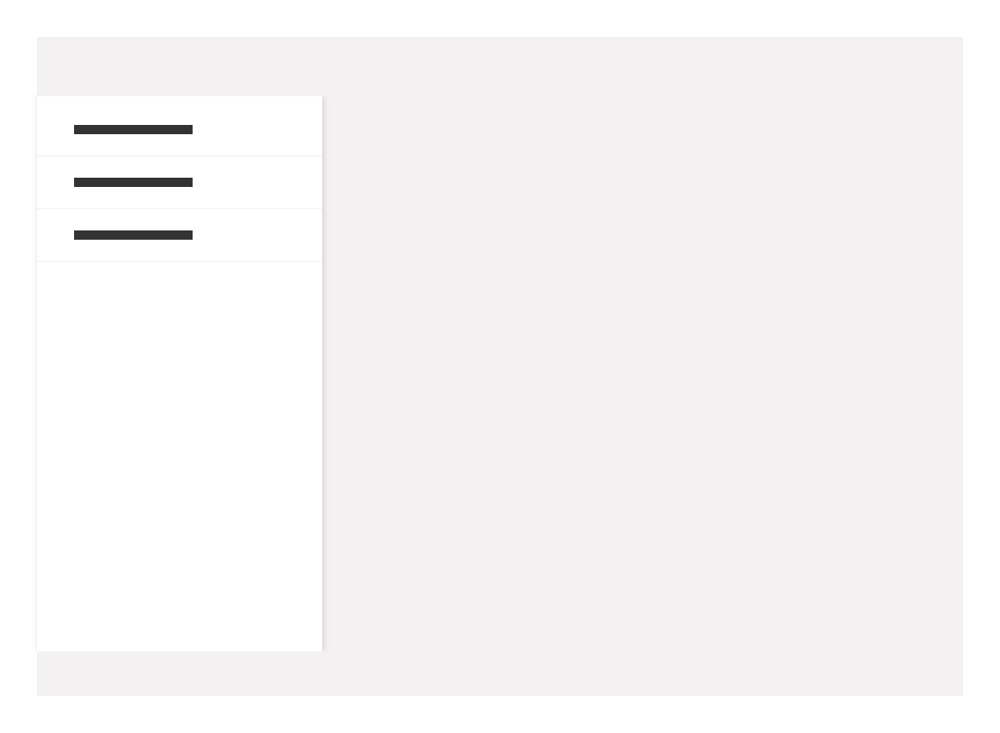
*O menu aparece à esquerda da Área de Conteúdo, podendo consumir o espaço  disponível na tela em conjunto com a área de conteúdo.*

A área de navegação é a única área que pode ter uma barra de rolagem independente.

*Enquanto as outras áreas utilizam a barra de rolagem do navegador, a área de navegação pode utilizar uma barra de rolagem exclusiva.*

**Observação:** A área de navegação pode ocupar regiões diferentes, dependendo do seu comportamento. Veja "Objetos Temporários - Área de Navegação" em Responsividade.

### 5. Área de rodapé

Esta é uma área essencial do _template base_ onde é utilizado o componente _**Footer**_ com suas variações e tipos.

Todos os comportamentos (e demais regras) definidos na [diretriz do Footer](/components/footer) devem ser utilizados dentro do _Base_.

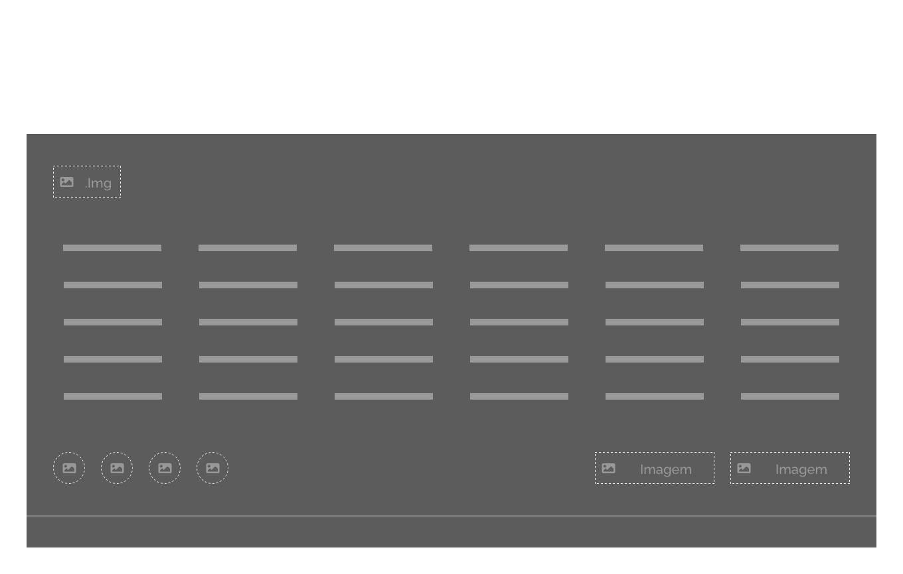
*Área de footer no template base.*

---

## Responsividade

O _Base_ pode ter o comportamento de Largura de _Grid_ Fluida ou Fixa, seguindo as recomendações previstas do [Fundamento Grid](/fundamentos-visuais/grid), ou seja, por padrão, a _Grid_ de 8 e 4 colunas o comportamento será fluida, enquanto o de 12 colunas, pode ser tanto fluida como fixa a depender do uso.

- **Largura Fixo (grid 12 colunas)**: utilizado em conteúdo informativo ou educacional, onde o conteúdo textual não pode sofrer muita alteração estrutural devido a resolução da tela. Exemplos: Portais, Blogs, Landing Pages...
- **Largura Fluida (grid 12 colunas)**: utilizado quando existe a necessidade de otimizar e aproveitar todos os espaços úteis de uma tela, tais como sistemas e aplicativos desktop por exemplo.

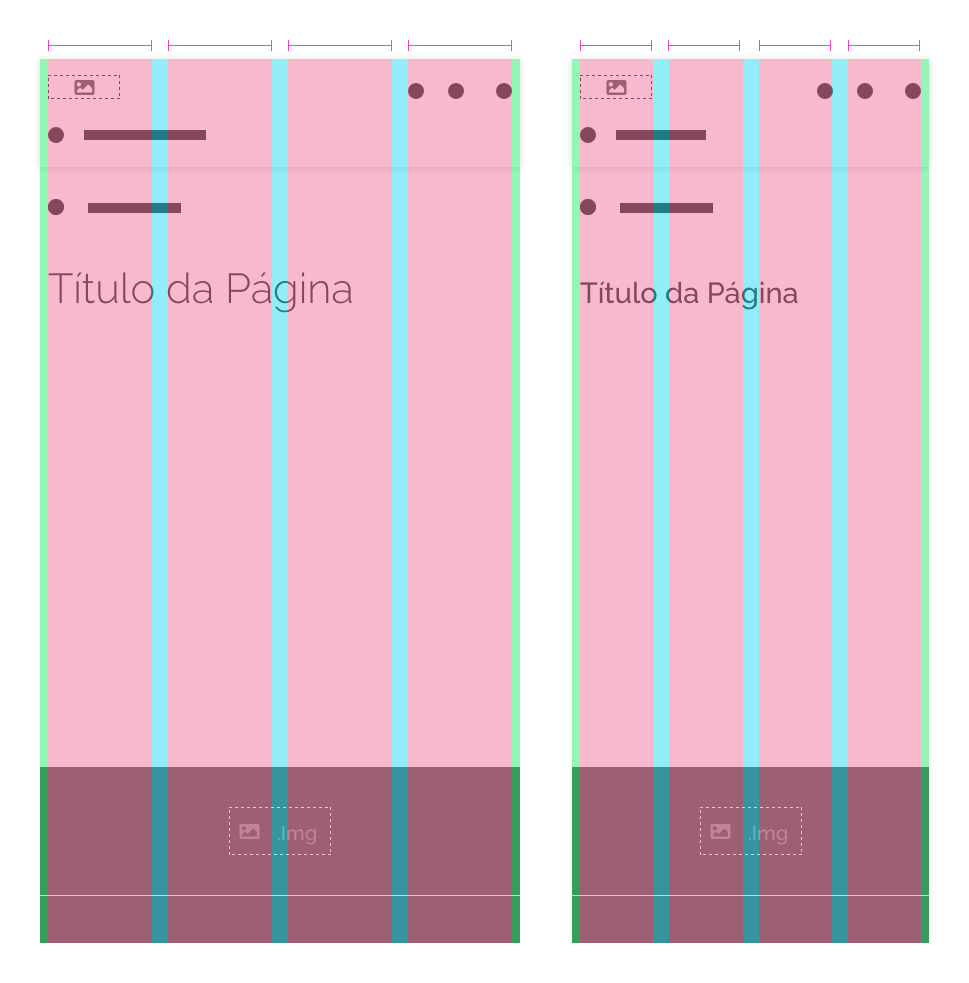
*Na _grid_ de 4 colunas o comportamento padrão é Fluido.*

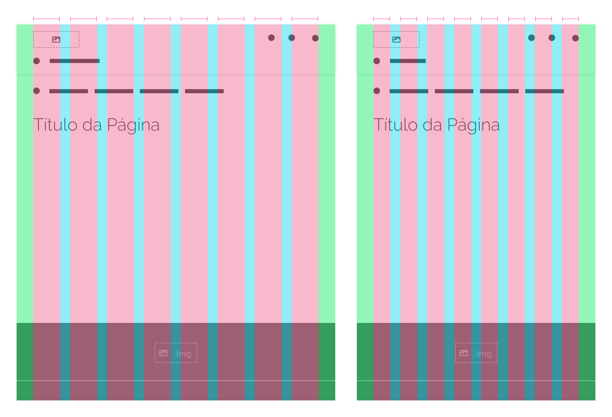
*Na _grid_ de 8 colunas o comportamento padrão é Fluido.*

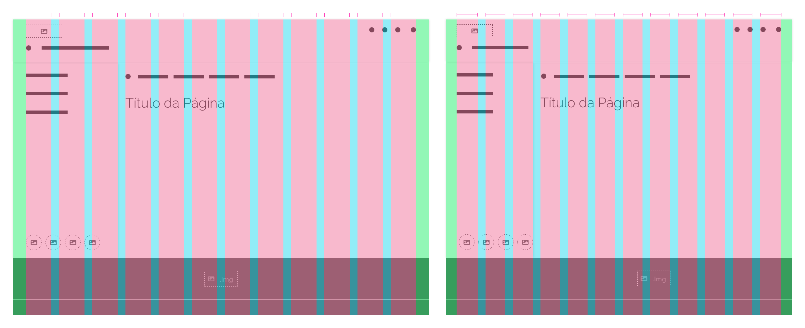
*_Grid_ de 12 colunas com comportamento Fluido.*

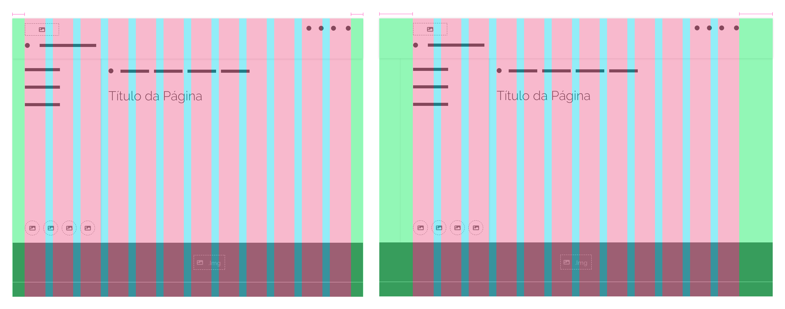
*_Grid_ de 12 colunas com comportamento Fixo.*

**Observação:** o comportamento padrão deve ser entendido como uma recomendação que consiga resolver a maioria das situações. Porém, entendemos que em alguns momentos, dependendo do contexto do projeto, outros comportamentos podem fazer mais sentido.

> **Exemplo**: um dispositivo _Tablet_ no formato paisagem, pode ser interessante utilizar uma _grid_ de 8 colunas com comportamento de largura fixa, ao invés do padrão fluido...

Independente do comportamento utilizado, lembre-se que a sangria dos elementos ainda continuam existindo (observe o _Header_ e _Footer_), porém o conteúdo ainda continua respeitando a _grid_.

As áreas do _base_ **não possuem dimensões fixas**, apenas respeitam o modelo da _Grid_ e utilizam o espaço dos elementos ou componentes determinados.

### Objetos temporários - Área de navegação 

Em alguns casos (geralmente pela falta de espaço) ou apenas para focar atenção do usuário para o conteúdo, a Área de Navegação pode ficar "escondida" até o momento da "solicitação". A solicitação pode ser executada de diversas maneiras: um "botão de menu" (encontrado no _header_), por gestos (em dispositivos de toque), via teclado ou até por comandos de voz...

Esse comportamento dinâmico (esconder/aparecer) se enquadra no conceito de **Objetos Temporários** visto na diretriz da _grid_, onde a área poderá ser **Flutuante** ou **Persistente**.

É importante definir algumas boas práticas para que esse comportamento não atrapalhe os outros elementos dispostos na _grid_ e evitem inconsistências ao longo da interface:

#### Menu flutuante

Apesar de não influenciar diretamente na _grid_, é interessante que o menu flutuante sempre esteja posicionado a esquerda da interface (como de costume) ou abaixo da interface (geralmente para dispositivos _mobiles_).

Por estar flutuando, pode ser necessário atualizar alguns atributos visuais (como sombra) para seguir as conformidades vistas no Fundamento Elevação.

Podemos simplificar o Menu Flutuante em dois modos:

1. **Comum**: Ele aparece como um elemento _dropdown_ comum.

   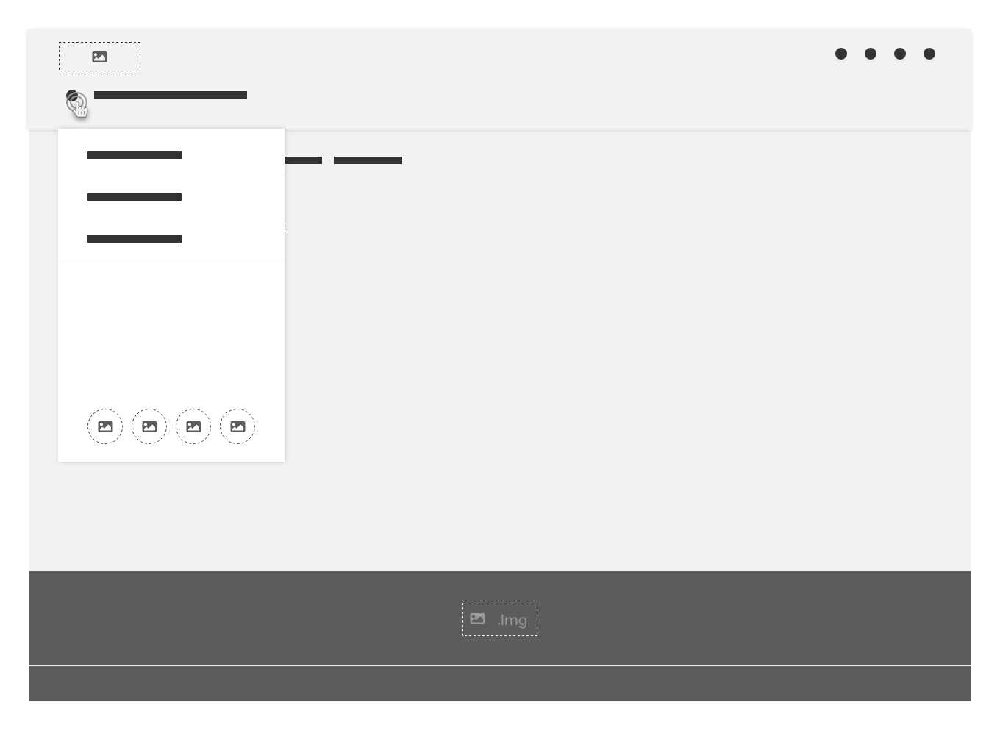
   *Aqui o _Menu_ funciona como um elemento _Dropdown_, seguindo todas as regras específicas para este comportamento.*

2. **Preenchimento**: quando necessita da atenção total do usuário. Neste caso ele pode preencher o espaço disponível da tela além de utilizar um elemento _overlay_ de Foco (veja [fundamento Superfície](/fundamentos-visuais/superficie)), destacando a navegação e deixando claro que os outros elementos da interface ainda não podem ser interagidos enquanto o menu estiver visível.

   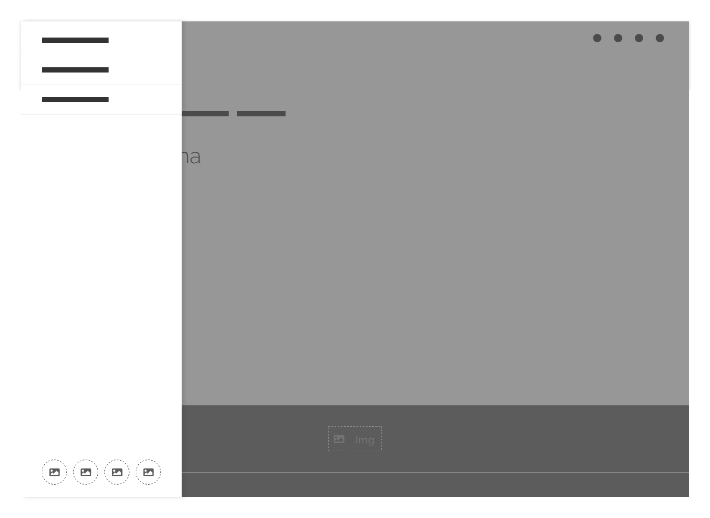
   *Quando existe a necessidade de destacar um menu flutuante. Ele utiliza toda a altura útil da tela, além de utilizar uma superfície _overlay_.*

   
   *Em dispositivos _mobile_ o menu flutuante pode estar localizado na parte inferior da tela, facilitando o acesso à área de navegação.*

#### Menu persistente

É interessante que o Menu Persistente sempre esteja posicionado à esquerda da interface (como de costume). O uso é recomendado para _Grid_ de 12 colunas ou para _grid_ de 8 colunas com _breakpoint_ _Tablet Landscape_.

Neste modo, a Área de Navegação sempre influenciará a área de conteúdo, e dependendo da necessidade de destaque, pode influenciar as outras áreas do _base_.

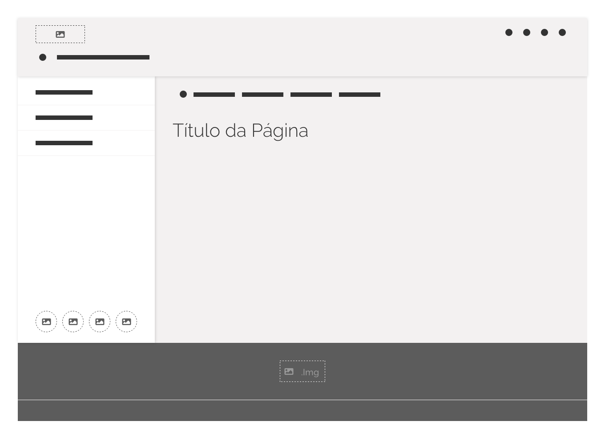
*Menu persistente pode influenciar somente a área de conteúdo.*

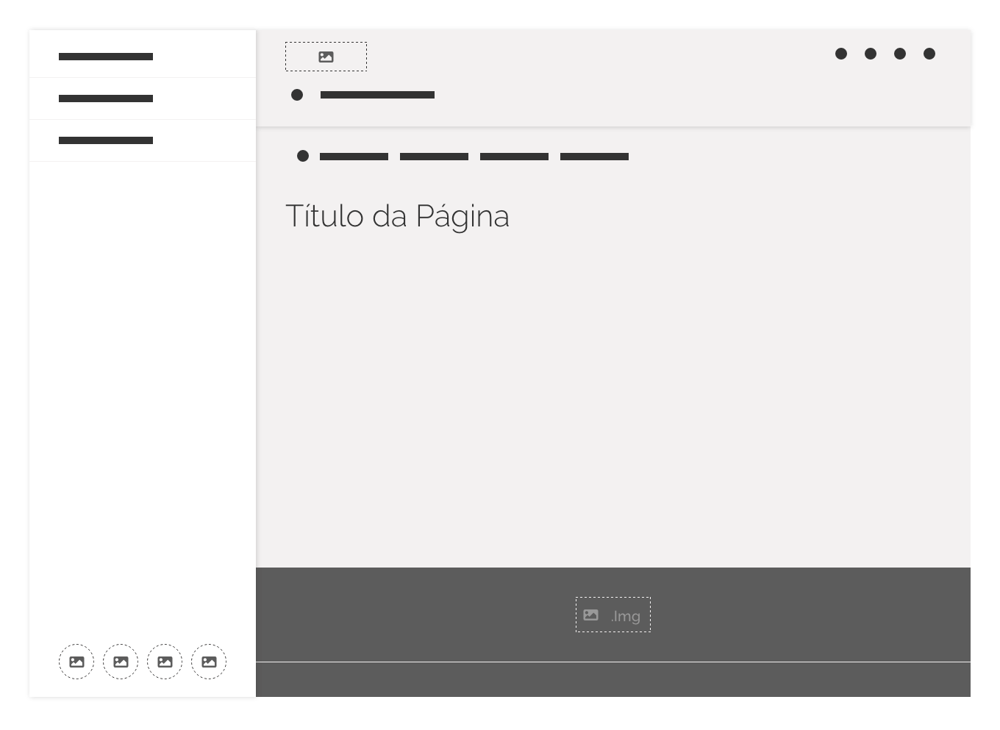
*Quando precisar chamar maior atenção do usuário, o menu pode influenciar todas as áreas. Neste caso ele empurra/puxa todas as áreas dentro da _grid_ responsiva*

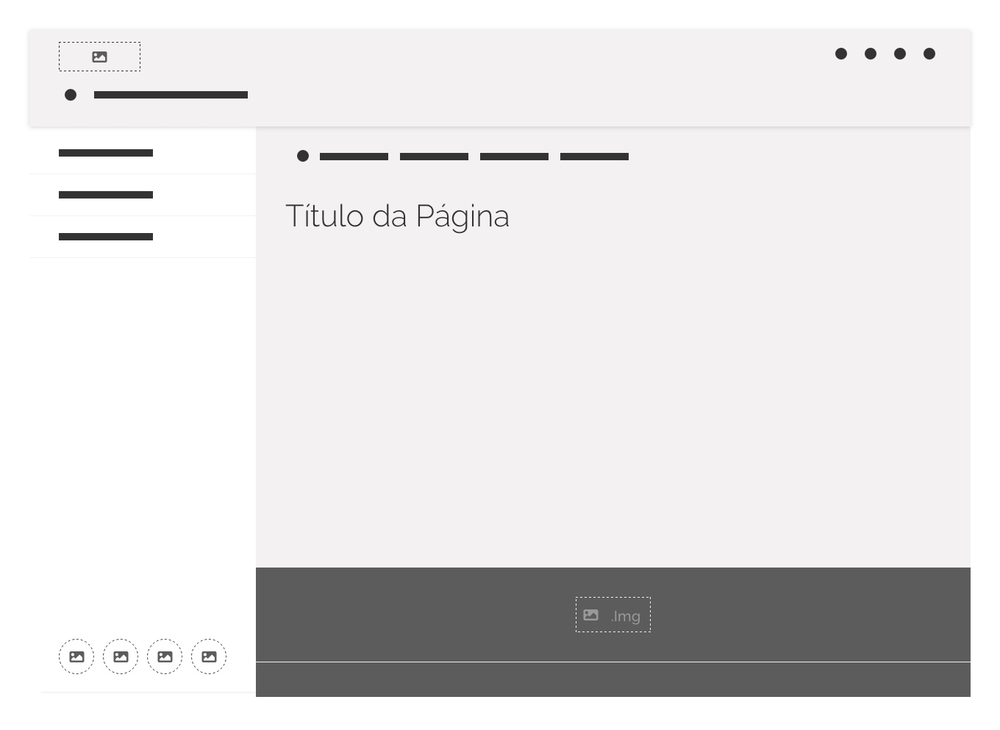
*Menu persistente pode influenciar a área de conteúdo e o rodapé.*

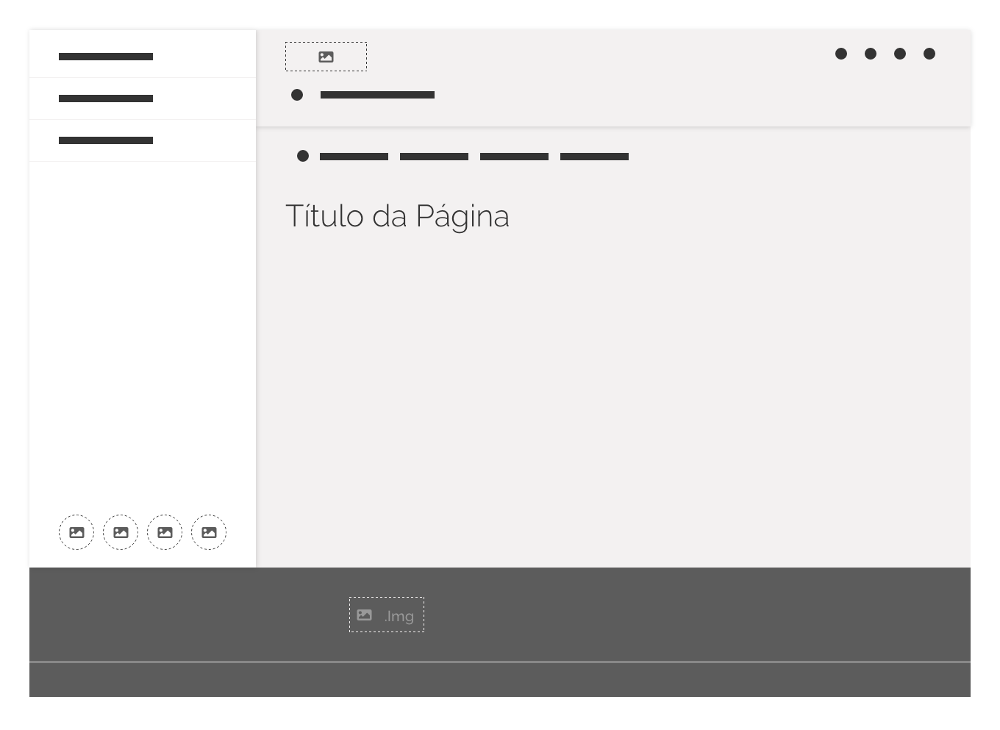
*Menu persistente pode influenciar a área de conteúdo e o cabeçalho.*

**Observação:** As boas práticas aqui listadas levam em consideração o uso das áreas dentro do modelo _base_. Para entender melhor o comportamento dos componentes citados, veja as diretrizes de cada elemento de forma individual.

> **Exemplo:** para entender como um _Menu_ se comporta em uma _Grid_, leia a sua diretriz. Nela encontrará maiores detalhes e exemplos.

---

## Acessibilidade

Tornar a navegação acessível é uma das principais preocupações a ter em mente para fornecer um acesso universal aos conteúdos. O fato dos usuários conseguirem navegar até o conteúdo que pretendem acessar, é meio caminho andado para uma interface acessível.

### Navegação com o teclado

É importante que os usuários consigam acessar todo o conteúdo e as funcionalidades apenas por meio do teclado.

Para tornar o "teclado acessível", é importante permitir que os usuários:

1- Acompanhem onde está o foco do teclado (ver documento Estados);
2- Naveguem para todos os elementos interativos;
3- Ignorem a navegação se houver muitos _links_.

Uma das armadilhas da tabulação ao longo do _layout_ de uma página é que inúmeros elementos interativos devem ser navegados de modo a chegar ao conteúdo desejado. Em algumas páginas, isso significa que os usuários podem ter que passar por inúmeros _links_ (e elementos interativos) para enfim chegar ao conteúdo principal, o que pode ser difícil, irritante e demorado.

Essa navegação pode ser facilitada por meio de atalhos, tanto no teclado como por âncoras para o conteúdo desejado.

Oferecer um menu oculto (_**skip link**_) com âncoras para as principais áreas da página fornece benefícios para usuários que usam apenas teclado sem prejudicar aqueles que usam o _mouse_ para navegar.

O GOVBR-DS conta com o componente _skip link_ para realizar essa função. Consulte-o para mais detalhes.

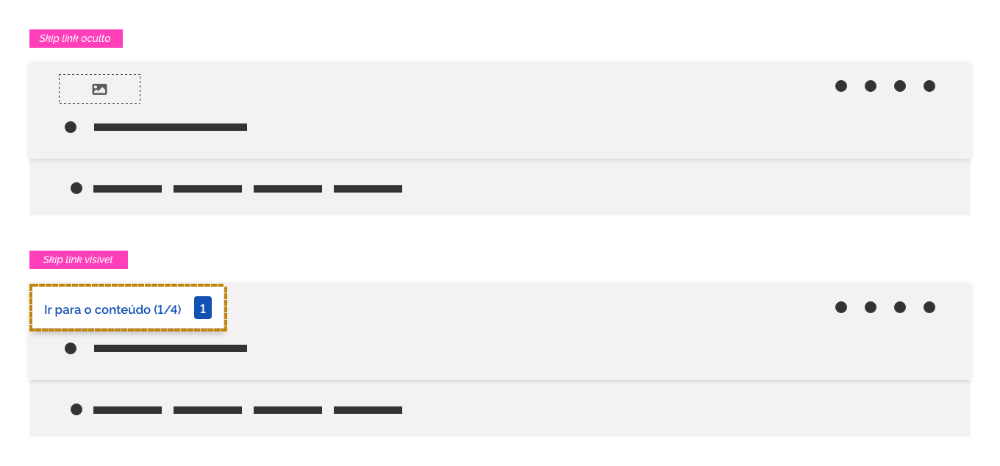
*_Skip link_ deve ficar visualmente oculto para aqueles que navegam pelo _mouse_*

Crie âncoras que façam o usuário acessar tanto o conteúdo principal como um menu de navegação principal e áreas de suporte ao usuário (como ajuda, acessibilidade, busca...).

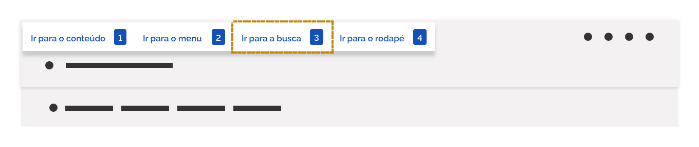
*_Skip link_ com várias opções de âncoras.*

---

## Especificação

Não existem muitas especificações visuais para o _Base_. Muitos dos elementos vão seguir as especificações de cada componente utilizado. Porém, é importante que o **conteúdo** mantenha uma distância mínima entre as áreas.

**Importante**: Os espaçamentos mínimos recomendados devem levar em consideração os espaçamentos (seja de segurança ou não) dos componentes e elementos já utilizados.

| Name                | Property | Spacing Scale Token  |
| ------------------- | :------: | :------------------: |
| Área de Cabeçalho   |  bottom  | `--spacing-scale-3x` |
| Área Navegação      |  Right   | `--spacing-scale-3x` |
| Área de Localização |  Bottom  | `--spacing-scale-3x` |
| Área Área de Rodapé |   top    | `--spacing-scale-5x` |

*Espaços mínimos que devem ser levados em consideração ao utilizar o _base_. Lembre-se de respeitar a _grid_.*

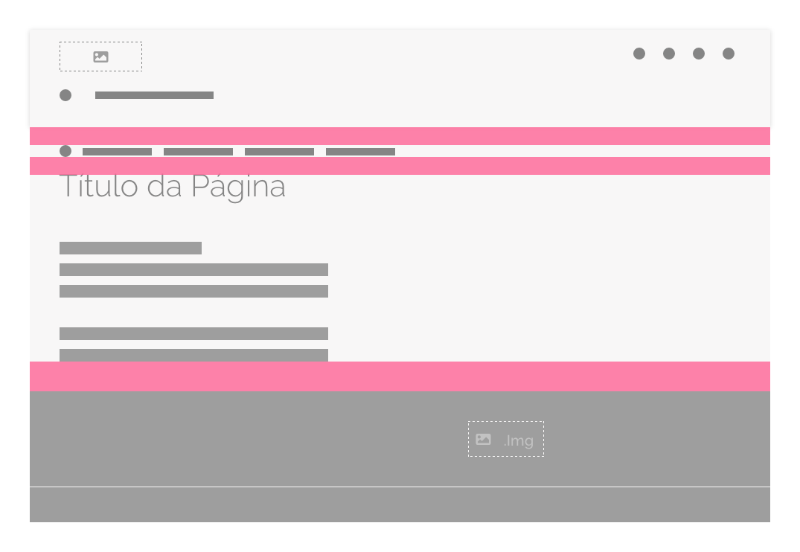
*Como a área de navegação não existe no exemplo acima, não existe necessidade de utilizar o espaçamento entre os conteúdos das outras regiões.*
