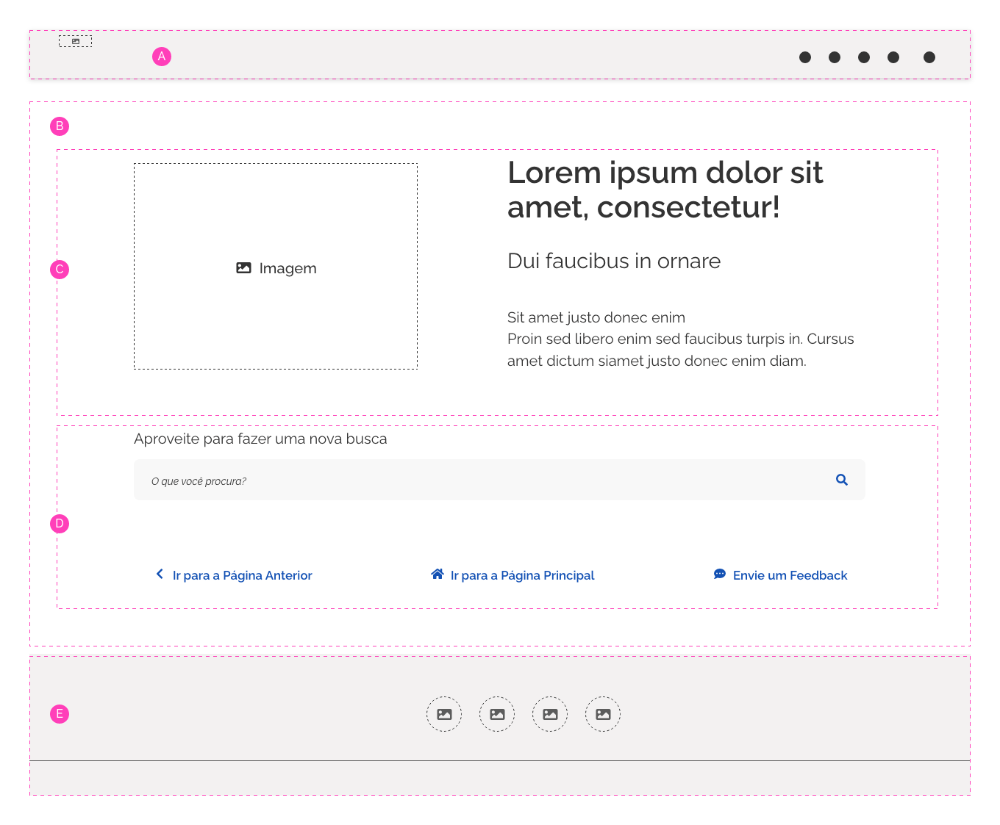
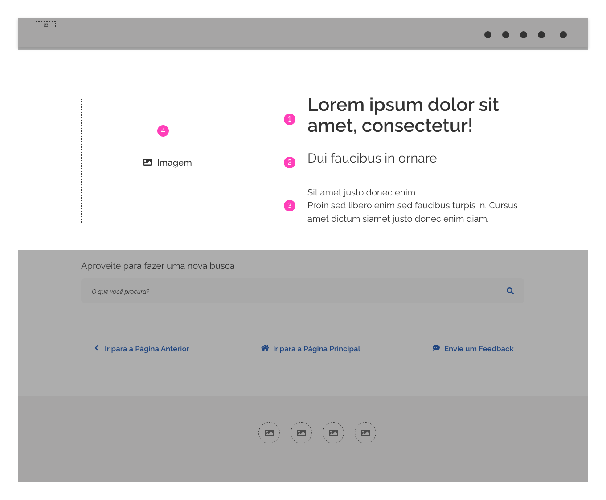
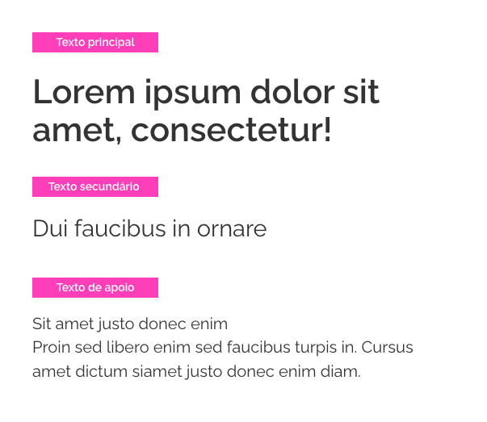
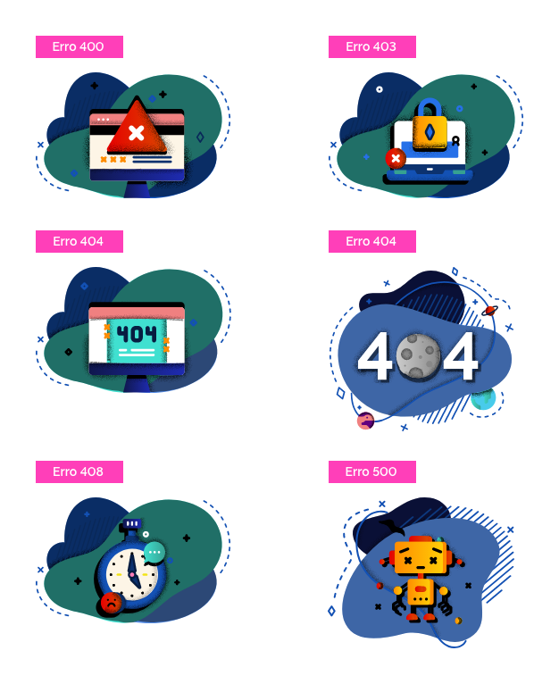
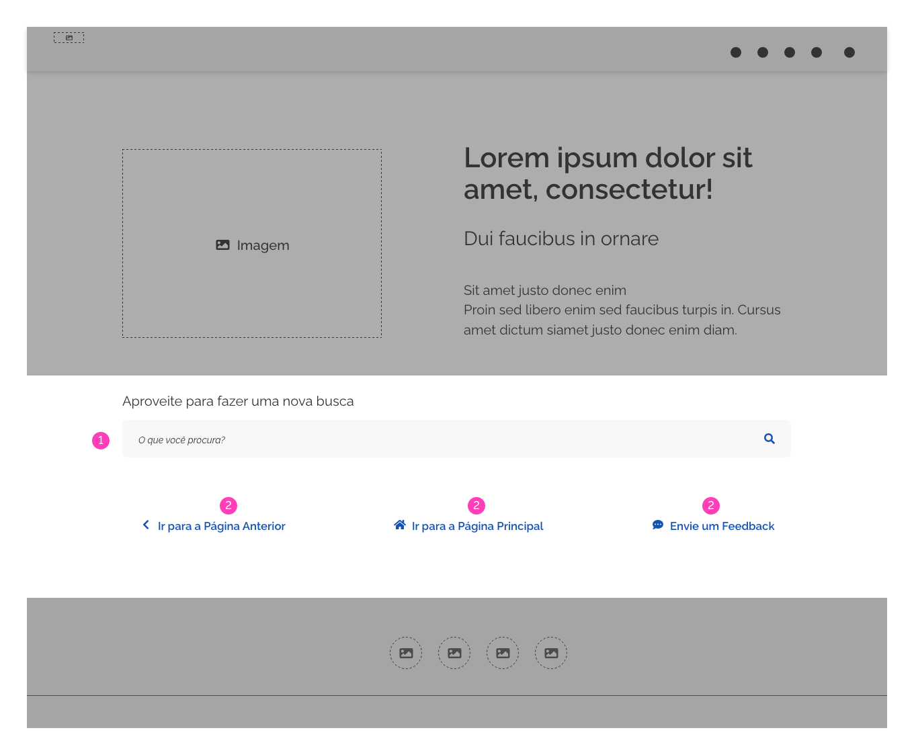
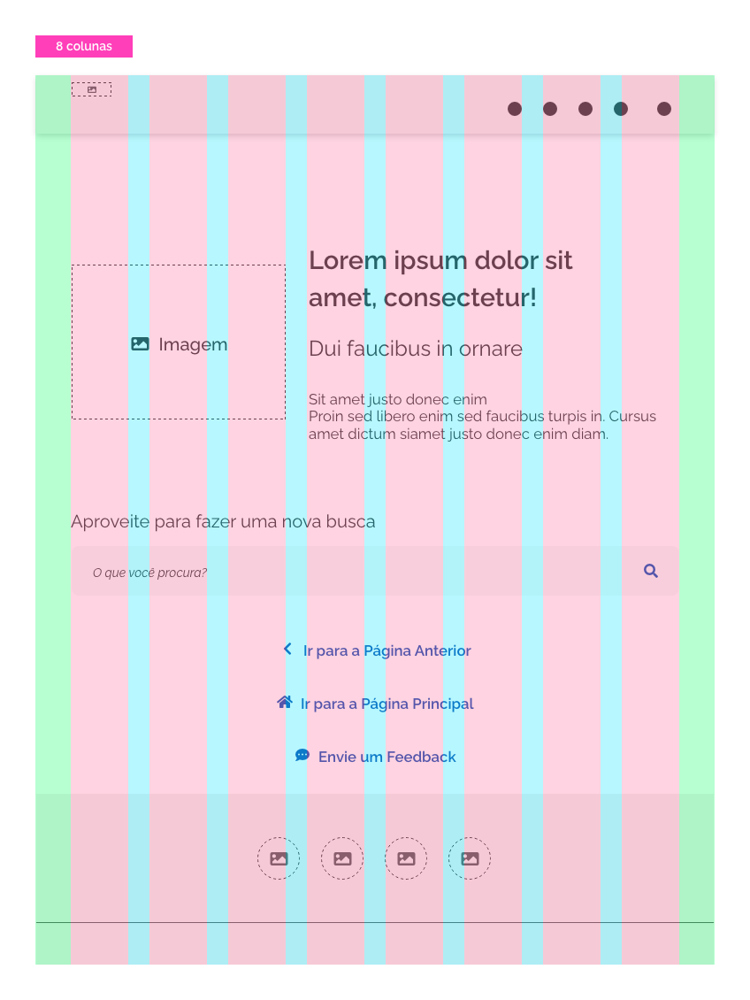
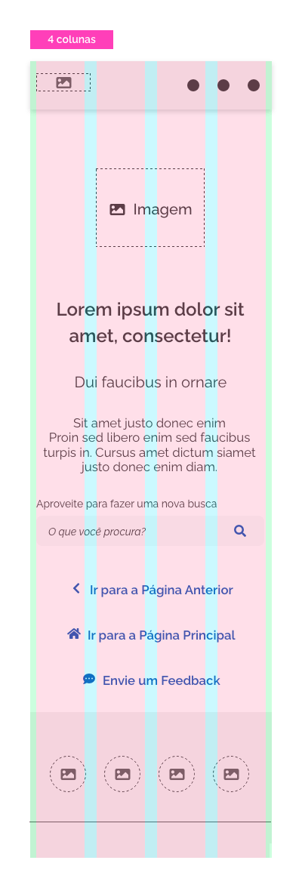

[version]: # (3.1.2)

*Exemplo de _template_ de erro do tipo erro 404 - Página Não Encontrada.*

## Tipos de Erros

As possibilidades de erros de navegação são extensas, no entanto, não é correto deixar que o usuário cometa um erro sem explicar previamente o motivo. Melhor do que isso, é necessário criar e disponibilizar na interface mecanismos que previna ou o auxilie dos possíveis erros que surgirão.

Entre os erros mais comuns, o mais conhecido é o  **erro 404**, que ocorre quando há um equívoco de digitação do usuário ou uma falha de configuração do administrador de um _site_.
As principais causas são:

- **URL incorreta**: quando o usuário digita um endereço inexistente;

- **Página movida**: quando o editor do _site_ altera a URL da página;

- **Página apagada**: quando o administrador do _site_ exclui uma página.

A seguir é apresentado como curiosidade exemplos de outros tipos de erros de navegação que o usuário pode encontrar:

- 400: _Bad Request_ ou Requisição Inválida;
- 401: _Authorization Required_ ou Não autorizado;
- 403: _Forbidden_ ou Proibido;
- 408: _Request Time-Out_ ou Tempo de solicitação esgotado;
- 410: _Gone_;
- 500: _Internal Server Error_ ou Erro interno do servidor;

Os códigos (XXX) servem para transmitir informações para o usuário e, também, para os administradores do _site_.
Em cada página de erro que vemos há um código HTTP de três dígitos que foi enviado pelo servidor _web_. O primeiro dígito informa a classe do código. As classes 1XX (informa), 2XX (indica sucesso) e 3XX (indica redirecionamento da página) não são páginas de erros e normalmente o usuário não tem contato com eles.
Geralmente, as classes de erros que o usuário tem contato são as 4XX (representam erros causados pelo usuário) e 5XX (indicam problemas no servidor do _site_).

A lista de erros é muito grande e não é objetivo desse documento detalhá-lo, mas caso deseje se aprofundar no tema consulte: <https://developer.mozilla.org/pt-BR/docs/Web/HTTP/Status>

---

## Anatomia

O _template_ Erro utiliza a mesma estrutura do "_template_ base", com as seguintes áreas ou regiões: área do _header_, área do conteúdo e área do _footer_, com algumas pequenas modificações:

1. A criação de algumas recomendações e mudanças de configuração nas áreas do _header_ e do _footer_;

2. A Área do conteúdo foi dividido em duas subáreas: área informativa e área de suporte.

A. Área do _header_;
B- Área do conteúdo;
C- Área informativa;
D- Área de suporte (_opcional_);
E- Área do _footer_.

*Áreas de uma típica tela de erro.*

## Detalhamento das áreas

### A- Área do _header_

É recomendado o uso da **versão compacta** do _header_ na tela de erro. A finalidade é orientar o usuário que ainda se encontra no _site_ correto, apesar da tela que está buscando não existir. Isso o ajuda a não se sentir "abandonado". O _header_ pode conter os _links_ que forem necessários ou apenas a marca. Quanto mais simples e limpo melhor.

*_Header_ na versão compacta.*

### B- Área do conteúdo

Para facilitar a organização do conteúdo na tela a área de conteúdo pode ser dividida em duas subareas: área informativa e área de suporte.

#### C- Área Informativa

Assim como definido nas heurísticas de Jakob Nielsen sobre prevenção de erros, essa área possui uma grande importância pois visa dar ao usuário um _feedback_ visual e textual sobre a resposta do sistema à sua busca, auxiliando-o em suas próximas tomadas de decisão.

Os conteúdos e componentes apresentados na área informativa não são estáticos, podendo variar de acordo com a necessidade do sistema e do usuário.

1. Texto principal;
2. Texto secundário;
3. Texto de apoio (_opcional_);
4. Imagem (_opcional_).

*Área informativa.*

##### 1, 2 e 3- Textos

É recomendável dividir hierarquicamente o texto em no máximo três níveis:

- Texto principal;
- Texto secundário;
- Texto de apoio (_opcional_).

*Exemplos dos três níveis hierárquicos de textos para a tela de erro.*

- Utilize o **texto de principal** como um título, informando ao usuário que algo deu errado na navegação. Seja claro e objetivo e sempre que necessário use linguagem leve e descontraída;

- Utilize o **texto secundário** para complementar a informação trazida pelo texto principal. Sempre que possível passe uma mensagem otimista;

- Utilize o **texto de apoio** para esclarecer o que pode ter ocorrido e/ou solicitar um _feedback_ do visitante.

Os textos ficam a critério de cada _site_ e podem variar de acordo com a regra de negócio e _layout_ mas alguns pontos devem ser ressaltados:

- Os textos devem ser escritos em uma **linguagem simples e fácil de serem compreendidos** pelos usuários não técnicos;

-  Em **hipótese alguma** os textos devem deixar a entender que o erro tenha sido cometido pelo usuário, mesmo que seja esse o caso;

- Os textos devem ser precisos ao **especificar exatamente o que foi feito de errado** (ou seja, não serem genéricos ou vagos);

- Os textos precisam ser construtivos ao **sugerir etapas que o usuário possa seguir para corrigir o problema**.

É possível destacar o texto principal com uso de cores (de preferência cores associadas à imagem utilizada). Lembre sempre de testar os contrastes e garantir a legibilidade e a leiturabilidade. Tenha a atenção para optar por cores previstas na paleta cromática do GOVBR-DS. O uso de tamanhos e estilos dos textos também são livres mas devem obedecer às regras previstas nos Fundamentos.

**Atenção:** esteja atento para que o tom e voz do texto utilizado não destoe do _site_, isto é, não exagere no humor se o _site_ possuir um tom mais sério e vice-versa. De fato, essa é uma ótima oportunidade de descontrair um pouco e amenizar o "peso" da frustração do usuário, porém o tom e voz não devem ser drasticamente alterados. Tenha bom senso.

##### 4- Imagem

Tanto ilustrações como fotos podem ser utilizadas como imagem a fim de apoiarem visualmente a mensagem de erro. O importante neste caso é que a imagem seja **clara**, **direta** e **simples**. Por ser um elemento de suporte, a imagem não deve chamar mais atenção que o texto.

É permitido e até recomendado que a imagem tenha um tom mais descontraído e humanizado (até mesmo engraçado eventualmente), pois desta forma ajuda a criar empatia com o usuário amenizando o momento de frustração, porém não exagere. Tenha em mente que o tom da imagem não deve se opor ao do _site_. Mais uma vez, bom senso nunca é demais.

*Alguns exemplos de possíveis ilustrações para diferentes tipos de telas de erro.*

#### D- Área de Suporte (_opcional_)

Os conteúdos e componentes apresentados na área de suporte são opcionais podendo variar de acordo com a necessidade do sistema e do usuário. Essa área auxilia e propõe novas ações a serem tomadas pelo usuário.

1. _Search_ (_opcional_);
2. Buttons (_opcional_).

*Área de suporte.*

##### 1- _Search_

Embora seja um elemento opcional, um campo de busca é útil para o usuário se orientar dentro da tela de erro. Lembre-se que o usuário se encontra "perdido" e tudo o que puder ajudá-lo a se localizar é bem vindo.
O mecanismo de busca pode estar embutido no _header_ porém é recomendável que esteja localizado na área de conteúdo, pois desta forma é dado maior destaque a essa funcionalidade.

*É preferível localizar o _search_ na área de conteúdo.*

Uma boa ideia é aproveitar a busca para recomendar palavras-chave ao usuário por meio de _tags_.
Por exemplo, digamos que o usuário tenha chegado à tela de erro por meio de uma busca no _Google_ com a palavra-chave "cerimônia". _Tags_ com termos válidos semelhantes podem ser sugeridos ao usuário para facilitar o processo de busca.

*Sugestão de palavras-chave para busca é uma funcionalidade que pode facilitar muito a vida do usuário.*

##### 2- Buttons

A tela de erro pode disponibilizar botões terciários com opções para que o usuário possa se deslocar para a tela inicial ou para a tela de origem. É interessante também disponibilizar um botão que aponte para uma tela de coleta de _feedbacks_ (erros, críticas e sugestões). Esta é uma boa oportunidade de mostrar ao usuário que sua opinião é relevante.

*Botões úteis para interação com o usuário.*

Sinta-se livre para propor as ações que julgar interessantes para a experiência do usuário.

### E- Área do _Footer_

Assim como o _header_, é também recomendado que o _footer_ esteja na versão compacta e se for necessário pode apresentar _links_ para as mídias sociais. Essa é uma boa oportunidade para fortalecer o engajamento do usuário. Assim como foi dito para o _header_, quanto mais simples melhor.

*_Footer_ na versão compacta.*

---

## Comportamento

### Responsividade

O conteúdo da tela de erro deve se ajustar na _grid_ da resolução correspondente.
A seguir apresentamos exemplos do _template_ adaptados para as _grids_ de 12, 8 e 4 colunas.

*Template de erro ajustado na grid de 12 colunas.*

*Template de erro ajustado na grid de 8 colunas.*

**Atenção:** quando a quantidade de botões for três ou mais, disponibilize-os verticalmente.

*Template de erro ajustado na grid de 4 colunas.*

## Melhores Práticas

- Páginas de erro podem vir a ser o sucesso ou o fracasso da sua experiência com o usuário. Esta pequena, porém importante seção do _design_ do _site_ tem o potencial de estimular os visitantes a tomar uma ação. Ela pode ser o diferencial entre o visitante desistir e sair do seu _site_ ou tornar-se um cliente leal e grande fã do seu produto.

- Quanto ao SEO e, consequentemente, o ranqueamento do _site_, segundo o próprio _Google_, essas páginas não impactam de maneira direta. Mas vale lembrar que o tempo de permanência e uma experiência fluida são fatores que implicam no volume de tráfego e isso sim influencia de forma determinante no posicionamento de um _site_.

- Uma vez percebido que a origem do erro é uma falha da arquitetura do _site_ corrija o mais rápido possível. Apesar de todo esforço para amenizar uma experiência traumática por parte do visitante, esta é uma página que ninguém quer realmente visitar.

## Modelos de Telas de Erro

A seguir, apresentamos alguns modelos de telas de erro projetadas seguindo os conceitos apresentados neste manual e servem como referência:

*Modelo de tela de erro com utilização de ilustração.*

*Modelo de tela de erro com utilização de ilustração.*

*Modelo de tela de erro com utilização de ilustração.*
