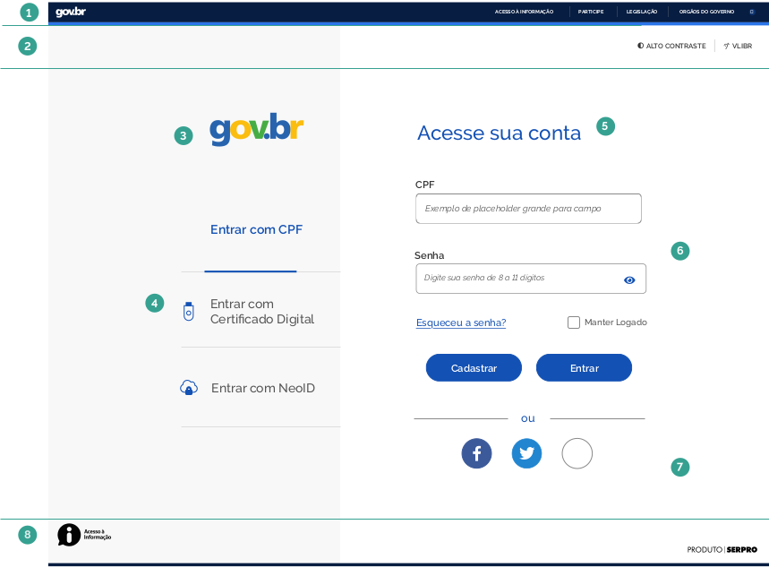
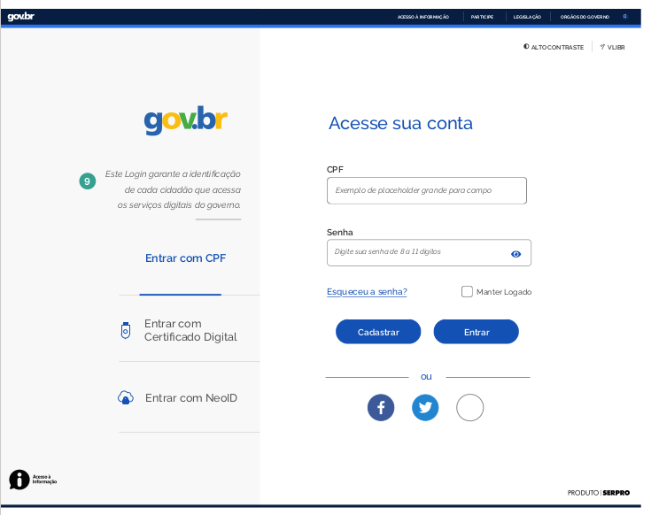
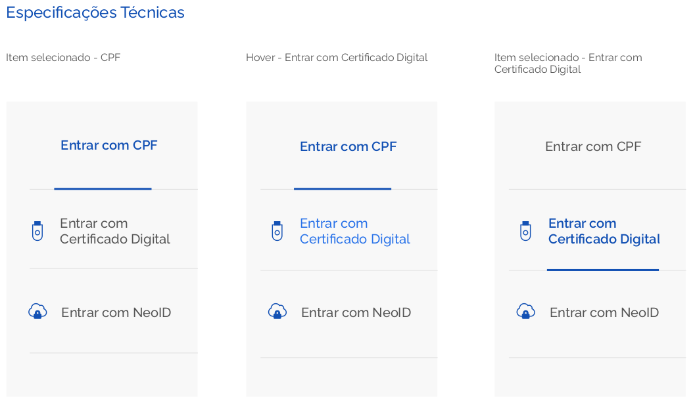
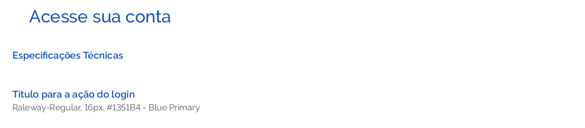
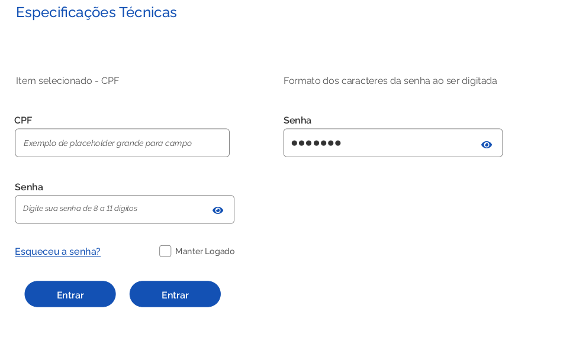

# Template do Login - Sistemas

Este documento busca especificar as principais áreas que compõe o template para login em sistemas no padrão Gov.Br e as instruções sobre onde e quais componentes devem figurar na tela.
As possibilidades de se conectar são distribuídas em 3 diferentes grupos: por Certificação (digital e NeoID); por CPF e Senha e por Redes Sociais.

### Elementos da Estrutura Principal

Os elementos que compõem a Identidade visual proposta para os sistemas são:

##### 1 | Barra Padrão de Identidade Digital Padrão gov.br

##### 2 | Barra acessibilidade

##### 3 | Marca

##### 4 | Acesso com certificados

##### 5 | Título

##### 6 | Miolo

##### 7 | Login com redes sociais

##### 8 | Rodapé (Barra de Assinatura da Identidade Padrão)

### Estrutura mínima

### Estrutura com texto explicativo

#### 1 | Barra Padrão de Identidade Digital Padrão gov.br

#### 2 | Barra de Acessibilidade

Localizada no topo da capa, traz os botões de acessibilidade Auto Contraste e Libras. Que acionam as funcionalidades específicas listadas.

#### 3 | Marca

A marca do "gov.br" recomenda-se utilizar a imagem conforme orientação no link: https://www.governodigital.gov.br/transformacao/compras/orientacoes/identidade-visual-govbr

#### 4 | Acesso com certificados

O acesso com o Certificado Digital e NeoID pode ser acionado pelos links. Eles acionam páginas específicas das aplicações vinculadas aos respectivos certificados.

#### 5 | Título

#### 6 | Miolo

A área de maior massa de dados da tela. O tipo de acesso depende da entrada de dados e sua submissão. Permite também acionar a recuperação de senha e manter-se logado.

#### 7 | Login com Redes Sociais

Outra forma de se logar é utilizar as redes sociais, os botões específicos identificam as possibilidades disponíveis.

#### 8 | Rodapé

O rodapé (footer) ocupa a parte inferior da estrutura padrão dos sítios e portais na Identidade Digital do Executivo Federal. Trata-se de mais um elemento que assegura a credibilidade do ambiente quando o usuário chega ao final da tela. Além de apresentar atalhos para a para as diferentes áreas do sítio, a estrutura conta com o link para o site da Lei de Acesso à Informação e link para o Acesso a informação e a assinatura de Produto Serpro.
