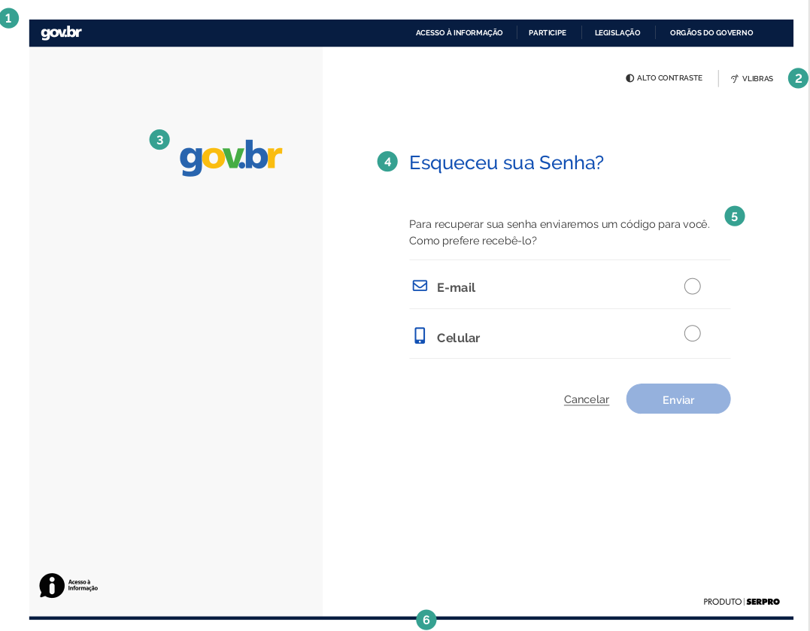
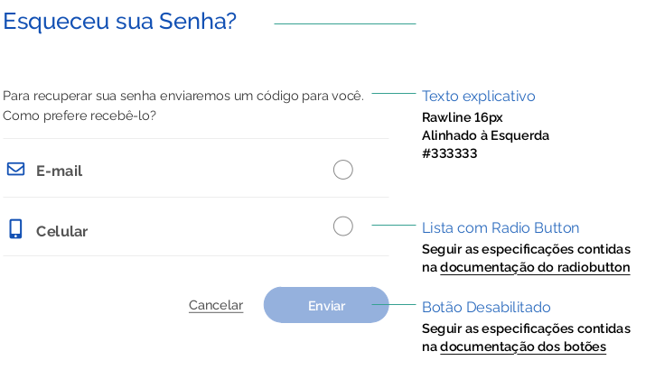
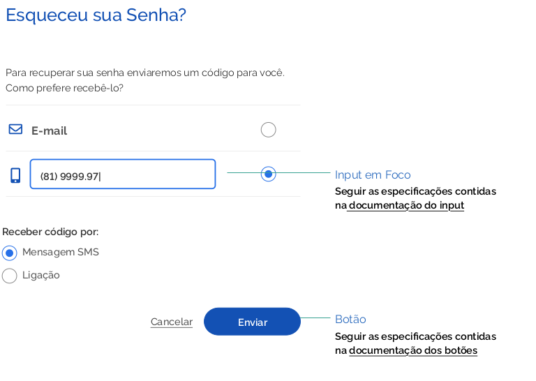
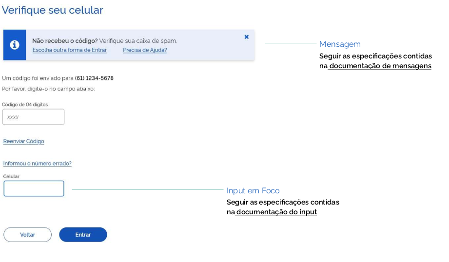
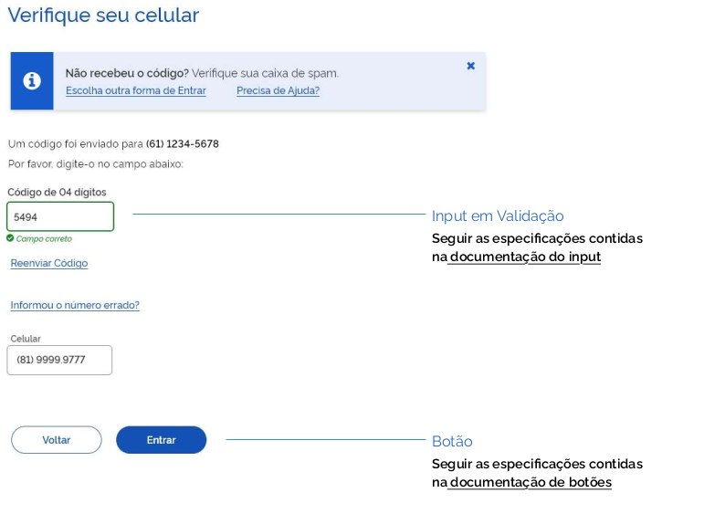
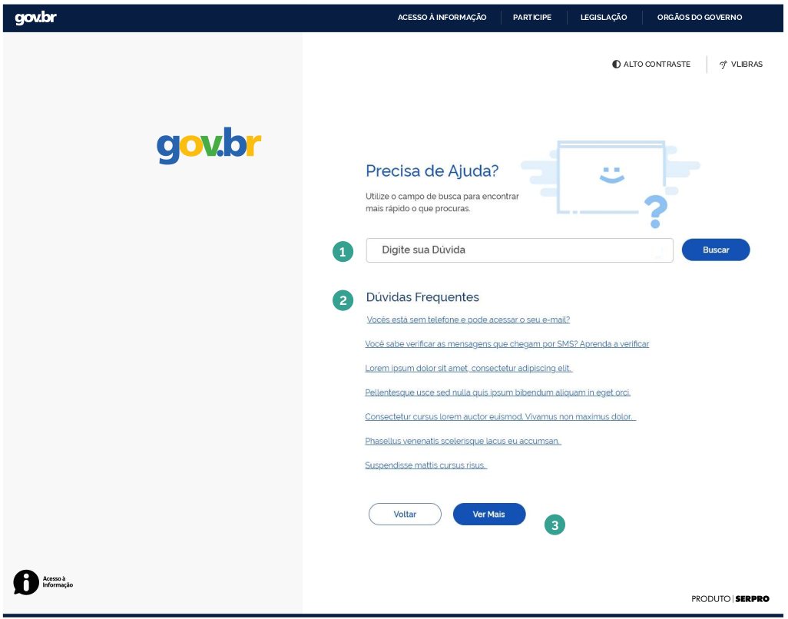
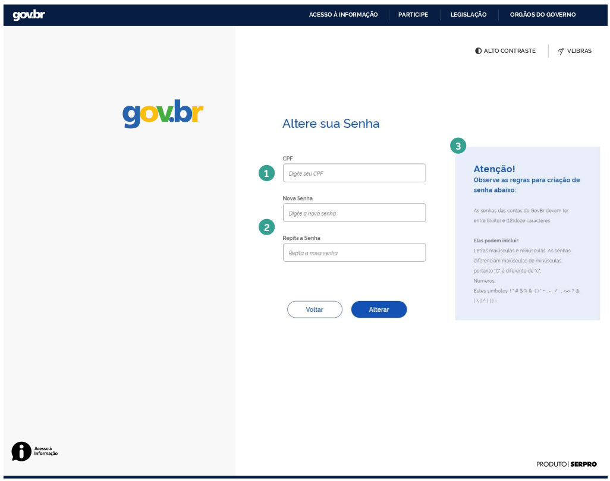
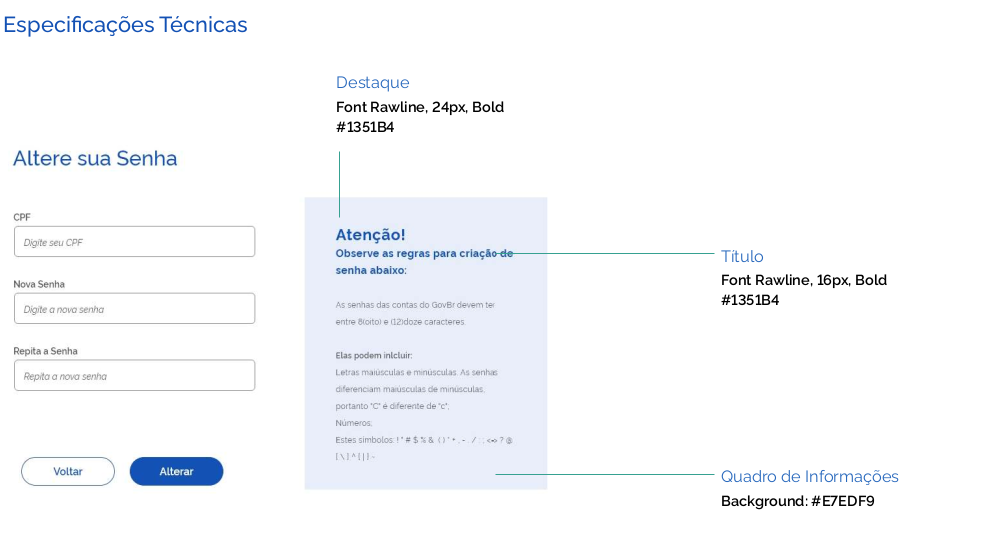
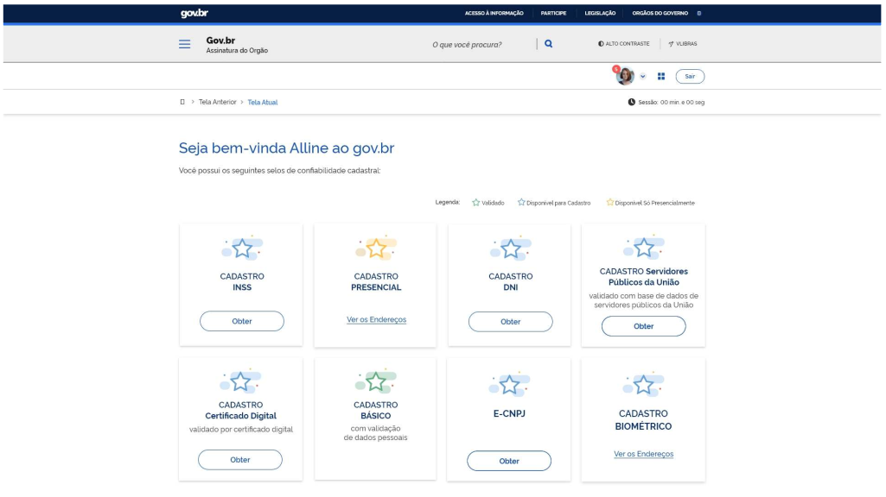

# Template Fluxo de Recuperação de Senha

Este documento busca especificar as principais áreas que compõe o template das telas do fluxo de recuperação de senhas e as
instruções sobre onde e quais componentes devem figurar na tela.

### Elementos da Estrutura Principal

Os elementos que compõem a Identidade visual proposta para os sistemas são:

##### 1 | Barra Padrão de Identidade Digital Padrão gov.br

##### 2 | Barra Acessibilidade

##### 3 | Marca

##### 4 | Título

##### 5 | Miolo

##### 6 | Rodapé

### Estrutura mínima

### Especificações Técnicas

### Estrutura da Tela para Verificação

Após escolher um modo de recebimento do código de acesso, o conteúdo passa a exibir um campo para o usuário digitar o código de 04 dígitos de ativação da conta. Haverá na tela também um link para o usuário receber um novo código, caso a operação não tenha sido realizada ou percebida pelo usuário.

#### 1 | Mensagem

Alerta ao usuário, caso ele não tenha recebido o código, sobre outra forma de recebê-lo e também fornece o link de ajuda.

#### 2 | Miolo - Área de Verificação

Exibe o número do celular digitado inicialmente pelo usuário e um campo para ele digitar o código de acesso.

#### 3 | Link para usuário reenviar o código

#### 4 | Atalho para usuário informar número do celular correto

Atalho para usuário corrigir o número do celular, caso tenha digitado errado.

### Especificações Técnicas

### Estrutura da Tela de Ajuda

Caso o usuário tenha dúvida em algum passo do processo, este poderá acessar o link 'Precisa de Ajuda?', contido na mensagem da tela de verificação. O link dará acesso à tela de ajuda e então o usuário poderá realizar pesquisas através do campo de busca ou acessar a lista de Dúvidas Frequentes.

#### 1 | Campo de Busca

Através do campo de busca o usuário poderá realizar pesquisa por palavra-chave.

#### 2 | Dúvidas Frequentes

Esta lista apresenta as dúvidas mais recorrentes por parte dos usuários.

#### 3 | Botão Ver Mais

Através deste botão, o usuário terá acesso à lista completa de dúvidas frequentes.

### Estrutura da Tela de Alteração de Senha

Após a validação do código na tela de verificação, o usuário tem acesso à tela de alteração de senha. Nela, o usuário poderá redefinir sua senha levando em conta os critérios de segurança estabelecidos.

#### 1 | Campo CPF

#### 2 | Campos Nova Senha e Repetir Nova Senha

#### 3 | Orientações para definição de senha

Neste quadro, deverão estar explícitos os critérios e orientações de segurança no que condiz a geração de uma nova senha.

### Acesso ao Sistema

Após realizar a alteração da senha, o usuário poderá ter acesso ao sistema. Abaixo segue um exemplo de tela de sistema após o login.

