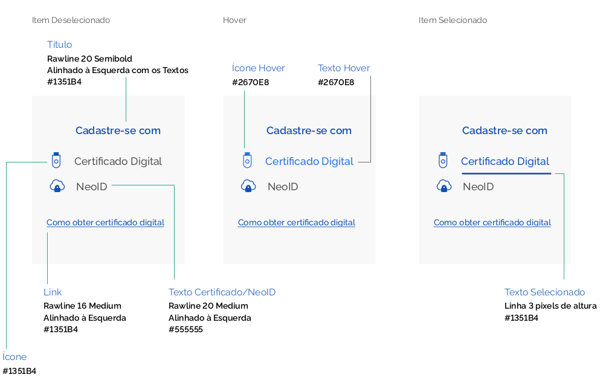
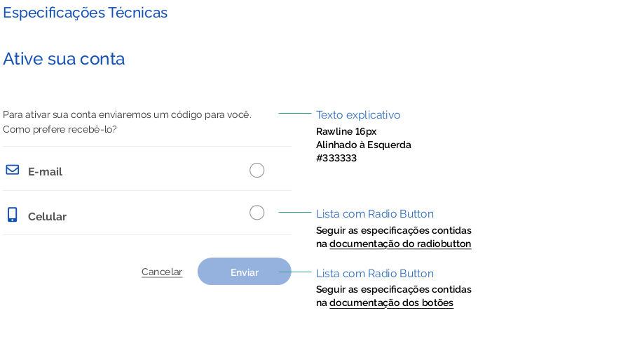

# Template do Cadastro - Sistemas

Este documento busca especificar as principais áreas que compõe o template da tela de Cadastro do Usuário no padrão Gov.Br e as instruções sobre onde e quais componentes devem figurar na tela.
As possibilidades de acessar a conta, assim como no login podem se dar de 3 formas diferentes: por Certificação (digital e NeoID);
por CPF/Senha e por Redes Sociais.

### Elementos da Estrutura Principal

Os elementos que compõem a Identidade visual proposta para os sistemas são:

#### Estrutura antes de realizar o cadastro

##### 1 | Barra Padrão de Identidade Digital Padrão gov.br

##### 2 | Barra acessibilidade

##### 3 | Marca

##### 4 | Cadastro através dos certificados ou das redes sociais

##### 5 | Título

##### 6 | Miolo

##### 7 | Rodapé (Barra de Assinatura da Identidade Padrão)

##### 8 | Texto explicativo

### Estrutura mínima

### Estrutura com texto explicativo

#### 1 | Barra Padrão de Identidade Digital Padrão gov.br

#### 2 | Barra de Acessibilidade

Localizada no topo da capa, traz os botões de acessibilidade Auto Contraste e Libras. Que acionam as funcionalidades específicas listadas.

#### 3 | Marca

A marca do "gov.br" recomenda-se utilizar a imagem conforme orientação no link: https://www.governodigital.gov.br/transformacao/compras/orientacoes/identidade-visual-govbr

#### 4 | Cadastro com Certificados

O cadastro com o Certificado Digital e NeoID pode ser acionado pelos links no lado esquerdo da tela. Eles acionam páginas específicas das aplicações vinculadas aos respectivos certificados.

### Especificações Técnicas

#### 5 | Título

Localizada no topo do miolo, vem antes dos campos a serem preenchidos.

#### 6 | Miolo

Área de maior massa de dados da tela. Local onde aparecem os campos referentes a preenchimento dos dados do cadastro.

#### 7 | Rodapé

O rodapé (footer) ocupa a parte inferior da estrutura padrão dos sítios e portais na Identidade Digital do Executivo Federal.
Trata-se de mais um elemento que assegura a credibilidade do ambiente quando o usuário chega ao final da tela.
Além de apresentar atalhos para a para as diferentes áreas do sítio, a estrutura conta com o link para o site da Lei de Acesso à Informação e link para o Acesso a informação e a assinatura de Produto Serpro.

#### 8 | Texto Explicativo

Texto facultativo que pode auxiliar o usuário no preenchimento do cadastro. Serve para dar informações que sejam fundamentais ao cadastro.

#### 9 | Estrutura da Tela de Ativação da Conta

Após inserção dado CPF e Senha, o conteúdo do lado direito da tela passa a exibir os elementos necessários à ativação da conta. Momento que o usuário opta por receber o código de ativação por e-mail ou pelo celular, via SMS.

#### 10 | Miolo - Ativação de Conta

Lista de itens para o usuário escolher a melhor forma de receber o código de ativação da conta (por e-mail ou celular).

#### 11 | Área para receber o código de ativação da conta

Ao clicar em um RadioButton, aparecerá um input para o usuário digitar ou o e-mail ou celular e assim. receber o código de ativação da conta.

#### Estrutura da Tela para Verificação

Após escolher um modo de recebimento do código de acesso, o conteúdo do lado direito da tela passa a exibir um campo para o usuário digitar o código de 04 dígitos de ativação da conta. Haverá na tela também um link para o usuário
receber um novo código, caso a operação não tenha sido realizada ou percebida pelo usuário.

#### 12 | Miolo - Área de Verificação

Exibe o número do celular digitado inicialmente pelo usuário e um campo para ele digitar o código de acesso.

#### 13 | Link para usuário reenviar o código

#### 14 | Atalho para usuário informar número do celular correto

Atalho para usuário corrigir o número do celular, caso tenha digitado errado.

