Este documento busca especificar as principais áreas que compõe os templates para websites e portais na versão mobile seguindo o padrão Gov.Br e as instruções sobre onde e qual tipo de conteúdo devem ser utilizados.

### Elementos da Estrutura Principal

Os blocos e seções do template são readequados afim de apresentar melhor
visualização em dispositivos móveis. De modo geral, o número de colunas em cards e blocos de notícias são reduzidos, assim como imagens são trocadas por outras com enquadramento melhor. Alguns elementos podem ser ocultados ou reposicionados de acordo com a necessidade.

Dentro desses aspectos de mudança, o layout é modificado conforme mostrados
abaixo:

#### 1 | Cabeçalho (header)

O cabeçalho é um dos principais elementos que determina a identidade gov.br para
todos os sites. Este é replicado de forma consistente em todas as páginas. É onde se destaca a chancela de uma instituição sobre um ambiente digital. Localizado no topo da capa, traz a assinatura do órgão e garante que se trata de um ambiente sob responsabilidade do Executivo Federal.

#### 2 | Banner Principal

Nesta área de destaque deverá ser exibida uma imagem que representa melhor o
tema que o Governo ou Órgão do Goveno quer divulgar. Poderá ser uma imagem com conteúdo abstrato ou específico pragmático, perene ou temporária, de acordo com a necessidade.

#### 3 | Campo de Busca

Localizado em uma área de destaque, a funcionalidade de busca é um dos principais meios pelo qual o cidadão vai acessar os serviços ou conteúdos de seu interesse ou necessidade.

#### 4 | Assuntos em Alta

Neste bloco serão exibidos alguns conteúdos que o Governo ou Órgão do Governo
querem dar ênfase. **Na versão mobile, os assuntos em alta serão exibidos através de uma lista de links dentro de um menu retrátil. Poderão ser exibidos e ocultados através do clique no título do bloco.**

#### 5 | Serviços e Informações

Nesta seção serão exibidos alguns serviços em destaque para o cidadão.

#### 6 | Lista de Serviços por Categoria

Logo abaixo dos Serviços em Destaque para o Cidadão, serão exibidos os serviços
agrupados por categoria. **Na versão mobile, a lista de cards é acessada pela
navegação através da barra de rolagem horizontal.**

#### 7 | Números do Governo

Nesta área serão exibidos alguns indicadores com os quais o Governo quer dar
ênfase.

#### 8 | Banner Publicidade

Este bloco é reservado para publicidade do Governo ou Órgão do Governo. **Na versão mobile, as imagens deverão ser tratadas de forma a obter o melhor
enquadramento para smartphones e tablets.**

#### 9 | Principais Notícias

Aqui serão exibidas as notícias específicas do Governo ou Órgão do Governo.

#### 10 | Aplicativos do Governo Federal

Nesta seção, serão exibidos os aplicativos que o Governo quer dar ênfase.

#### 11 | Banner Publicidade

Este bloco é reservado para publicidade do Governo ou Órgão do Governo.** Na versão mobile, as imagens deverão ser tratadas de forma a obter o melhor
enquadramento para smartphones e tablets.**

#### 12 | Atendimento ao Cidadão

Esta área é reservada para prover canais de comunicação entre o cidadão e o
Governo ou Órgão do Governo. Canais para sugestões, denúncias, elogios,
solicitações, entre outros.

#### 13 | Rodapé Funcional

O rodapé (footer) ocupa a parte inferior da estrutura padrão dos sítios e portais na
Identidade Digital do Executivo Federal. Trata-se de mais um elemento que assegura a credibilidade do ambiente quando o usuário chega ao final. Além de apresentar atalhos para as diferentes áreas do sítio, a estrutura conta com o link para o site da Lei de Acesso à Informação e link para o próprio portal aplicado na logomarca do Governo do Brasil. **Na versão mobile, os subitens ficam ocultos e são acionados através do clique no título de cada agrupamento.**

#### 14 | Notícia em Destaque

Nesta área deverá ser exibida a notícia de destaque. Esta deverá vir em formato de
banner com o título e resumo da notícia na parte de baixo da imagem.

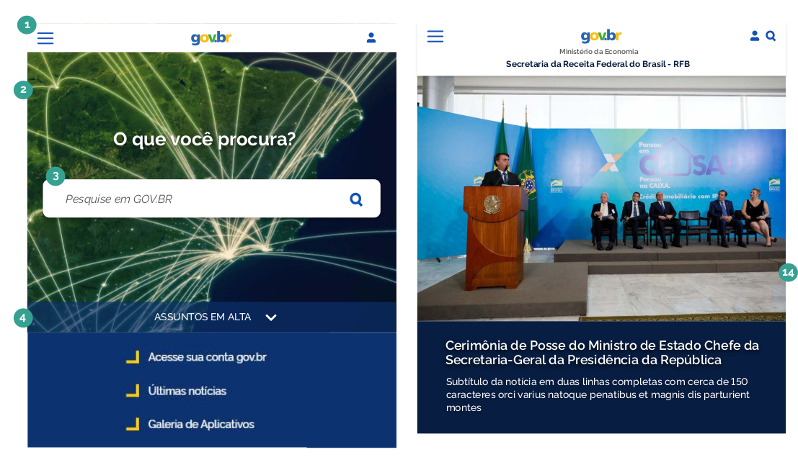
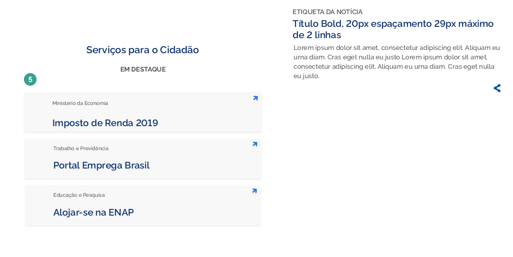
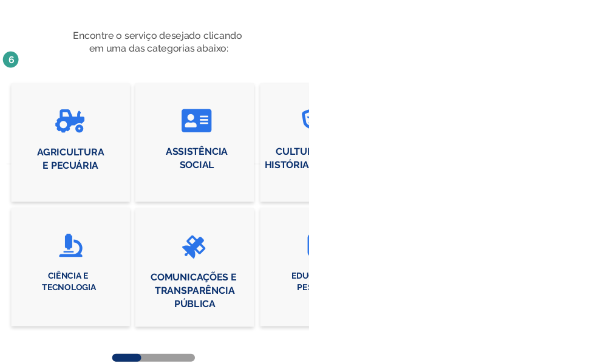
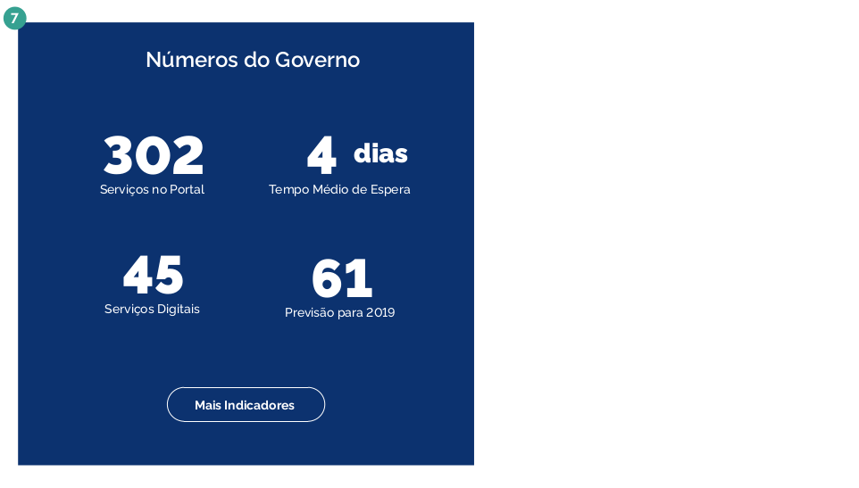
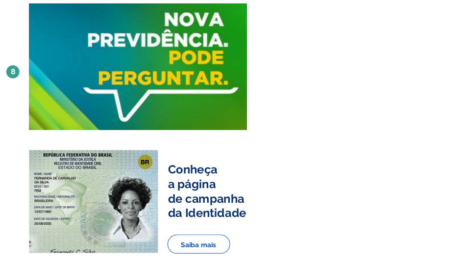
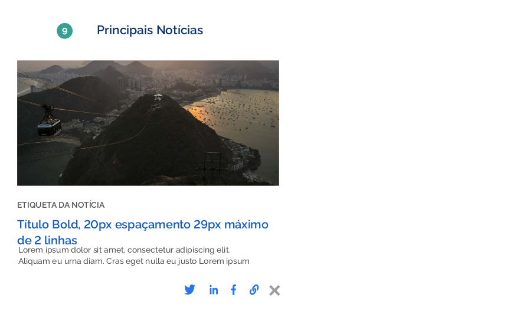
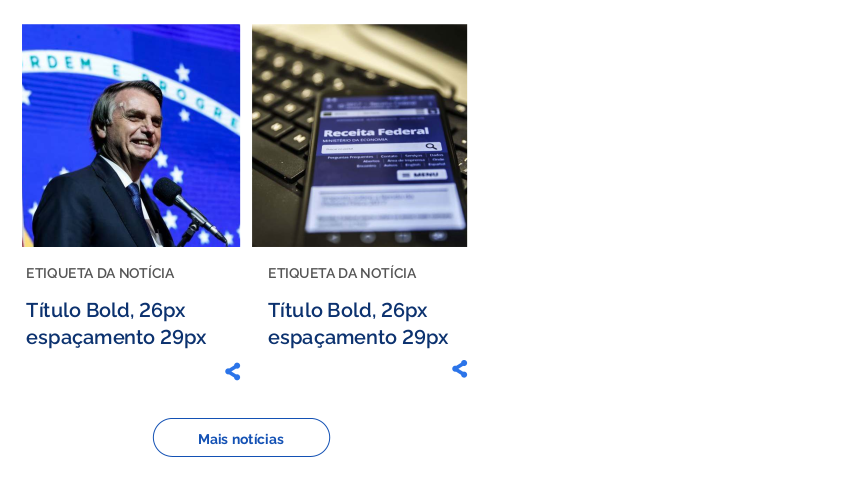
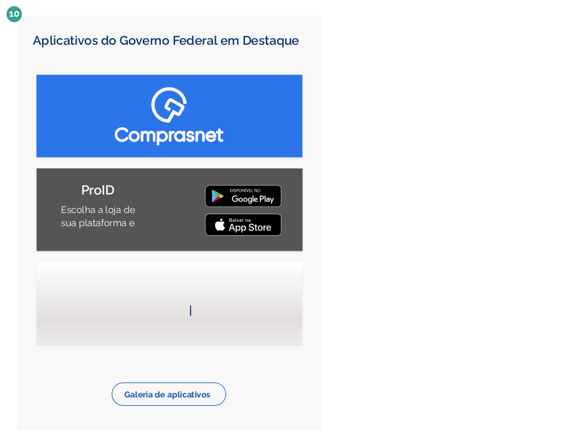

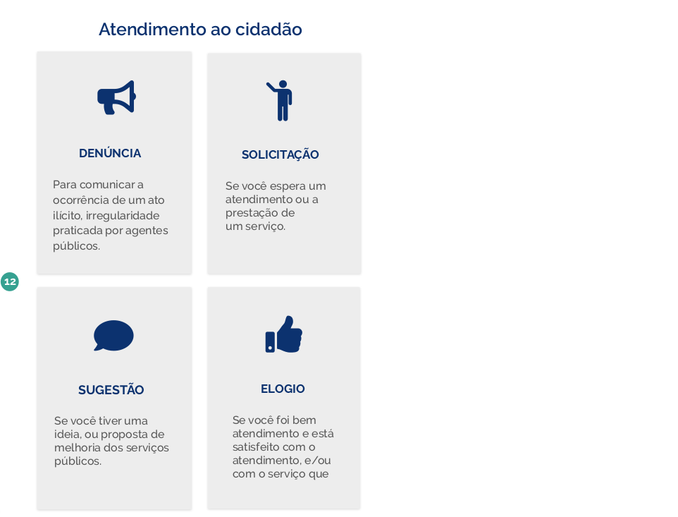
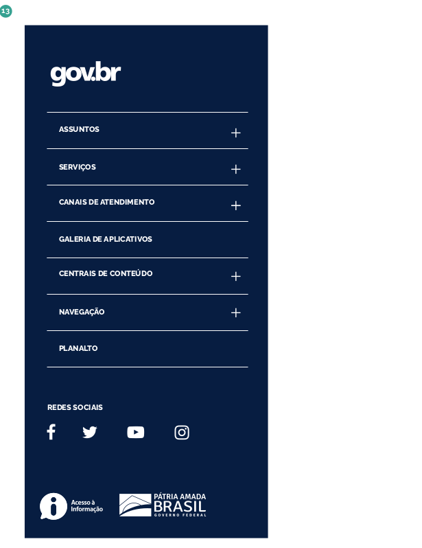

### Menu

O menu apresenta ao cidadão as principais áreas de um sítio, de modo que ele poderá ir diretamente para a seção temática que deseja. Na Identidade Padrão, a estrutura completa de menu é acessada a partir do botão “hambúrguer” (representado por três pequenas linhas horizontais sobrepostas) situado no lado esquerdo ao lado do título principal do cabeçalho. Com um
clique, é aberta uma caixa com todos os itens referentes ao primeiro e segundo e terceiro níveis de navegação.

Os principais elementos e áreas estruturais são:

#### 1 | ícone hamburguer

O menu será acessado a partir do Ícone Hamburguer, que será posicionado ao lado do título principal no cabeçalho do site.

#### 2 | Ícone Fechar Menu

Após o clique no ícone hamburguer, o menu será exibido e o ícone será trocado pelo ícone fechar.

#### 3 | Menu Dropdown

O menu será exibido no formato Dropdown. Este será posicionado flutuando sobre o conteúdo logo abaixo do cabeçalho e ocupará toda largura do site ou portal.

#### 4 | Primeiro Nível

Ao ser exibido o menu, este mostrará apenas os links correspondentes ao primeiro nível de informação. Caso existam subníveis, serão exibidas setas ao lado de cada link.

#### 5 | Segundo Nível

O segundo nível de informação aparecerá após o clique na seta lateral do primeiro
nível. Este será apresentada sobre o primeiro nível e o usuário poderá navegar de
volta para o primeiro nível através da seta no topo do menu.

#### 6 | Links Úteis

Na base do menu será exibido um conjunto de links úteis: _Acesso à Informação,
Participe, Órgãos do Governo e Acessibilidade_. Todos eles levarão o usuário a sítios externos.

#### 7 | Links para Redes Sociais

No canto inferior direito do menu, serão posicionados os links de acesso às redes
sociais do Governo ou Órgão.

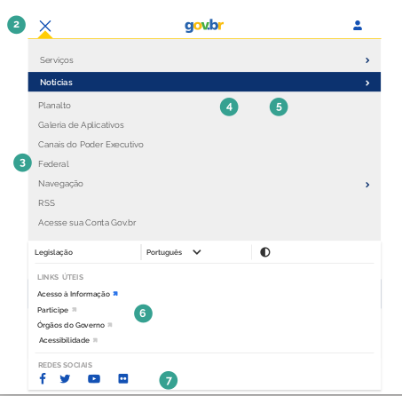
