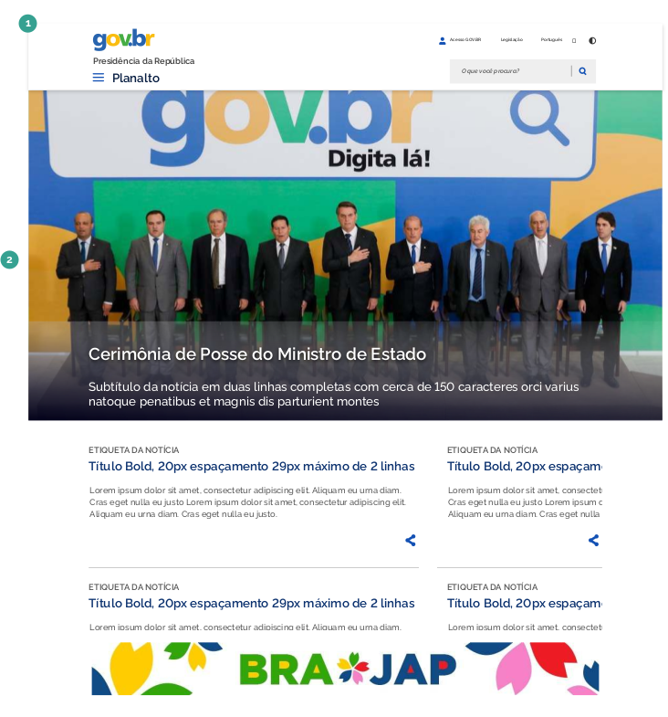
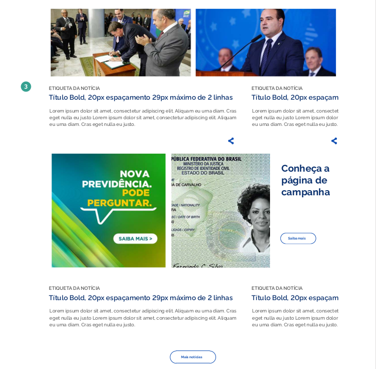
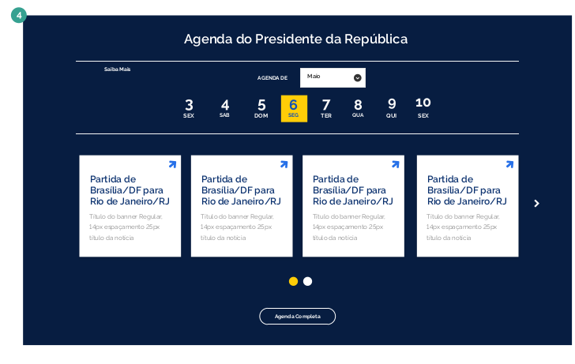
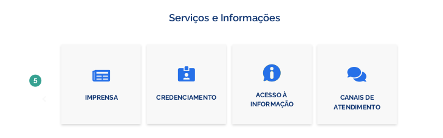
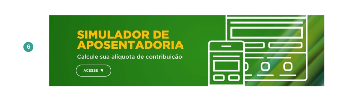
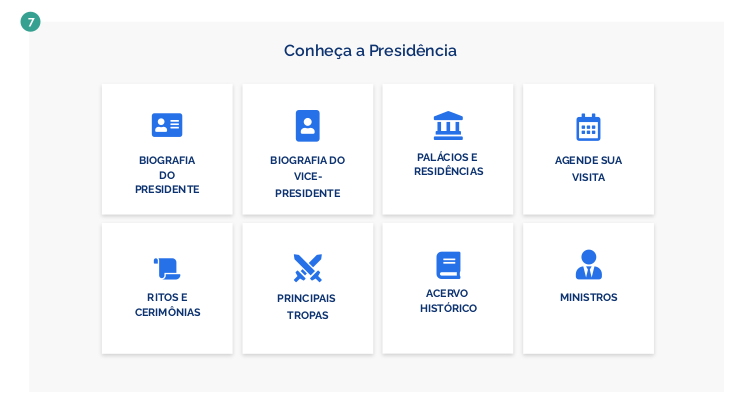
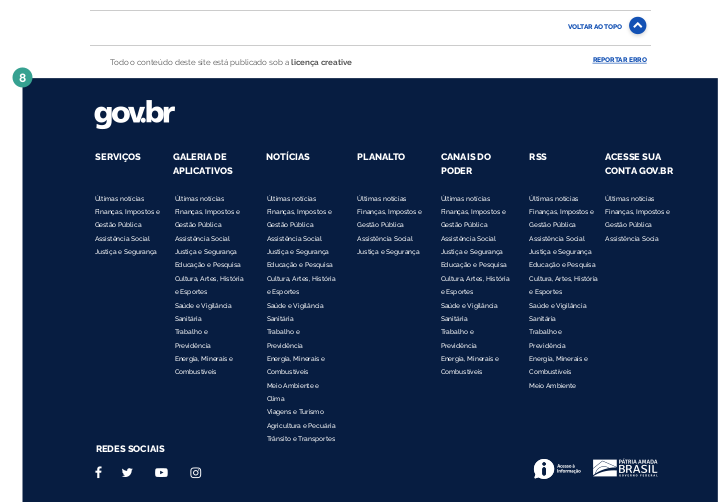

Este documento busca especificar as principais áreas que compõe os templates para websites e portais no padrão Gov.Br e as instruções sobre onde e qual tipo de conteúdo devem ser utilizados.

### Elementos da Estrutura Principal

As principais áreas estruturais são:

##### 1 | Cabeçalho (header)

O cabeçalho é um dos principais elementos que determina a identidade gov.br para todos os sites. Este é replicado de forma consistente em todas as páginas. É onde se destaca a chancela de uma instituição sobre um ambiente digital. Localizado no topo da capa, traz a assinatura do órgão e garante que se trata de um ambiente sob responsabilidade do Executivo Federal.

##### 2 | Notícia em Destaque

Nesta área deverá ser exibida a notícia de destaque. Esta deverá vir em formato de banner com o título e resumo da notícia na parte de baixo da imagem.

##### 3 | Área de Notícias

A área de notícias terá um layout flexível, podendo assumir uma diagramação com uma, duas ou mais colunas. As chamadas para as notícias serão apresentadas com etiqueta da notícia logo acima do título, título principal, descrição da notícia e botão para compartilhamento da mesma. Ao final desta seção, poderá haver um botão de acesso à página com a listagem completa das notícias.

##### 4 | Agenda do Presidente da República

O bloco de agenda mostrará os eventos públicos do Presidente da República e o
usuário poderá navegar por mês, selecionando a opção desejada no combobox, pelos dias da semana, clicando no dia desejado e por evento, navegando lateralmente pela barra de rolagem horizontal. Os eventos serão exibidos com título e descrição. Também será possível acessar a agenda completa através de um botão localizado ao final da agenda.

##### 5 | Serviços e Informações

Esta área apresentará os serviços e informações de utilidade para o cidadão em
formato de cards, com título e ícone representativo.

##### 6 | Banner Publicidade

Logo abaixo do bloco Serviços e Informações, haverá espaço reservado para
publicidade.

##### 7 | Conheça a Presidência

Nesta seção serão apresentados a biografia do presidente, acervo histórico, palácios e residências, principais tropas, entre outros temas dentro do contexto de informações da presidência da república.

##### 8 | Rodapé Funcional

O rodapé (footer) ocupa a parte inferior da estrutura padrão dos sítios e portais na
Identidade Digital do Executivo Federal. Trata-se de mais um elemento que assegura a credibilidade do ambiente quando o usuário chega ao final. Além de apresentar atalhos para as diferentes áreas do sítio, a estrutura conta com o link para o site da Lei de Acesso à Informação e link para o próprio portal aplicado na logomarca do Governo do Brasil.

