# Template do Login - Sistemas

ste documento busca especificar as principais áreas que compõe os templates para sistemas no padrão Gov.Br, nas versões Desktop e Mobile contendo as instruções sobre onde e qual tipo de conteúdo deve entrar a cada parcela da apresentação — por exemplo, conteúdos que podem aparecer no início (cabeçalho) e conteúdos que só podem aparecer no final (rodapé).

## Templates para Sistemas - Desktop

### Elementos da Estrutura Principal

Os elementos que compõem a Identidade visual proposta para os sistemas são:

##### 1 | Cabeçalho (header)

##### 2 | Menu Principal (vertical)

##### 3 | Menu - Subítens (vertical)

##### 4 | Miolo

##### 5 | Rodapé (Barra de Assinatura da Identidade Padrão)

### Layout Sistemas Web - Tela Principal

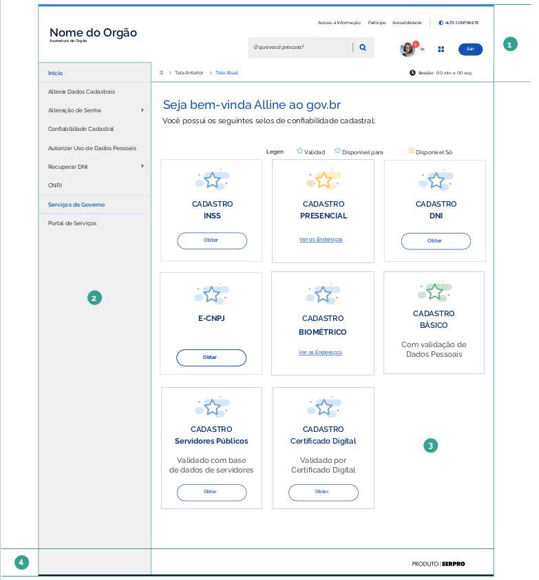

### Cabeçalho

O cabeçalho é um dos principais elementos que determina a identidade gov.br para todos os sistemas, este é replicado de forma consistente em todas as páginas. É onde se destaca a chancela de uma instituição sobre um ambiente digital.

Localizado no topo da capa, traz a assinatura do órgão e garante que se trata de um ambiente sob responsabilidade do mesmo.

A Identidade Padrão conta com um cabeçalho simples e moderno, que possibilita uma navegação intuitiva com acesso para as principais áreas e funcionalidades do sistema.

Alguns dos itens que compõe o cabeçalho para sistemas podem ser ocultados, reorganizados e(ou) substituídos. Essa mudança é determinada por interesse do órgão ou pela regra de negócios determinada para cada perfil de acesso do usuário.

### Cabeçalho com menu principal (Opção 01)

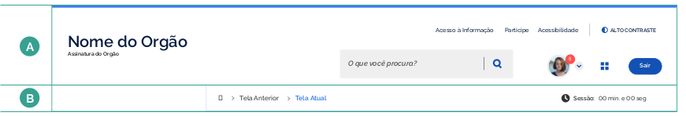

### Cabeçalho com menu principal (Opção 02)

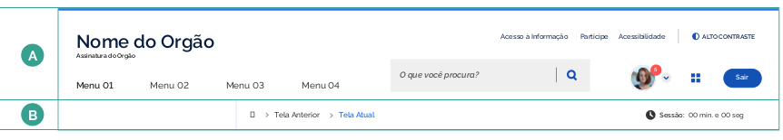

### Composição e Especificações

#### A | Barra Principal

- Nome e descrição do sistema
- Campo de busca
- Links Importantes e Botões de Acessibilidade (Auto Contraste e Libras)
- "Menu Horizontal" - Utilizado somente quando houver poucos tópicos ou funcionalidades disponíveis (Opção 02)
- Área configuração e perfil do status do perfil do usuário, com indicador (badge) de notificações.
- Ícone de acesso rápido a outras aplicações - Utilizado somente quando houver necessidade.
- Botão Sair (logout)

#### B | Barra Secundária

- Breadcrumbs
- Contador de Sessão

### Aplicação de marcas no cabeçalho

Cada sistema que possui sua própria logo devem aplica-la no cabeçalho dos seus respectivos sites, desde que respeitadas as
seguintes recomendações:

A imagem deve ter o mínimo de contraste exigido pelas diretrizes do Modelo de Acessibilidade em Governo Eletrônico – eMAG.É possível verificar os níveis de contraste na seguinte plataforma: https://webaim.org/resources/contrastchecker/.

Caso o sistema não tenha uma logo própria, recomendamos a utilização nome do Sistema em caixa alta, na fonte Rawline, Black, 20 pt, cor #333333. A "assinatura do órgão" que é a descrição do significado do nome, deve vir à baixo na fonte Rawline, Semibold, 14 pt, cor #333333.

Recomenda-se utilizar a imagem com preenchimento total de cor.
O tamanho máximo do símbolo é de 72x72 pixels (largura e altura), sempre com fundo transparente.
A área máxima é correspondente a área útil. Ou seja, caso o símbolo esteja em posição vertical, a altura máxima deve
permanecer 80 pixels, de modo que a largura será definida automaticamente.

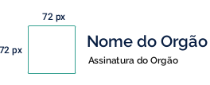

Recomenda-se a utilização “chapada” do símbolo, com o menor número de cores possível, para que a leitura não seja prejudicada. É possível inserir duas imagens para aplicações em fundo escuro e fundo claro, caso seja necessário.

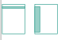

### Menu

O menu apresenta ao usuário as principais áreas e funcionalidade do sistema, de modo que ele poderá ir diretamente para a seção temática que deseja. Foi projeto dois tipos de menu: Menu vertical e um menu horizontal. A utilização desses menus estão condicionados à complexidade do sistema.

Os sistemas que possuem muitas áreas e funcionalidades em sua arquitetura da informação, deverá optar pelo menu vertical, devido a sua complexidade. Os sistemas mais simples, que possuem poucos tópicos de navegação, deverá optar pelo Menu Horizontal.

No entanto, os sistemas mais simples, com poucas áreas e funcionalidades, terão acesso direto ao menu horizontal que estará situado do lado esquerdo do cabeçalho, logo a baixo do logo com a assinatura.

### Layout Sistemas Web - Menu Subníveis

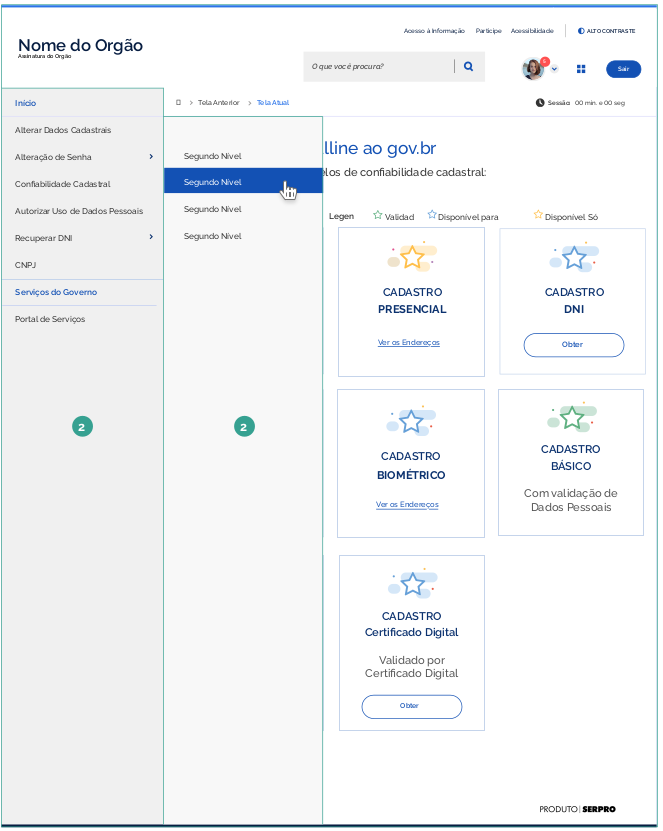

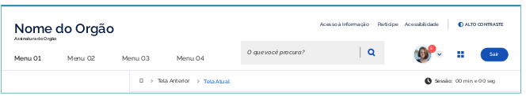

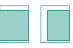

### Miolo

É a área principal do sistema. onde se destaca os conteúdos produzidos por cada órgão. Por meio dos módulos previstos, as diferentes informações podem ser apresentadas em acordo com o formato disponível, objetivo da mensagem e aderência junto aos usuários.
Assim, é possível construir as páginas internas com o conteúdo e todos os componentes que for necessário.

### Rodapé

O rodapé (footer) ocupa a parte inferior da estrutura padrão dos sistemas para o Design Sytem do gov.br.
Trata-se de mais um elemento que assegura a credibilidade do ambiente quando o usuário chega ao final.

Destaca-́se no rodapé a assinatura para os produtos desenvolvidos pelo SERPRO (Serviço Federal de Processamento de Dados).

Também é possível, em alguns casos, adicionar outras informações complementares e necessárias ao próprio sistema.

## Templates para Sistemas - Mobile Responsivo

#### Elementos da Estrutura Principal

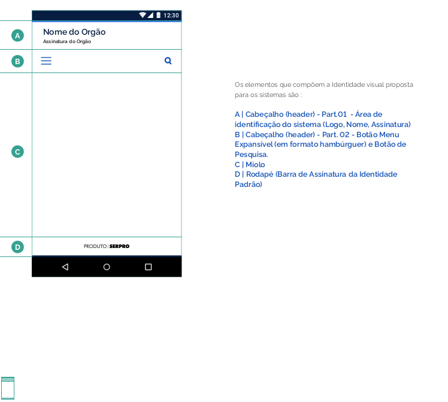

#### Elementos da Estrutura Principal

O cabeçalho da versão mobile responsivo, devido a limitação de espaço, apresenta diferenças significativas na sua composição. Várias funcionalidades, antes visíveis, serão ocultadas ou transferidas para a área do menu, ficando visíveis obrigatoriamente a identificação do sistema e os botões de acesso ao menu e a busca.

#### Representação da funcionalidade do campo de Busca (pesquisa)

Ao selecionar o botão de busca (lupa), toda área A é imediatamente convertida em um campo de busca, ocultando temporariamente o botão do menu e dando total destaque a ação de pesquisar.

Ao iniciar a digitação através do teclado do aparelho telefônico, o sistema apresentará uma pequena lista, com a funcionalidade "autocomplete", trazendo sugestões de palavras e termos, visando otimizar a interação de busca do usuário com o sistema.

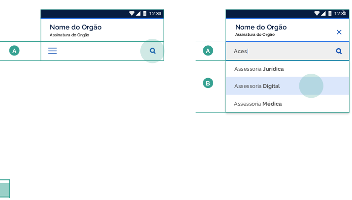

#### Menu

O menu será apresentado, temporariamente, em toda área principal do dispositivo móvel (miolo).
O botão "hamburger", após acionado, será substituído pelo botão "X", indicando ao usuário a funcionalidade de fechar/recolher.

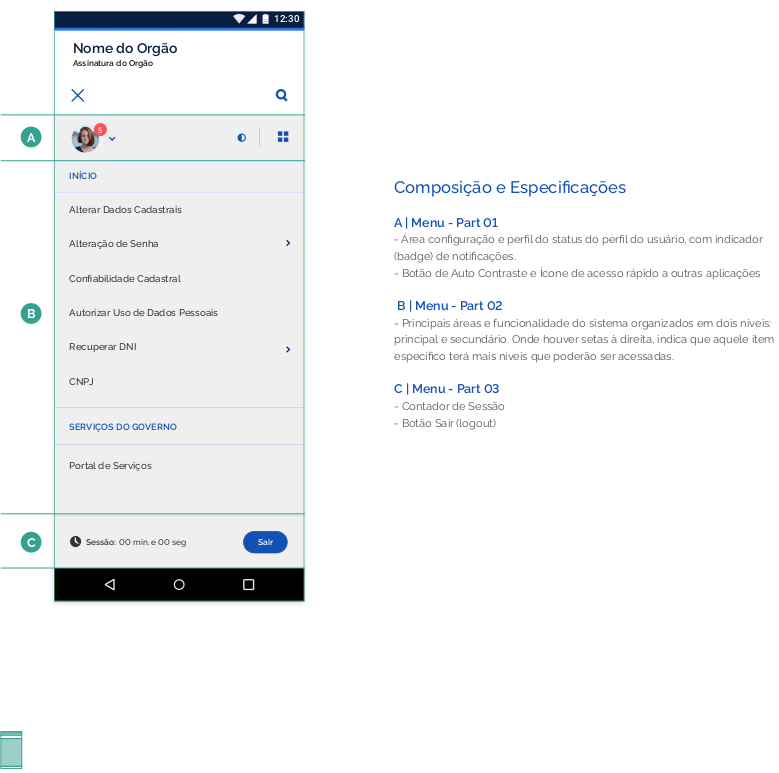

#### Miolo

Assim como na versão web, é a área principal do sistema. onde se destaca os conteúdos produzidos por cada órgão. Por meio dos módulos previstos, as diferentes informações podem ser apresentadas em acordo com o formato disponível, objetivo da mensagem e aderência junto aos usuários.
Assim, é possível construir as páginas internas com o conteúdo e todos os componentes que for necessário.

#### Rodapé

O rodapé (footer) na versão mobile responsivo, para smartphones, terá a marca "produto SERPRO centralizada.

