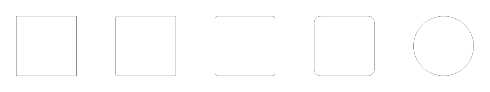

As classes foram criadas baseadas no [Fundamento Superfície](fundamentos-visuais/superficie).

- `rounder-none`: Sem arredondamento
- `rounder-sm`: Arredondamento pequeno
- `rounder-md`: Arredondamento médio
- `rounder-lg`: Arredondamento grande
- `rounder-pill`: Formato de pílula
