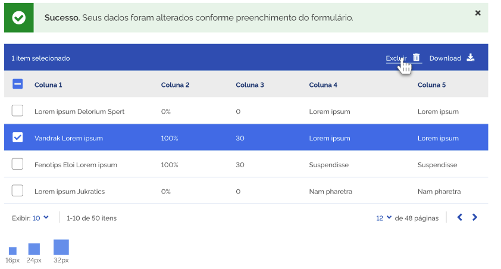

## Mensagens de Alerta

As mensagens servem para dar feedback ao usuário sobre o que está acontecendo no sistema. Muitas tem a função de orientar o usuário a preencher um formulário ou encontrar uma forma de acessar o conteúdo procurado. Outras porém, podem servir de alerta a possíveis consequências na realização de alguma ação. E outras podem por exemplo indicar que o preenchimento. 

### Tipos

A cor é um bom recurso para comunicar, porém pensando em acessibilidade é necessário utilizar mais um recurso para que essa mensagem seja entendida. Além da cor um ícone é utilizado para comunicar ao usuário o tipo de alerta e sua importância. Nesse caso, o ícone pode auxiliar na transmissão de informações que deverão ser percebidas tanto pelos usuários que não tem problemas de visão, como pelos que têm alguma dificuldade ou não podem perceber a diferença entre as cores.

#### 1 | Mensagens de Erro 

As mensagens de Erro são utilizadas para informar ao usuário que algo não saiu como ele esperava. O ideal é que no final dessa mensagem apareça alguma sugestão de como o usuário possa resolver aquela situação.

#### 2 | Mensagens de Sucesso 

As mensagens de Sucesso servem para auxiliar que o usuário perceba que a ação que ele realizou, de fato aconteceu. Exemplo, ao salvar dados numa tabela ou formulário.

#### 3 | Mensagens de Atenção 

As mensagens de Atenção, muitas vezes trazem informações que possam alertar ao usuário que determinada ação depende de outra ação prévia, ou que haverá alguma consequência após a realização de uma ação e que esta merece uma atenção maior do usuário.

#### 4 | Mensagens de Informação 

As mensagens Informativas, são muitas vezes dicas para que o usuário entenda melhor o que o sistema está solicitando. Serve mais ou menos como tópicos de ajuda.

### Anatomia 

#### Tom de voz 

A linguagem utilizada nas mensagens deve ser clara e objetiva. É fundamental que o usuário entenda o que aconteceu, as consequências e o que pode ser feito. Então, é interessante que na mensagens venham sugestões de como o usuário pode resolver a questão. 

### Estrutura

No que diz respeito a estética, as mensagens devem ocupar a largura da área útil ocupada pela grid do sistema. O texto porém pode ocupar uma linha, duas, ou mais de duas, como exemplificado abaixo. 

#### 1 | Mensagens de Texto dentro de container, com texto ocupando 1 linha 

Nesse caso, o texto ocupará apenas 1 linha e aparecerá centralizado, com o ícone e com o box da mensagem.

#### 2 | Mensagens de Texto dentro de container, com texto ocupando 2 ou mais linhas 

Nesse caso, o texto ocupará 2 ou mais linhas e aparecerá centralizado, com o ícone e com o box da mensagem. O tamanho do container deve variar de acordo com o tamanho da mensagem. Nas mensagens que ultrapassam 1 linha de texto, deve-se destacar com semibold a ideia principal da mensagem e a mesma deve aparecer na primeira do texto. O resto do texto deve aparecer a partir da próxima linha com fonte regular.

Quando houver necessidade de aparecer mais de uma mensagem, deve-se repetir o box para que o usuário preste atenção que se trata de mensagens diferentes,

#### 3 | Mensagens de feedback em modal 

Deve se recorrer ao uso de modal somente nos casos que seja necessário impedir que o usuário prossiga sem ler ou que seja necessário ele realizar uma ação que tenha um impacto maior, como é o caso da exclusão de dados. O ícone deve sempre aparecer centralizado com a altura do container e o texto alinhado à esquerda.

### Posicionamento e comportamento 

#### 1 | Posicionamento nos sistemas 

No sistema, deve-se posicionar as mensagens logo abaixo do título/texto inicial e antes do conteúdo da tela. O comportamento esperado é que a mensagem empurre o conteúdo para baixo. E possa ser fechada acionando o ícone ou depois de 1 minuto.

#### 2 | Posicionamento antes de tabelas 

No sistema, deve-se posicionar as mensagens logo abaixo do breadcrumb e antes do conteúdo da tela. O comportamento esperado é que a mensagem empurre o conteúdo para baixo. E possa ser fechada acionando o ícone ou depois de 1 minuto.

### Dimensões

#### 1 | Mensagens de Texto dentro de container, com texto ocupando 1 linha 

Nesse caso, o box de fundo da mensagem deve ter 62px de altura e a largura deve ser a mesma largura do conteúdo da tela. O quadrado que contém o ícone deve ter 62x62px. O ícone deve vir centralizado dentro desse quadrado. A distância entre o quadrado e o início do texto que compõe a mensagem deve ser sempre de 24px. Essa mesma distância deve ser respeitada, entre o final do texto e a área de toque do ícone de fechar “x”.

#### 2 | Mensagens de Texto dentro de container, com texto ocupando 2 ou mais linhas 

Nesse caso, o box deve aumentar de acordo com o texto, sempre respeitando a margem de 24px. A largura do container deve ser a mesma largura do conteúdo da tela.

### Ícones de Alerta 

Os ícones das mensagens de alerta horizontais deverão, ter 28px, mas serão exibidos com uma área total de 36x36px. A área do toque permanece 48px.

Já os que aparecem nas mensagens dentro de pop ups devem ter 36x36px e uma área total de 40x40px.

### Tipografia e Cor

Foram escolhidas 4 cores para compor as mensagens de alerta do Design System: Vermelho: # E60000, Verde:#168821, Amarelo: #FFCD07 e Azul:#155BCB. Para compor o background de cada uma das mensagens utilizou-se um percentual de 10% de cada uma dessas cores de acordo com a mensagem a que se destina, sendo: o vermelho para erro, o verde para sucesso, o amarelo para atenção e o azul para informação.

#### 1 | Mensagens de Erro

#### 2 | Mensagens de Sucesso

#### 3 | Mensagens de Atenção

#### 4 | Mensagens de Informação

